<small>*Frontispiece of Dialogue Concerning the Two Chief World Systems (Galileo Galilei 1632)*</small>

<div class="mobile-only">

> You are viewing this on a mobile device, but SITP is best viewed on a desktop — the book includes various multimedia lecture videos, visualizers, any tufte-style sidenotes with many external hyperlinks to other resources.

</div>

> We<span class="sidenote-number"></span><span class="sidenote">*A modified excerpt from The Structure and Interpretation of Computer Programs [§1: Building Abstractions with Procedures](https://mitp-content-server.mit.edu/books/content/sectbyfn/books_pres_0/6515/sicp.zip/full-text/book/book-Z-H-9.html#%_chap_1)*</span> are about to study the idea of a computational process. Computational processes are abstract beings that inhabit computers. As they evolve, processes manipulate other abstract things called data. The evolution of a process is directed by a pattern of ~~rules called a program~~ <a href="">*parameters called a model*</a>. People ~~create programs~~ <a href="">*train models*</a> to direct processes. In effect, we conjure the spirits of the computer with our spells.<br><br>
A computational process is indeed much like a sorcerer's idea of a spirit. It cannot be seen or touched. It is not composed of matter at all. However, it is very real. It can perform intellectual work. It can answer questions. It can affect the world by disbursing money at a bank or by controlling a robot arm in a factory. The ~~programs~~ <a href="">*models*</a> we use to conjure processes are like a sorcerer's spells. They are carefully ~~composed~~ <a href="">*recovered*</a> from ~~symbolic~~ <a href="">*numerical*</a> expressions in arcane and ~~esoteric~~ <a href="">*parallel*</a> programming languages that prescribe the ~~tasks~~ <a href="">*losses*</a> we want our processes to ~~perform~~ <a href="">*minimize*</a>.

# I. Elements of Networks<br>

<!-- 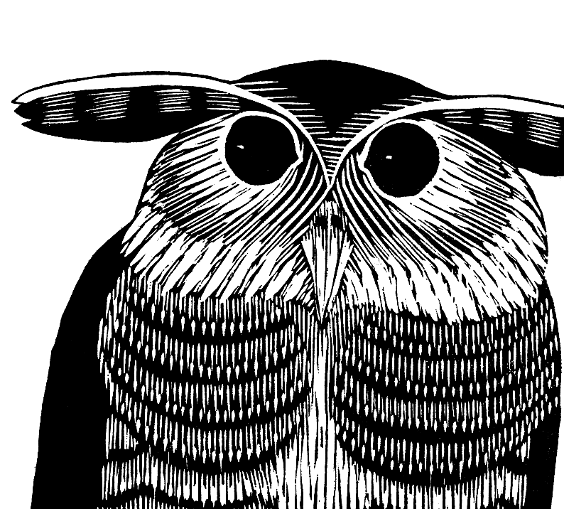 -->

<br>

<div class="dropcap">

Although separated by over 2000 years, the programmers of Silicon Valley face a daunting task
quite similar to the one encountered by the mathematicians of Ancient Greece.
That is, to contribute towards this new approach of augmenting and amplifying human intelligence,
they must climb back down from their current pitch and backtrack to the beginner's mind they once had.

</div>

Not different from learning another mathematical or programming language, they must transition from
their *finitely discrete structures* and *deterministic procedures* tooling they have grown acustomed to
and make the transition to the *infintely continuous structures* and *stochastic procedures*.
Back then, ancient greek mathematicians were only comfortable with the finiteness of natural numbers like $1$, $2$, and $3$,
and had to grapple with the infinite nature of the real numbers such as $\sqrt{2}$, $\pi$, and $e$.
Similarly, the programmers of today are being asked to transition from programming algorithms of *sets, maps, lists, trees, and graphs*
to optimizing the distributions of *scalars, vectors, matrices, tensors, and neural networks*.

More coloquially, programmers interested in the deep learning approach to artificial intelligence must make the transition
from **software 1.0**<span class="defnote">**software 1.0**</span>
to **software 2.0**<span class="defnote">**software 2.0**</span>
<span class="sidenote-number"></span><span class="sidenote">*See [(Karpathy 2017)](https://karpathy.medium.com/software-2-0-a64152b37c35)*</span>,
a distinction used to differentiate the classical act of programming software line by line,
and the newer approach of programming software by specifying a dataset, a neural net architecture with a goal, and searching the space of programs with compute.
How to exactly program with this new approach will take the remainder of the book to explain.

While software 2.0 has increased the intelligence and autonomy of our devices throughout the past decade
— to name a few, language understanding with Google's Translate and Apple's Siri, vision understanding with Tesla Autopilot —
at the end of 2022 **ChatGPT** was released to the world marking the beginning
of **software 3.0**<span class="defnote">**software 3.0**</span>
<span class="sidenote-number"></span><span class="sidenote">*See [(Karpathy 2025)](https://www.youtube.com/watch?v=LCEmiRjPEtQ)*</span>,
enabling the activity of programming with none other than the English language.
What may be surprising to realize is that artificial intelligence like ChatGPT is "just" another computer program.
However, rather than being implemented in a language like C, Java, or Javascript, it's implemented in one that goes by the name of **PyTorch**,
a software 2.0 programming language centered around `torch.Tensor`, a multidimensional array humbly embedded within a Python package.

In this whimsical whirlwind tour dubbed **The Structure and Interpretation of Tensor Programs (SITP)**, we will embark on a quest to build from scratch
our own deep neural network like ChatGPT by implementing [`nanochat`](http://github.com/karpathy/nanochat)
and our own deep learning framework like `torch` by implementing [`borscht`](https://github.com/j4orz/borscht).
Whether you're an eager high school student, an up coming college student, or a battle-tested industrial programmer,
**SITP** has been meticulously designed so that the only prerequisite required
is a basic familiarity with the elements of programming, and high school calculus.
Any additional experience is helpful, not mandatory.
If you'd like to revisit your programming fundamentals, we recommend DCIC, [The Data Centric Introduction to Computing (Fisler, Krishnamurthi, Lerner, Politz)](https://dcic-world.org/) which uses Pyret graduating to Python, and starts with the table data structure (the `torch.Tensor` in disguise!)<span class="sidenote-number"></span><span class="sidenote">*Also, the principle of the design recipe where code follows data is quite relevant for parallel programming.*</span>.

So with that all said, go on young hacker. Venture forth!<br>

## I. Table of Contents

<div class="toc">

- [Overture: A Lean Snake and Parallel Crab](#overture-a-lean-snake-and-parallel-crab)
- [1. Self-Supervised Sequence Learning with Single-Layer Networks](#1-self-supervised-sequence-learning-with-single-layer-networks)
  - [1.1 From Certain to Uncertain Knowledge](#11-from-certain-to-uncertain-knowledge)
    - [1.1.1 From Variables to Random Variables](#111-from-variables-to-random-variables)
    - [1.1.2 Probability as Array Programming](#112-probability-as-array-programming)
  - [1.2 Next Token Prediction is Classification and Compression](#12-next-token-prediction-is-classification-and-compression)
    - [1.2.1 The Estimation of Software 2.0](#121-the-estimation-of-software-20)
    - [1.2.2 Multidimensional Arrays with the Joint, Marginal, and Conditional](#122-multidimensional-arrays-with-the-joint-marginal-and-conditional)
    - [1.2.3 Counting Markov Biased Histograms](#123-counting-markov-biased-histograms)
    - [1.2.4 Some More on Maximum Likelihood Estimation](#124-some-more-on-maximum-likelihood-estimation)
    - [1.2.5 Prediction is Compression is Intelligence](#125-prediction-is-compression-is-intelligence)
    - [1.2.6 Evaluation with Perplexity, and Bias-Variance Tradeoff](#126-evaluation-with-perplexity-and-bias-variance-tradeoff)
  - [1.3 Parameterizing Classification with Logistic Regression](#13-parameterizing-classifcation-with-logistic-regression)
    - [1.3.1 Architecture with Logistic Regression](#131-architecture-with-logistic-regression)
    - [1.3.2 Optimizing Loss with Gradient Descent](#132-optimizing-loss-with-gradient-descent)
    - [1.3.3 Optimizing Loss with Iterative Reweighted Least Squares](#133-optimizing-loss-with-iterative-reweighted-least-squares)
    - [1.3.4 Probabilistic and Decision Theoretic Perspective](#134-probabilistic-and-decision-theoretic-perspective)
    - [1.3.5 Evaluation with Bias Variance Tradeoff](#135-evaluation-with-bias-variance-tradeoff)
  - [1.4 Parameterizing Quantification with Linear Regression](#14-parameterizatnig-quantification-with-linear-regression) <!-- with least squared error -->
  - [1.5 Summary](#16-summary)
  - [1.6 Further Reading](#17-further-reading)
  - [1.7 Problems](#18-problems)
- [Intermezzo One: The Language of Continuous Mathematics](#intermezzo-one-the-language-of-continuous-mathematics)
  - [I.1 Probability Spaces](#i1-probability-spaces)
  - [I.2 Random Variables and their Distributions](#i2-random-variables-and-their-distributions)
  - [I.3 Random Processes and their Kernels](#i3-random-processes-and-their-kernels)
  - [I.4 Measurable Spaces]()
  - [I.5 Vector Spaces](#i6-vector-spaces)
  - [I.6 Convex Sets]()
  - [I.7 Further Reading](#i7-bibliographic-notes)
- [2. The Multidimensional Parallelized Tensor](#2-the-multidimensional-tensor)
  - [2.1 The Three Language Problem]()
  - [2.2 Virtualizing Shapes with Strides]()
  - [2.3 Accelerating Basic Linear Algebra on CPUs](#23-accelerating-matrix-multiplication-on-cpus) <!-- with computation and communication of rooflines -->
  - [2.4 From the BLAS to LAPACK]()
  - [2.5 Singular Value Decomposition]()
  - [2.10 Summary]()
  - [2.11 Further Reading]()
  - [2.12 Problems]()
- [Intermezzo Two: The Language of Numerical Analysis]()

</div>


## Overture: A Lean Snake and Parallel Crab

>Dependent type theory<span class="sidenote-number"></span><span class="sidenote">*Harper's forward to (Friedman and Christiansen 2018)'s [https://thelittletyper.com/](https://thelittletyper.com/)*</span> (...) is a wonderfully beguiling, and astonishingly effective, unification of mathematics and programming. In type theory when you prove a theorem you are writing a program to meet a specification-and you can even run it when you are done! A proof of the fundamental theorem of arithmetic amounts to a program for factoring numbers. And it works the other way as well: every program is a proof that its specification is sensible enough to be implementable. Typе theory is a hacker's paradise.

> In which we introduce and motivate the programming languages used throughout the book, including Lean, Python, Rust, and CUDA Rust.

<br>

<div class="dropcap">

The Structure and Interpretation of Tensor Programs is very much a whimsical whirlwind wonderland tour<span class="sidenote-number"></span><span class="sidenote">*See [http://www.literateprogramming.com/](http://www.literateprogramming.com/)*</span> to the world of deep learning and deep learning systems.
And part of what makes a whirlwind tour so whimsical and wonderful is the mystery of adventure,
but due to the breadth of which the SITP book covers, we briefly explain how the show is about to unfold.
That is, a "how to read this book" if you will, explaining how concepts will be presented and explained.

</div>

The primary story this book tells is the one of how *intertwined* the activities of mathematics and programming are
with respect to the discipline of deep learning. That is, the performance of the systems in which neural networks are trained
on affect bottom line quality as much as their architectures.
As a first approximation, you can conceptualize deep learning frameworks like `torch` and `jax`
as Python packages that provide *accelerated, mathematical* primitives of statistical distributions, high dimensional arrays, and optimizers from probability theory, linear algebra, and calculus.

In SITP however, you will be using a framework called `borscht`, which you can roughly think of a minimal, hackable subset that avoids the complexity and cost that the more industrial frameworks
offer<span class="sidenote-number"></span><span class="sidenote">*After our journey together, you can take a look at the [Afterword](./after.md)
which explains the primary differences between such frameworks, thus bridging you from `borscht` to `torch` and `jax`.*</span>.
In addition, not only will you be *using* `borscht` but also *implementing* your very own.
By the end of the book, you will have a working implementation of `borscht` capable of running distributed training and inference for `nanochat`,
which you are encouraged to modify, extend, and hack on thereafter.
This is effectively the primary purpose of this book: for you to learn deep learning and deep learning *systems* in one unified treatment,
which brings us to our next order of business: presenting the show's cast with a playbill, or in other words, the map of the territory.

In order to provide accelerated mathematical primitives, deep learning frameworks (including `borscht`) are implemented with a variety of programming languages.
For `borscht` specifically, we will be using *four*, namely that of the Lean, Python, Rust, and CUDA Rust programming languages.
Such languages are referred to as host languages because they are *used* to implement the `borscht` deep learning language.
We briefly motivate each language, explain the order in which they will be presented,
suggest possible reading "passes" to iteratively and incrementally deepen your use of each language, and provide alternatives.

First, Python is of course used because that is the primary programming language in which artificial intelligence community conducts its research in,
and for good reason. It's an extremely productive one, especially for researchers who might be not as well versed in the dark arts of casting spells upon the computer.
The first contact of any mathematical concept will be an intuitive and informal one, *using* `borscht` in Python in order to carry out a computation.
Then, the second contact is in between chapters with Intermezzos, which formalize those very same concepts using dependent types provided by the interactive proof assistant `Lean`.
These intermezzos can optionally be skipped upon a first reading.
However, each successive chapter will assume and make use of the formalized concepts within each Intermezzo therein.

The third and fourth contact of a given mathematical concept are in tandem, which involves *implementing* `borscht` in a mix
of the Python, Rust, and CUDA Rust programming languages. Systems programming languages like Rust and CUDA Rust
are used in order to provide native acceleration of multi and massively parallel processors like CPUs and GPUs.
For each mathematical concept, a slower version will be implemented with a mix of Python and Rust, and a faster version will be implemented with CUDA Rust.

If you find yourself more mathematically oriented and disinterested in the high performance computing and performance engineering of such mathematical primitives,
you can skip any sections with CUDA Rust, and implement the sections using Rust with Python.
If you find yourself inclined in such peformance engineering but are not interested in learning the Rust and CUDA Rust programming languages, you can follow along with C/C++ and CUDA C/C++, although the primary difference not much, given that Rust's ownership is simply formalizing many of the language features of C++11 with linear types.
If you find yourself interested in the performance engineering but disinterested in both Rust and C++, you can use CUDA Python.

We surface all this complexity now because we trust you to make the right decision for yourself.
If you want to follow along with a pure Haskell implementation, go for it.
Take charge of your own education, as ultimately you are the captain of your own ship.
This is no different to professors and authors that offer courses and textbooks on compiler construction
provide the freedom for learners to choose the host language you will use for your compiler
— they are assuming that what is new to you is not the host language, but the principles of compiler construction itself.
Similarly, this book is emphatically not about teaching any of the aforementioned four languages, but rather the principles of deep learning and deep learning systems.
That is, these various programming languages are the *means* of SITP rather than the *end*.

With that being said, we briefly provide a unified introduction the three programming languages of Lean, Python, and Rust together so you can compare and contrast with the foundation you already have as a programmer
in [§A. From Problems to Proof](./ap.md#a-from-problems-to-proof),
which constructs various number systems along with some elementary proofs.

With that said, down the rabbit hole we go.

<!-- This sets a very high standard: every rule of inference and every step of a calculation has to be justified by appealing to prior definitions and theorems, all the way down to basic axioms and rules. -->


## 1. Self-Supervised Sequence Learning with Single-Layer Networks

> In which we transition to the stochastic and infinitely continuous software 2.0 by implementing ngram and linear language models with [`borscht`]() using the languages of probability theory, linear algebra, and calculus.

### 1.1 From Certain to Uncertain Knowledge
<small>[$\hookleftarrow$ Table of Contents](#i-table-of-contents)</small>

> In which we have our first encounter with language modeling via GPT-2 and `borscht`, and the foundational notions from probability and linear algebra used, namely random variables, their distributions, and their computational equivalent of the multidimensional array.

<div class="toc">

- [1.1 From Certain to Uncertain Knowledge](#11-from-certain-to-uncertain-knowledge)
  - [1.1.1 From Variables to Random Variables](#111-from-variables-to-random-variables)
  - [1.1.2 Probability as Array Programming](#112-probability-as-array-programming)

</div>

<!-- Because of how pervasive large language models have become over the past few years,
many people are familiar with the ideas that large language models are next token predictors
in the same way that digital computers speak 0s and 1s,
the internet is an intergalactic highway,
and the cloud is some cloud in the computer, -->

#### 1.1.1 From Variables to Random Variables

<small>[$\hookleftarrow$ Table of Contents (§1.1 From Certain to Uncertain Knowledge)](#11-from-certain-to-uncertain-knowledge)</small>

<br>


<div class="dropcap">

The gifts that the information revolution brought forth to humanity, at their essence, have simple explanations.
As a first approximation, the digital computer can be described as 0s and 1s,
the intergalactic computer network as an information highway,
and the cloud as computers in the sky.
The same can be said for those that the intelligence revolution is currently bringing in.
Assistants can be described as LLMs trained with thumbs up or thumbs down,
reasoners as producing chains of thought,
and agents as models that have access to a command line.
This magic is continuing to grow  as people are even composing agents together into swarms
but the key technology that underlies everything is the large language model,
which itself, can be simply explained as a next token predictor.
That is, given some user prompt as input,
it generates an answer by repeatedly producing a probability distribution over the next word,
sampling a word, and appending such word to the input.

</div>

Although ChatGPT, Claude and friends are relatively new to our universe,
the idea of generating sentences with next token prediction is surprisingly not new
and dates back to the work of Russian mathematician Andrey Andreyevich Markov in 1913,
and shortly after Claude Shannon in
1948<span class="sidenote-number"></span><span class="sidenote">*Will the real Claude please stand up?*</span>.
So why is humanity's so-called tech tree late to such technology?
Predominantly for two reasons.

Philosophically, because of the eternal tension between the **discrete**<span class="defnote">**discrete**</span> and **continuous**<span class="defnote">**continuous**</span> methods in describing our reality.
Programmers were reluctant to use stochastic and infinitely continuous techniques,
favoring those that were logical and finitely discrete.
However, ... like a physicist position of every particle in a vacuum,
even with a set of initial equations for position and momentum with equations for
change, **describing reality with too many parts to count**<span class="defnote">**bitter lesson**</span>.
This created the need for statistical mechanics, describing particles with **probability distributions**<span class="defnote">**probability distributions**</span>.

Practically, it's predominantly because of the fossil-fuel like subsidy of **data**<span class="defnote">**data**</span> provided by the aforementioned
intergalactic computer network we call the web,
the **compute**<span class="defnote">**compute**</span> provided by massively parallel processors originally designed for video games
we call graphic processing units (henceforth GPUs),
which can be used efficiently by a neural network **architecture**<span class="defnote">**architecture**</span> called attention.
This is why ChatGPT Claude are called **large language models**<span class="defnote">**large language model**</span>.

<br>

<div class="full-bleed">
<iframe height="500px" loading="lazy" src="https://www.youtube.com/embed/LPZh9BOjkQs?si=FAZSTr1_zkFeSuOf"  title="YouTube video player" frameborder="0" allow="accelerometer; autoplay; clipboard-write; encrypted-media; gyroscope; picture-in-picture; web-share" referrerpolicy="strict-origin-when-cross-origin" allowfullscreen></iframe>
</div>

<small>*Large Language Models explained briefly (Grant Sanderson, 3Blue1Brown 2024)*</small>

<br>

Large language models are trained using methods from the discipline of **deep learning**<span class="defnote" data-refine="deep-learning">**deep learning**</span>,
which in turn, are based in the statistical **machine learning**<span class="defnote" data-refine="machine-learning">**machine learning**</span> approach to artificial intelligence.
This means, in order to produce such a probability distribution over possible next words,
ChatGPT, Claude and others use a lot of mathematical machinery from
the areas of probability theory (clearly), linear algebra, and calculus.
We will introduce such mathematical primitives by keeping our language models simple at first
in [Part I. Elements of Networks](./1.md) — namely what is called the ngram model and linear models
in which the aforementioned Markov and Shannon were working on around a century ago —
before diving into the design of neural network architectures (including transformers with the attention operator) in [Part II. Deep Neural Networks](./2.md)<span class="sidenote-number"></span><span class="sidenote">*Physicists learn the standard model before general relativity. Similarly, we must learn the foundations of machine learning before deep learning.*</span>.

> [!NOTE]
>  If you'd like a more historical and philosophical approach
in how the logical and finitely discrete techniques of software 1.0 failed to build
such conversational machines, you are encouraged to visit [§B. From Symbolic Software 1.0 to Stochastic Software 2.0](./ap.md#b-from-symbolic-software-10-to-stochastic-software-20),
which covers early systems from classical computational linguistics and natural language processing. Namely, `ELIZA`, `LUNAR`, and `CYC`. <br><br> Up ahead we will be intuitively introducing many notions from probability and linear algebra in the context of large language modelling with `numpy`. At any time you find yourself interested in the formal definitions of such concepts — whether before the pump of intuition, in between, or after — you are encouraged to visit [§Intermezzo One: The Language of Continuous Mathematics](#intermezzo-one-the-language-of-continuous-mathematics). <br style="clear: both;">

<div id="gpt2-widget" style="
  font-family: var(--mono-font, 'Source Code Pro', monospace);
  font-size: 0.85em;
  background: var(--quote-bg);
  border-radius: 6px;
  padding: 1rem;
  margin: 1.5rem 0;
">
  <div style="opacity:0.5;font-size:0.8em;margin-bottom:0.5rem;user-select:none;">GPT-2 2019 · next-token probabilities · runs in your browser</div>
  <form id="gpt2-form" style="display: flex; gap: 0.5rem;">
    <input id="gpt2-input" type="text" autocomplete="off" value="Hello world, nice to" placeholder="type a prefix…" style="
      flex: 1;
      min-width: 0;
      background: var(--bg);
      color: var(--fg);
      border: 1px solid var(--quote-border, #444);
      border-radius: 4px;
      padding: 0.4rem 0.6rem;
      font: inherit;
      outline: none;
    ">
    <button type="submit" style="
      background: var(--quote-bg);
      color: var(--fg);
      border: 1px solid var(--quote-border, #444);
      border-radius: 4px;
      padding: 0.4rem 0.8rem;
      font: inherit;
      cursor: pointer;
    ">predict</button>
  </form>
  <div id="gpt2-status" style="opacity:0.5;font-size:0.8em;margin:0.6rem 0;">press predict — GPT-2 (~250 MB) downloads on first use, then runs locally</div>
  <div id="gpt2-out"></div>
</div>
<script type="module" src="assets/gpt2/gpt2-widget.js"></script>
<small>Demo 1.1</small>

Consider the sentence "Hello world, nice to meet you" and feed it into GPT-2 with the words "meet you" missing. When you click the button "predict",
GPT-2 produces a list of real numbers approximately represented by floating points
that are between 0 and 1 and sum (or normalize) to 1,
which is called a **distribution**<span class="defnote" data-refine="distribution">**distribution**</span>,
because it is *distributing* truth across a weighted set of values,
or in other words, it's **uncertainty**<span class="defnote">**uncertainty**</span>.
Each number represents
the **probability**<span class="defnote">**probability**</span>, **chance**<span class="defnote">**chance**</span>, **likelihood**<span class="defnote">**likelihood**</span>, or **belief**<span class="defnote">**belief**</span>
that GPT-2 *assigns* to an **outcome**<span class="defnote">**outcome**</span>, which in this case is the next word.

But rather than produce a distribution with two outcomes like a coin,
six outcomes like a die, or fifty two outcomes like cards,
it produces one for $|V|$ outcomes, where $V$ is the set of words in some vocabulary.
The size of GPT-2's vocabulary is 50257, and the list of probabilities you see
in Demo 1.1 are the top 10 most likely.
As a first approximation, it's not incorrect to view large language models
as an urn containing a ball labeled with each word in the vocabulary.
However, it's important to note in the case of language that some balls are weighted heavier than others.

To be more precise, because we are passing an input sentence,
such a distribution is a **conditional distribution**<span class="defnote" data-refine="conditional-distribution">**conditional distribution**</span>. That is, GPT-2 is producing the distribution of the next word conditioned on the sequence of words passed in as input, and is denoted by

$p(w\underbrace{|}_{\text{given}}\text{input sentence})$

and with Demo 1.1, evaluating GPT-2 is equivalent to $p(w| \text{Hello world, nice to})$.
More accurately, each number in that list of probabilities
is the chance that GPT-2 assigns a **random variable**<span class="defnote" data-refine="random-variable">**random variable**</span>
taking on a specific outcome.
A random variable is like a deterministic variable in that it can take on values,
but rather than being assigned one specific value, it can possibly take on many with a certain degree of chance.
A random variable's distribution then corresponds to an array or list of values which we call a *distribution*
because it *distributes* the truth or state of the random variable across many outcomes.

In the case of GPT-2, the conditional distribution $p(w|h)$'s random variable is denoted with $W|H$.
To make random variables more explicit, some people will denote distributions with their random variables included,
which in our case of a conditional distribution over next words, is $p(W=w|H=\mathbf{h})$ or $p_{W|H}(w|\mathbf{h})$.
However, this brings us to our next point which is that with conditional distributions,
the random variable being conditioned on is actually **no** longer random,
because it is assumed that it has already taken on a value,
in this case
$\mathbf{h} \in \reals^4$ where $\mathbf{h}_0=\text{Hello}$, $\mathbf{h}_1=\text{world}$, $\mathbf{h}_2=\text{nice}, \mathbf{h}_3=\text{to}$.
So, with $p_{W|H}(w|\mathbf{h})$ more generally, there is *no* randomness associated with the history $\mathbf{h}$.
Let us print the distribution over the next word that GPT-2 produces given the history $\text{Hello world, nice to}$ from Demo 1.1:


<div class="full-bleed">

<div class="dual">

{{#nb 1.1_gpt2output.ipynb:1}}

{{#nb 1.1_gpt2output.ipynb:2}}

</div>

</div>

Where the state of $W|H$ is being spread across 50257 possible outcomes of GPT-2's vocabulary.
Each index `i` of the `probs` array corresponds to a value in the token outcomes `tokens[i]`,
with each `probs[i]` corresponding to the chance, or possibility, of the random variable taking on the value `tokens[i]`.
That is, what connects the weighted array `tokens` and the state space `probs` is the index `i`.
It is more accurate then, to describe a **random variable**<span class="defnote" data-refine="random-variable">**random variable**</span> as states represented by indices $i \in \N$,
and the type of a distribution $p$ ends up being some function $p: \N \to [0,1]$
that sends states of indices to their probabilities, such that for all $n\in \N, p(n) \ge 0$
and $\sum\limits_{n \in \N}=1$. In general, any list of values between 0-1 and normalizes to 1 is a valid distribution.
These properties are referred to as *non-negativity* and *normalization* respectively.
We can validate that `probs` is a valid distribution by verifying that each probability is between 0-1 and the distribution normalizes to
1<span class="sidenote-number"></span><span class="sidenote">*However, since we are only including the top 10 most likely words out of 50256, we've re-normalized `probs` so that the total sum of `probs` is 1. The original sum is 0.8181, with the other 1-0.8181=0.1819 spread across the other 50256-10=50246 unseen words.*</span>.
Moreover, since the space of possible outcomes has size of 50257, the random variable $W|H$ is said to be
a **discrete random variable**<span class="defnote">**discrete random variable**</span> with a **probability mass function**<span class="defnote">**probability mass function**</span>
as opposed to a **continuous random variable** with a **probability density function**<span class="defnote">**probability density function**</span>.


**experiment**<span class="defnote">**experiment**</span>
**trial**<span class="defnote">**trial**</span>
**frequency**<span class="defnote">**frequency**</span>

<br><br>

{{#nb 1.1_gpt2output.ipynb:3}}

#### 1.1.2 Probability as Array Programming

<small>[$\hookleftarrow$ Table of Contents (§1.1 From Certain to Uncertain Knowledge)](#11-from-certain-to-uncertain-knowledge)</small>

You may have also noticed
that the output distribution is not a vanilla Python list, but rather one initialized with
[`borscht.tensor(array_like)`](https://numpy.org/doc/stable/reference/generated/numpy.array.html#numpy.array)<span class="defnote">**[`borscht.tensor(array_like)`](https://numpy.org/doc/stable/reference/generated/numpy.array.html#numpy.array)**</span> which constructs the **multidimensional array**<span class="defnote">**multidimensional array**</span> [`borscht.Tensor`](https://numpy.org/doc/stable/reference/generated/numpy.ndarray.html)
from a vanilla Python list.
While we will gradually become more intimately familiar with multidimensional arrays such as the `borscht.Tensor` throughout the course of this adventure, in the current case of `probs`, it's a vector with support in $\reals^{|V|}$, 

{{#nb 1.1_gpt2output.ipynb:4}}

The notebook cell above verifies `probs` is a vector $v \in \reals^{10}$ with the two primary properties of an `ndarray`, namely [`borscht.Tensor.shape`](https://numpy.org/doc/stable/reference/generated/numpy.shape.html#numpy.shape) and [`borscht.Tensor.dtype`](https://numpy.org/doc/stable/reference/generated/numpy.ndarray.dtype.html): `probs.shape`<span class="defnote">**`borscht.Tensor.shape`**</span> and `probs.dtype`<span class="defnote">**`borscht.Tensor.dtype`**</span> evaluating to `(10,)` and `dtype64` respectively means
it's a vector with support in $\reals^{10}$
whose real values are being *approximately* represented with double precision floating point numbers.
For now, we take the computer science perspective of a **vector**<span class="defnote">**vector**</span>, which is simply a list of numbers, without any induced geometry:

<!-- Another important attribute is `ndarray.ndim`<span class="defnote">**`.ndim`**</span>, which is `len(probs.shape)` and reports the rank of an array. Since `probs.ndim` evaluates to 1, it has a rank of 1, or equivalently, is a vector.**row major (todo)**<span class="defnote">**row major (todo)**</span>
**col major (todo)**<span class="defnote">**col major (todo)**</span>
(todo, resulting tensor from `.reshape()` aliases the same underlying storage with different shape and strides. )
(todo rank) -->

<div class="full-bleed">
<iframe height="500px" loading="lazy" src="https://www.youtube.com/embed/fNk_zzaMoSs?si=4VlGYtMLE2ELVsD0"  title="YouTube video player" frameborder="0" allow="accelerometer; autoplay; clipboard-write; encrypted-media; gyroscope; picture-in-picture; web-share" referrerpolicy="strict-origin-when-cross-origin" allowfullscreen></iframe>
</div>

[Vectors | Chapter 1, Essence of linear algebra (3Blue1Brown)](https://youtu.be/fNk_zzaMoSs?si=aYR7qL2UkBDauJtN)

In the video, 3Blue1Brown mentions that vector can be viewed as a fancy word for a list,
which is viewing vectors from the data-oriented perspective. For instance `probs` being some vector $v \in \reals^{10}$.
But if you squint your eyes and view the `probs` array from the functional perspective, is it some function $p: \N \to \reals$<span class="defnote">**statistical learning**</span><span class="sidenote-number"></span><span class="sidenote">*Also, if you squint your eyes at the hashmap data structure (in Python a `dict`) with the functional perspective, it's a function $map: \text{str} \to T$. In fact, there was a [Names Tensor: (Tensor Considered Harmful)](https://nlp.seas.harvard.edu/NamedTensor) proposal by Alexander Rush for treating and viewing tensors more like `dict`s rather than `tuple`s.*</span>.

{{#nb 1.1_gpt2output.ipynb:5}}

That is, the notation $\reals^{10}$ can be viewed as a function $f: \{1,\dots,10\} \to \reals$,
or more generally for $\reals^n$, the function $f: \N \to \reals$.
The two notations are equivalent!

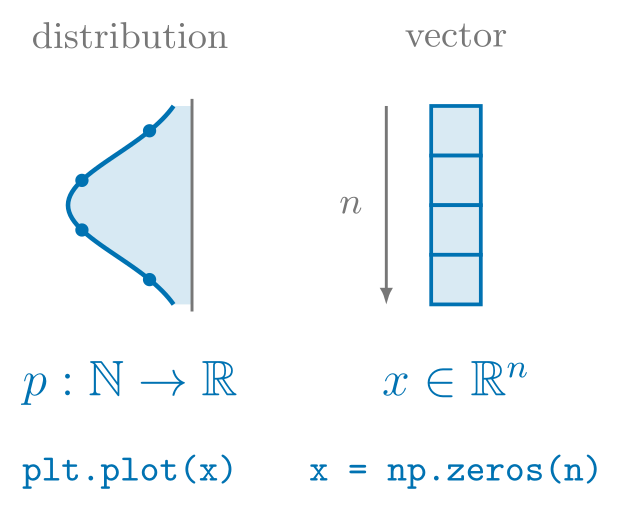

> [!IMPORTANT]
>  **Probability can be seen as array programming**! Every valid distribution which is some function $p: \N \to [0,1]$ whose values are between 0 and 1 and normalizes to 1 has a corresponding [`borscht.Tensor`](https://numpy.org/doc/stable/reference/generated/numpy.ndarray.html) with `.shape` of `(todo)`. <br style="clear: both;">


Returning to the focal point of probability and GPT-2's conditional distribution $p(w|\mathbf{h})$,
we now know that it corresponds with an `ndarray` whose `.shape` is `(50256,)`,
or in other words some vector $\mathbf{x} \in \reals^{50256}$.
More generally, an `ndarray` with `.shape` of `(V)`,
corresponds to a vector with a support $\mathbf{x} \in \reals^{|V|}$, where $V$ is the vocabulary.
(todo: context-length is dimensionality of $\mathbf{h}$).
For convenience sake, we analyzed the top 10 probabilities with an `ndarray` whose `.shape` was `(10,)`,
which corresponded to a vector $\mathbf{x} \in \reals^{10}$.

{{#quiz ../quizzes/test.toml}}


outcomes -> events

- todo **event**<span class="defnote">**event**</span>
- todo **probability of OR**<span class="defnote">**probability of OR**</span>
- todo **sum rule**<span class="defnote">**sum rule**</span>

```python
import numpy as np

# The same GPT-2 output distribution p(w | "Hello world, nice to") from above, top 10 of 50257 words
tokens = ["see", "meet", "hear", "have", "be", "know", "you", "talk", "say", "get"]
probs = np.array([0.3169, 0.1268, 0.1246, 0.1046, 0.0471, 0.0352, 0.0320, 0.0128, 0.0114, 0.0067])

tokens_start_with_h_or_s_and_contains_a_probs = []
for token, prob in zip(tokens, probs):
    stripped = token.strip()
    starts_with_h = stripped.startswith("h")
    starts_with_s = stripped.startswith("s")
    contains_a = "a" in stripped
    if (starts_with_h or starts_with_s) and contains_a:
        tokens_start_with_h_or_s_and_contains_a_probs.append(prob)

prob_starts_with_h_or_s_and_contains_a = sum(tokens_start_with_h_or_s_and_contains_a_probs)

print(f"probability that word starts with letter h: {prob_starts_with_h}")
print(f"probability that word starts with letter s: {prob_starts_with_s}")
print(f"probability that word starts with letter h or s: {prob_starts_with_h + prob_starts_with_s}")
print(f"probability that word starts with letter h or s, and contains letter a: {prob_starts_with_h_or_s_and_contains_a}")

```

- todo: numpy vectorization

So when you ask an LLM a question, it generates a full answer (with many sentences)
word by word by repeating the following loop:

1. evaluating the probability of the next word conditioned on the input
2. selecting (or sampling) a word. halt if the word is the special END word.
3. appending it to the existing text, and evaluating the probability again with the modified input

Now that you understand the basics of language modeling, the trillion dollar question
is how to produce such a conditional distribution $p(w| \mathbf{h})$?
In some sense that's all there is to large language models.

### 1.2 Next Token Prediction is Classification and Compression
<small>[$\hookleftarrow$ Table of Contents](#i-table-of-contents)</small>

> In which we introduce the terminology of software 2.0 in the context of language modeling; the joint, marginal, conditional with multidimensional arrays, reductions, and broadcasting; implement our first language model by maximizing the likelihood of biased ngrams; evaluate said model's limits with information theoretical and probabilistic quantities such as perplexity, entropy, bias variance tradeoff, the curse of dimensionality; and finally, understand intelligence more generally as compression.

<!-- > [!NOTE]
>  This is an important chapter for the method of maximum likelihood estimation, as well as the evaluation of bias variance tradeoff and the curse of dimensionality will be applied to linear models in the following sections. Moreover, in [Part II. Deep Neural Networks](./2.md), we will explore how deep nets solve the bias variance tradeoff and the curse of dimensionality with double descent and decomposition respectively. Make sure to read carefully. <br style="clear: both;"> -->

<div class="toc">

- [1.2 Next Token Prediction is Classification](#12-next-token-prediction-is-classification)
  - [1.2.1 The Estimation of Software 2.0](#121-the-estimation-of-software-20)
  - [1.2.2 Multidimensional Arrays with the Joint, Marginal, and Conditional](#122-multidimensional-arrays-with-the-joint-marginal-and-conditional)
  - [1.2.3 Counting Markov Biased Histograms](#123-counting-markov-biased-histograms)
  - [1.2.4 Some More on Maximum Likelihood Estimation](#133-optimizing-loss-with-iterative-reweighted-least-squares)
  - [1.2.5 Prediction is Compression is Intelligence]()
  - [1.2.6 Evaluation with Perplexity, and Bias-Variance Tradeoff]()
  - [1.2.7 Further Viewing and Reading]()

</div>

#### 1.2.1 The Estimation of Software 2.0
<small>[$\hookleftarrow$ Table of Contents (§1.2 Next Token Prediction is Classification)](#12-next-token-prediction-is-classification-and-compression)</small>

<br>


<div class="dropcap">

After [§1.1 From Certain to Uncertain Knowledge](#11-from-certain-to-uncertain-knowledge),
you are now initiated with the basics of language modeling where models such as GPT-2 are conditional distributions
of a sentence's next word given those that have already occured, namely $p(w|\mathbf{h})$.
For instance, with the input text `"Hello world, nice to meet"` as the history $\mathbf{h}$,
GPT-2 produces a conditional distribution with an `ndarray` of `.shape` `(V,)` which corresponds to a vector with support in $\reals^{|V|}$
— since we are only taking the top 10 most likely words though, `.shape` is `(10,)` with support in $\reals^{10}$.
We now shift our attention from *using* language models to *implementing* ones, namely the conditional distribution $p(w|\mathbf{h})$ GPT-2.
We will incrementally increase the expressivity of our models culminating with GPT-2's transformer architecture in [Part II. Deep Neural Networks](./2.md). But for now, we start with the basics and return to first principles.

</div>

As mentioned in the previous chapter, large language models are trained using methods from the discipline of **deep learning**<span class="defnote" data-refine="deep-learning">**deep learning**</span>,
which in turn are based in **machine learning**<span class="defnote" data-refine="machine-learning">**machine learning**</span>,
which in turn are based in **statistical learning**<span class="defnote">**statistical learning**</span><span class="sidenote-number"></span><span class="sidenote">*Actually, the implementation of learning is not just limited to the stochastic and infinitely continuous methods of software 2.0, more classically known as connectionism. It's also possible to implement with logical and finitely discrete methods of software 1.0 (symbolism), albeit with much less success. See inductive logic programming also known as reverse deduction [https://en.wikipedia.org/wiki/Inductive_logic_programming](https://en.wikipedia.org/wiki/Inductive_logic_programming).*</span>,
which in turn are based in **statistical inference**<span class="defnote">**statistical inference**</span>,
which in turn employs the use of **statistical estimation**<span class="defnote">**statistical estimation**</span>.
What the heck are the meanings of all these terms?
Roughly speaking, people in the business of estimation like AI researchers at frontier labs
are given data (in statistical jargon, observe samples) such as the internet and would like to *estimate* distributions (of the population) from said data,
namely a $p(w|\mathbf{h})$ like GPT-2.
Estimation of distributions is one possible activity of making *inferences* from data
— as opposed to simply *describing* data<span class="sidenote-number"></span>
<span class="sidenote">*See [https://en.wikipedia.org/wiki/Descriptive_statistics](https://en.wikipedia.org/wiki/Descriptive_statistics).*</span> —
another useful form of inference is *hypothesis testing*<span class="sidenote-number"></span><span class="sidenote">*See [https://en.wikipedia.org/wiki/Statistical_hypothesis_test](https://en.wikipedia.org/wiki/Statistical_hypothesis_test).*</span>, the process of
deciding whether observed data provide sufficient evidence to reject a null hypothesis.
Estimation however is the primary statistical tool used as opposed to hypothesis testing,
and once a distribution like $p(w|\mathbf{h})$ is estimated from data by research labs,
users can use such a distribution in order to generate sentences — hence this most recent wave of statistical methods from software 2.0 being coloquially known as **genai**<span class="defnote">**genai**</span>, other previous monikers being **big data**<span class="defnote">**big data**</span>, **data mining**<span class="defnote">**data mining**</span>, **data science**<span class="defnote">**data science**</span>, and **pattern recognition**<span class="defnote">**pattern recognition**</span> — with an inference loop,
namely predicting a distribution over the next token, sampling and appending a token to the history and repeating.

Generally speaking, the difference in direction of estimating a distribution from data
versus generating data from a distribution is the primary distinction between probability and statistics,
although the line as we will soon see gets quite blurry<span class="defnote">**synthesis**</span><span class="sidenote-number"></span><span class="sidenote">*In the same way traditional data and function blurs with software 1.0, since functions are also data.*</span>.
This distinction between the two is more broadly known as the difference between **analysis**<span class="defnote">**analysis**</span> and **synthesis**<span class="defnote">**synthesis**</span><span class="sidenote-number"></span><span class="sidenote">*See [https://plato.stanford.edu/entries/analytic-synthetic/](https://plato.stanford.edu/entries/analytic-synthetic/)*</span>.
Researchers analyze the observed data of the internet and recover an estimated distribution
whereas users synthesize data and generate sentences.
Sometimes they are referred to with direction in time: synthesis is the forward direction whereas analysis is the backward or inverse.
Throughout the book, we will incrementally explore increasingly expressive languge models
that can do a better job at recovering  $p(w|\mathbf{h})$ from data.

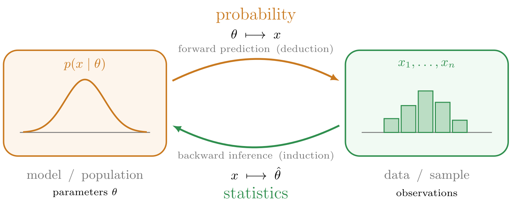

The availibility of said data determines the regime of statistical learning.
That is, if sample data is available in the form of input-output pairs
$d:=\{(\mathbf{x}^{(i)}, \mathbf{y}^{(i)})\}_{i=1}^{n}$, then the regime is known to be **supervised learning**<span class="defnote">**supervised learning**</span>, for the machine that is attempting to learn a distribution via induction is being *supervised* with the expected outputs, whereas the regime where such data is unavailable is known as **unsupervised learning**<span class="defnote">**unsupervised learning**</span>.
Where in unsupervised learning the goal of inference
is that of understanding (todo, foreshadow ebm?) like clustering or dimensionality reduction,
in the regime of supervised learning the goal is the aforementioned statistical estimation of a function
that predicts the expected output given the input. For instance, with the following supervised dataset (todo):

<div class="dual">

$$
\begin{aligned}
d:= &\{ \\
    &( \underbrace{\text{"Hello world, nice to"}}_{\mathbf{x}^{(1)}}, \underbrace{\text{"meet"}}_{\mathbf{y}^{(1)}} ) \\
    &(\text{"Hello world, nice to"}, \text{"see"}) \\
    &(\text{"Hello world, nice to"}, \text{"finally"}) \\
    &(\text{"Hello world, nice to"}, \text{have"}) \\
  \}
\end{aligned}
$$

{{#nb 1.2_bigram.ipynb:4}}

</div>

The goal of language modelling then is to estimate some function $f$ that when given input text $\mathbf{x}$, predicts the next word $\mathbf{y}$.
That is, some function $f: \mathscr{X} \to \mathscr{Y}$, where $\mathscr{X}$ is the input space of all possible *sentences*,
and $\mathscr{Y}$ is the output space of all possible next *words*. To construct such input and output spaces,
recall that a space of all words is the set $V$, which contains the words in a language model's vocabulary.
Then, a sentence is any $t$-length finite sequence $(v_1, v_2, \dots, v_t)$ of such words, and the set of all possible sentences *of length* $t$ is
the cartesian product $\underbrace{V \times \cdots \times V}_{\text{t times}}$, denoted with $V^t$.
This means, the space of all such sentences for all values $t$ is the union of sets $\cup_{t=0}^{\infty} V^t$ denoted by $V^{*}$,
and so finally, the target function to be estimated in language modelling has the form $f: V^{*} \to V$.
That is, the input space $\mathscr{X} := V^{*}$ is the set of all possible sentences, and the output space $\mathscr{Y} := V$ is the set of all possible words.

Moreover, the regime of supervised learning is further refined depending on the kind of output the estimated function is predicting.
In the case of a *categorical* output, the supervised learning is known as **classification**<span class="defnote">**classification**</span> for the machine's goal (the estimated function's output) is trying to classify the input's category.
The function $f$ is known as a classifier or **discriminant function**<span class="defnote">**discriminative function**</span> since it is classifying or discriminating an input $x \in \mathscr{X}$ as a particular $y \in \mathscr{Y}$.
Language modelling in particular is considered classification because given the input sentence $s \in V^{*}$, the next most likely token is being classified out of all tokens $v \in V$.
This stands in contrast to the case when the output that the estimated function is predicting is *quantitative*, which is known as **regression**<span class="defnote">**regression**</span>.
But for the classification of language modeling, how do we reconcile the goal of estimating some function $f: V^{*} \to V$, when GPT-2 is the probability distribution $p(w|\mathbf{h})$
which is a function of type $p_W: \N \to [0,1]$?
This motivates the distinction between what is known as the **inference**<span class="defnote">**inference**</span>
and **decision**<span class="defnote">**decision**</span> steps of classification
where in the inference stage a distribution $p(y)$ over the output space $\mathscr{Y}$ is first produced, subsequently followed by a decision stage which makes the assignment of $x$ by selecting a specific $y$.

Somewhat more confusingly, depending on the domain or context of statistical modeling,
the terminology for inputs $x$ and outputs $y$ might be further refined.
That is, inputs and outputs are also respectively referred to as **independent variable**<span class="defnote">**independent variable**</span>
and **dependent variables**<span class="defnote">**dependent variable**</span>,
as well as
**predictors**<span class="defnote">**predictors**</span>
and **responses**<span class="defnote">**responses**</span> in the context of experimental design.
They can also be referred to as
**features**<span class="defnote">**features**</span>
and **targets**<span class="defnote">**targets**</span>.
The difficulty of naming is not limited to the discipline of
programming<span class="sidenote">*See [https://martinfowler.com/bliki/TwoHardThings.html](https://martinfowler.com/bliki/TwoHardThings.html)*</span>.
Whatever you want to call them, at the heart of statistical learning, machine learning and deep learning is the activity of estimation, or approximations functions with inputs and outputs.
**two cultures of statistics**<span class="defnote">**two cultures of statistics**</span>

> [!WARNING]
>  (todo, cleanup also add the two culture parsing/interpretation of the term.) Inference is an overloaded term, and hence ambiguous without context! In generative AI the term inference refers to the forward process of evaluating a population's distribution $p(w|\mathbf{h})$ in order to generate samples via prediction. In classical statistics the term inference refers to the backward process of inferring a population's distribution from observed samples (todo estimation and hypothesis testing). Unfortunately terminology and jargon is just like syntax with programming languages! You will need to adjust the meaning of symbols depending on the context, which to foreshadow is precisely what the attention mechanism behind GPT-2's transformer architecture ends up achieving. <br style="clear: both;">

#### 1.2.2 Multidimensional Arrays with the Joint, Marginal, and Conditional

<small>[$\hookleftarrow$ Table of Contents (§1.2 Next Token Prediction is Classification)](#12-next-token-prediction-is-classification-and-compression)</small>

<br>

<div class="dropcap">

Now that we understand the process of language modelling is to estimate a classifying discriminator $f: V^{*} \to V$ which assigns a next word $v \in V$ given a sentence $s \in V^{*}$ under a self-supervised setting with access to input-output paired data $d := \{(\mathbf{x}^{(i)}, y^{(i)})\}_{i=1}^{n}$,
how do we actually go about estimating the distribution $p(w|h)$?
We know that $p_{W|H}(w|h)$ *denotes* the conditional distribution of the next word given the history of sentence thus far, we know this distribution *corresponds* to a [`borscht.Tensor`](https://numpy.org/doc/stable/reference/generated/numpy.ndarray.html) with `.shape` `(V)`, and we know the function *type* is $p_{W|H}: V^{*} \to \Delta^{|V|}$ (todo: $\Delta^{|V|}$ can be viewed as $|V| \to \reals$) which maps sentences to distributions over next words, but what is the actual function *body* or *definition* of a conditional distribution?

</div>

<!-- to compose with a decision boundary (todo) resulting in $f$? -->

First, let us modify our notation, unravelling the history vector $\mathbf{h}$ into individual word components $w_1, w_2, \dots, w_t$ so that $p(w_{t+1}|w_1, w_2, \dots, w_t)$
denotes the conditional probability of t+1'th word given the previous t words.

Let us first start by generalizing the notion of a distribution of a single random variable $p_X: \N \to \reals$ corresponds to a *flat* array of real-valued numbers satisfying non-negativity and normalization to that of a **joint distribution**<span class="defnote" data-refine="distribution">**joint distribution**</span>, defined as a *high dimensional* function $p_{X_1, \dots, X_t}$ with type $p_{X_1, \dots, X_t}: \reals \times \cdots \times \reals \to [0,1]$ corresponding to a *multidimensional* array,
with both mapping the values of $t$ random variables to their probabilities<span class="sidenote-number"></span><span class="sidenote">*As we will see shortly, we use $t$ for time since language has a sequential order, given that $n$ already denotes the length of the dataset $d:=\{(x^{(i)}, y^{(i)})\}_{i=0}^{n}$. Naming is hard!*</span>. That is, evaluating $p_{X_1, \dots, X_t}(x_1, \dots, x_t)$ produces a *single* probability for random variable $X_1$ taking on the value $x_1$ *and* $X_2$ taking on the value $x_2$ *and* so on, up until the random variable $X_t$ taking on the value $x_t$ — the commas are read as "and" (todo, better explanation?). Because the joint can be a distribution of two random variables, three, up to an arbitrary t, it's often vectorized as $p_{\mathbf{X}}(\mathbf{x})$.

In the case of (probabilistic) language modeling, the primary joint distribution of interest is the probability of a *fixed* t lengthed sentence occuring, which is $p_{W1,W2,\dots,W_t}(w_1,w_2,\dots,w_t)$ or $p(\mathbf{w})$  with $w \in \reals^{t}$, where the $W_i$'th random variable represents the $i$'th word in the $t$-lengthed sentence. For instance, $p(w_1=\text{Hello}, w_2=\text{nice}, w_3=\text{to}, w_4=\text{meet}, w_5=\text{you})$ is the probability of the complete sentence `"Hello nice to meet you"` (todo, instead of distribution over words, it's a distribtion over sentences).

> [!WARNING]
>  Note with the random variables being modeled the way they are (that is, *with* order) that the joint $p(w_1,\dots, w_t)$ is commutative. For instance, with $n:=2$, $p(\cin{w_1}, \cout{w_2}) = p(\cout{w_2},\cin{w_1})$. For instance, semantically speaking, $p(\cin{w_1}=\text{Hello},\cout{w_2}=\text{world})=p(\cout{w_2}=\text{world}, \cin{w_1}=\text{Hello})$ is saying that the probability of the first word being "hello" and the second word being "world" is equal to the probability of the second word being "world" and the first word being "hello". This holds more generally for any permutation of $w_1, w_2, \dots, w_t$. <br style="clear: both;">

With us defining the notion of a joint probability as a multidimensional array, it's probably no surprise that the joint distribution $p_{\mathbf{w}}(\mathbf{w})$ corresponds to a [`borscht.Tensor`](https://numpy.org/doc/stable/reference/generated/numpy.ndarray.html) with `.shape` `(V,...,V)` where `.ndim` is `t`. That is, `.shape` is a `t`-lengthed tuple. Take a look at Figure 1.2.2 below:

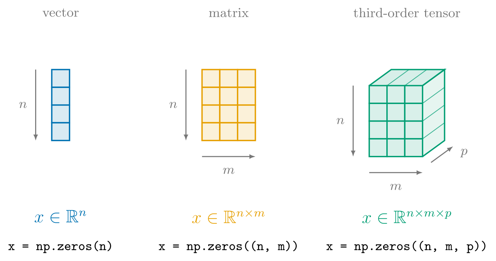

Figure 1.2.2<span class="sidenote-number"></span><span class="sidenote">*Alas, we failed to not use $n$ here. This $n$ is not the same $n$ as the length of the dataset (todo, you already introduced $\reals^n$ before you introduced $d$..).*</span>

In particular, let us consider the joint distribution of two random variables $p_{X,Y}$, whose 2 dimensional surface can be plotted. This distribution has type $p_{X,Y}: \N \times \N \to \reals$, which corresponds to a [`borscht.Tensor`](https://numpy.org/doc/stable/reference/generated/numpy.ndarray.html) with a `.shape` of `(n,m)` — a **matrix**<span class="defnote">**matrix**</span> supported in $\reals^{n \times m}$, or in other words, a $n$ by $m$ *rectangular* array that maps indices in $\{0,1,\dots,n\} \times \{0,1,\dots, m\}$ to their values in $\reals$.
The code example initializes a matrix with `np.zeros((n,m))`, presumably populates it with values, and plots the surface with `ax.plot_surface()`.

The joint of three random variables $p_{X,Y,Z}: \N \times \N \times \N \to \reals$ is plotted as what is known as a voxel plot (it's difficult to see 4 dimensions alltogether), which corresponds to a [`borscht.Tensor`](https://numpy.org/doc/stable/reference/generated/numpy.ndarray.html) with a `.shape` of `(n,m,p)` — a **tensor**<span class="defnote">**tensor**</span> supported in $\reals^{n \times m}$, a *cubic* array that maps indices in $\{0,1,\dots,n\} \times \{0,1,\dots, m\} \times \{0,1,\dots, p\}$ to their values in $\reals$. (todo, remark on naming with tensor.)
Similarly, the tensor is initialized with `np.zeros((n,m,p))`, is filled with values, and is plotted with `ax.voxels(x)`.

> [!IMPORTANT]
>  Once again, **probability can be viewed as array programming!** (go to previous important remark, and complete todo) <br style="clear: both;">

> [!WARNING]
>  A 10-dimensional vector is some $\mathbf{x}^{(1)} \in \reals^{10}$. A 100-dimensional vector is some $\mathbf{x}^{(2)} \in \reals^{100}$. Both vectors $\mathbf{x}^{(1)}$, and $\mathbf{x}^{(2)}$, have a rank of 1, hence why they are both considered vectors. Unfortunately with numpy a rank is stored under the `ndarray.ndim` attribute. <br><br>So, an array whose `ndarray.ndim` evaluates to 2 is not some vector $\mathbf{x}^{(3)}\in \reals^2$ but rather, an array that is some matrix $\mathbf{x}^{(4)} \in \reals^{n\times m}$, where $n$ and $m$ are unknown since `ndarray.shape` was not supplied. Conversely, a multidimensional array is not simply a flat array with arbitrary length $n$ to corresponding to any vector in $\reals^n$, but rather an array with arbitrary rank $n$ corresponding to any tensor $\mathbf{x}^{(4)}\in\reals^{d_1 \times d_2 \times \cdots \times d_n}$. **That is, multidimensional arrays are more accurately described as multirank arrays!** <br style="clear: both;">

Returning to the joint distribution of interest to language modeling, namely the probability of a sentence taking on specific words $p(W_1=v_i, W_2=v_i, \dots, W_t=v_i)$ where $v_i \in V$, let $t:=2$ so that we can consider the joint of two random variables $p(\cin{W_1=v_i}, \cout{W_2=v_j})$,
which corresponds to a matrix represented by a `ndarray` with `.shape` of `(V,V)`, in this case `(5,5)`.
In Figure 1.2.3, the surface on the left and the matrix on the right represent the same distribution $p_{\cin{W_1}, \cout{W_2}}(\cin{v_i},\cout{v_j})$. These values are one *possible* assignment to the function body $p_{\cin{W_1} \times \cout{W_2}}: \N \times \N \to \reals$, or equally, one *possible* assignment to the `ndarray`. For instance, we see that $p_{\cin{W_1}, \cout{W_2}}(\cin{\text{to}}, \cout{\text{meet}})=0.16$. (todo, it's really $p(W_1=3, W_2=4)$. (todo, table is technically infinite. t is not fixed.). Note that the corresponding $v_i \in V$ is provided, even though the distribution is defined on $\N$.

<div class="full-bleed">
<div class="dual">
  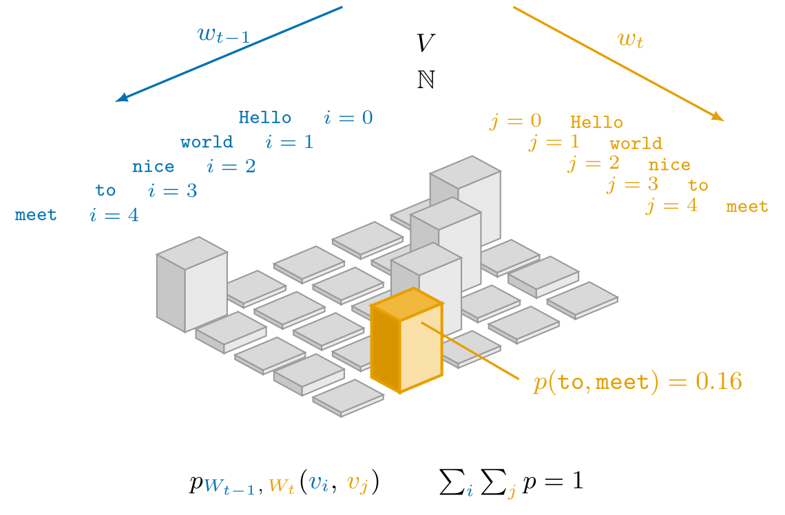
  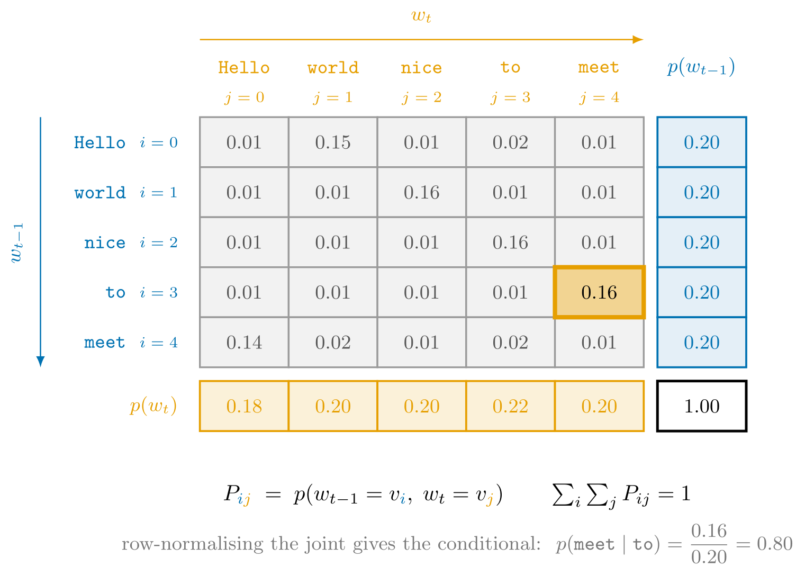
</div>
</div>

<small>Figure I.2.3</small>

- modify left figure to highlight the 0.15 and 0.16s
- why is the marginal a uniform (0.2)?

For a single random variable $W_i$, we can see that the truth of it's state is indeed distributed across the vocabulary $V$. For instance, scanning the <span class="okabe-blue">blue arrow from top to bottom</span>, we see that state of random variable $\cin{W_1}$ is distributed across five words. In particular, for one of those values $i=3$ which corresponds to $\text{to}$, it's state in of itself is distributed across $\cout{W_2}$ with the <span class="okabe-orange">orange arrow from left to right</span>. For instance, the chance of `"to meet"`should be more likely than `"to to"`.
The code for this joint is the transliteration of the matrix from Figure I.2.3 into [`borscht.Tensor`](https://numpy.org/doc/stable/reference/generated/numpy.ndarray.html) with `.shape`of `(5,5)`:

{{#nb 1.2_bigram.ipynb:8}}

Let us note two technical aspects of `borscht`.
The first place to draw your attention to is in the particular choice of naming the joint distribution as `p_VV`.
The `_VV` suffix is documentation-based coding brought back from the dead<span class="sidenote-number"></span><span class="sidenote">*See Hungarian notation [https://en.wikipedia.org/wiki/Hungarian_notation](https://en.wikipedia.org/wiki/Hungarian_notation). Also see [Google's C++ Style Guide](https://google.github.io/styleguide/cppguide.html#Windows_Code) — a somewhat representative and perhaps canonical standard of most source conventions — frown on Hungarian notation. Finally see [Named Tensor (Tensor Considered Harmful) (Rush)](https://nlp.seas.harvard.edu/NamedTensor) and [Named Tensor Notation (Chiang et al.,)](https://namedtensor.github.io/).*</span>
as a reading aid to humans and fellow LLMs to denote that the [`borscht.Tensor`](https://numpy.org/doc/stable/reference/generated/numpy.ndarray.html) has a `.shape` of `(V, V)`, where in this case `V` evaluates to 5. We even assert such fact with `assert p_VV.shape == (V, V)`.
Such judgement can actually be enforced by typechecking dynamically at runtime with the [`jaxtyping`](https://docs.kidger.site/jaxtyping/) Python package, particularly `Float[np.ndarray, "V V"]` (expand on jaxtyping and python typechecking):

{{#nb 1.2_bigram.ipynb:9 hl=4-5,20-21,30-32}}

The function `printp_VV` takes a parameter `p_VV` with type `Float[np.ndarray, "V V"]`,
so the first invocation with the argument `p_VV` itself passes.
Mutating `p_VV` to alias a `borscht.Tensor` with `.shape` `(3,)`
and applying the function a second time results in a type error.

Second, notice how the value of $p_{\cin{W_1}, \cout{W_2}}(\cin{\text{to}}, \cout{\text{meet}})$
is retrieved with `p_VV[toi, meeti]`. (todo, curry by indexing into first or second):

{{#nb 1.2_bigram.ipynb:10}}

Now, with `borscht` technicalities of shape suffixes and indexing aside, let us move onto the next probabilistic concept of the marginal.
From this joint distribution of two random variables $p_{\cin{W_1}, \cout{W_2}}$, we can *recover* both distributions of single random variables $p_{\cin{W_1}}$ and $p_{\cout{W_2}}$.
Consider again that second "level" of distribution. That is, the specific state of $\cin{W_1=\text{to}}$ being distributed in of itself across the first row of the matrix according to $\cout{W_2}$. We can "take out" the randomness of $\cout{W_2}$ by *summing* all the entries in the first row, and no longer have this second level or axis of state being distributed, and are simply left with $p_{\cin{W_1}}(\text{to})=0.2$. In general, for any $v_i$, we have that $p_{\cin{W_1}}({\cin{v_i}})=\sum\limits_{v_j \in V}p_{\cin{W_1}, \cout{W_2}}(\cin{v_i},\cout{v_j})$. Note that $\cin{v_i}$ is fixed! In the context of recovering a distribution of a single random variable *from* a joint distribution, such single random variable distribution is referred to as the **marginal distribution**<span class="defnote">**marginal distribution**</span>.

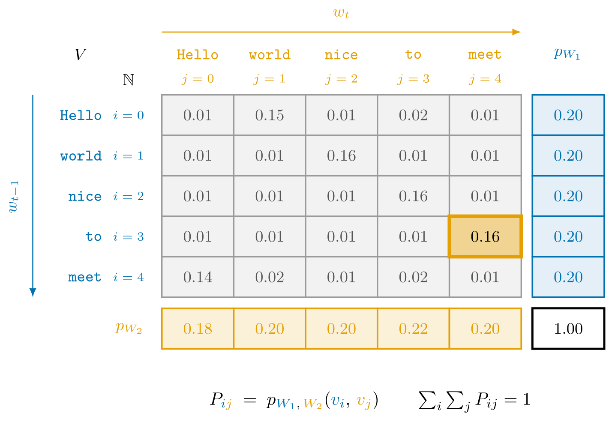

Transliterating this to `borscht`, we use `borscht.Tensor.sum()`<span class="defnote">**`borscht.Tensor.sum`**</span> **reduce operation**<span class="defnote">reduction</span> (expand):

{{#nb 1.2_bigram.ipynb:11}}

(todo: generalize for $t$ randvars) [`torch.sum`](https://docs.pytorch.org/docs/2.13/generated/torch.sum.html#torch.sum)

After generalizing the notion of a distribution into a joint distribution, and recovering marginals from said joint, we are now finally ready to backtrack to refining the notion of the conditional.
$p_{\cin{W_1}, \cout{W_2}}(\cin{\text{to}}, \cout{\text{meet}})=\frac{0.16}{0.2}=0.8$.

{{#nb 1.2_bigram.ipynb:12}}


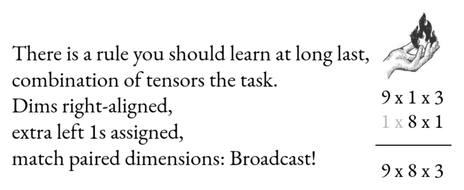

[Tensor Puzzles (Sasha Rush, Marcos Treviso)](https://github.com/srush/Tensor-Puzzles)

More generally,
**broadcasting**<span class="defnote">**broadcasting**</span>
*broadcast divide*

**conditional distribution**<span class="defnote" data-refine="conditional-distribution">**conditional distribution**</span>

$$
\underbrace{p_{\cout{W}|\cin{H}}(\cout{w}|\cin{h})}_{\text{conditional}}\stackrel{\triangle}{=} \frac{\overbrace{p_{\cout{W},\cin{H}}(\cout{w},\cin{h})}^{\text{joint}}} {\underbrace{p_{\cin{H}}(\cin{h})}_{\text{marginal}}}
$$

so, the conditional is defined as the joint over the marginal distribution that is being conditioned on. **chain rule**<span class="defnote">**chain rule**</span> **product rule**<span class="defnote">**product rule**</span> (decomposing a joint of sentences with a chain of conditionals over words requires proof (ntermezzo).)


#### 1.2.3 Counting Markov Biased Histograms
<small>[$\hookleftarrow$ Table of Contents (§1.2 Next Token Prediction is Classification)](#12-next-token-prediction-is-classification-and-compression)</small>

- (todo, explain data d)
- simplest idea: unbiased estimator count the relative frequency (which is the MLE) $\frac{h, w}{h}$
- need chain/product rule here. but do not introduce bayes rule, for that will introduce discriminant vs generative modeling.
- intractable, so need to introduce bias. with markov assumption (truncated conditional in chain rule)

Rather than strive for perfection, we can achieve the good by introducing some **bias**<span class="defnote">**bias**</span>, known as the **Markov assumption**<span class="defnote">**markov assumption**</span>.

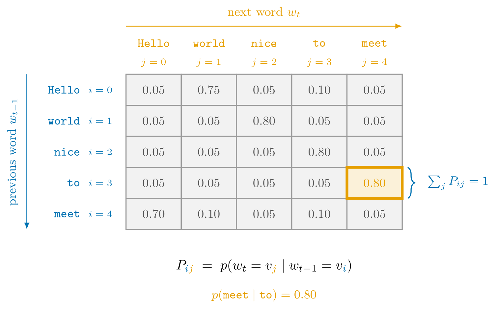

<!-- - definitions of rvs using calculus/analysis
- bernouilli an n=1 binomial
- categorical (an n=1 multinomial) -->
<!-- maximum likelihood estimation for bernouilli (binomial), categorial (multinomial) -->
<!-- empirical risk minimization -->
<!-- maximum a posteriori -->

{{#nb 1.2_bigram.ipynb:2}}

{{#nb 1.2_bigram.ipynb:3}}

{{#nb 1.2_bigram.ipynb:5}}

> [!WARNING]
>  WATCH the first hour, until 1:03 <br style="clear: both;">

<div class="full-bleed">
<iframe height="500px" loading="lazy" src="https://www.youtube.com/embed/PaCmpygFfXo?si=Vjp1DW-mwPUJFQ5B&amp;start=178"  title="YouTube video player" frameborder="0" allow="accelerometer; autoplay; clipboard-write; encrypted-media; gyroscope; picture-in-picture; web-share" referrerpolicy="strict-origin-when-cross-origin" allowfullscreen></iframe>
</div>

[Karpathy's spelled-out intro to language modeling: building makemore](https://youtu.be/PaCmpygFfXo?si=_t6ONP69v5t-wvHB&t=178)


{{#nb 1.2_bigram.ipynb:6}}

{{#nb 1.2_bigram.ipynb:7}}


#### 1.2.4 Some More on Maximum Likelihood Estimation
<small>[$\hookleftarrow$ Table of Contents (§1.2 Next Token Prediction is Classification)](#12-next-token-prediction-is-classification-and-compression)</small>

concepts
- bernouilli
- likelihood
- log likelihood
- negative likelihood
- optimizing likelihood
- loss
- entropy
- cross entropy loss

<!-- <div class="full-bleed">
  <iframe loading="lazy" height="500px" src="//player.bilibili.com/player.html?bvid=BV1kwBhY4EvW&p=21&t=435&high_quality=1&autoplay=false" title="Bilibili video player" scrolling="no" frameborder="no" allowfullscreen="true"></iframe>

  [Stanford CS109 Probability for Computer Scientists I M.L.E. I 2022 I Lecture 21
  ](https://youtu.be/utFEufMXHgw?t=435)
</div> -->

#### 1.2.5 Prediction is Compression is Intelligence
<small>[$\hookleftarrow$ Table of Contents (§1.2 Next Token Prediction is Classification)](#12-next-token-prediction-is-classification-and-compression)</small>

<div class="full-bleed">
<iframe height="500px" loading="lazy" src="https://www.youtube.com/embed/l6DKRf-fAAM?si=4Ee7_pRjZfLteRs2"  title="YouTube video player" frameborder="0" allow="accelerometer; autoplay; clipboard-write; encrypted-media; gyroscope; picture-in-picture; web-share" referrerpolicy="strict-origin-when-cross-origin" allowfullscreen></iframe>
</div>

[Reinventing Entropy | Compression is Intelligence Part 1 (3Blue1Brown 2026)](https://youtu.be/l6DKRf-fAAM?si=e0CzpHt6EX0ZknoB)


#### 1.2.6 Evaluation with Perplexity, and Bias-Variance Tradeoff
<small>[$\hookleftarrow$ Table of Contents (§1.2 Next Token Prediction is Classification)](#12-next-token-prediction-is-classification-and-compression)</small>

### 1.3 Parameterizing Classifcation with Logistic Regression
<small>[$\hookleftarrow$ Table of Contents](#i-table-of-contents)</small>

> In which we parameterize classification with a set of weights and biases known as the logistic regression model, which corresponds to a single neuron in a deep network; use the cross entropy loss; iteratively optimize such loss by straddling both linear algebra and differential calculus with iterative reweighted least squares; motivate cross entropy loss and least squares with them more general assumptions from the probabilistic and decision theoretic perspectives; and finally, evaluate

<div class="toc">

- [1.3 Parameterizing Classification]()
  - [1.3.1 Architecture with Logistic Regression](#131-architecture-with-logistic-regression)
  - [1.3.2 Loss Function with Cross Entropy Loss](#132-loss-function-with-cross-entropy-loss)
  - [1.3.3 Optimization with Iterative Reweighted Least Squares](#133-optimizing-loss-with-iterative-reweighted-least-squares)
  - [1.3.4 Probabilistic and Decision Theoretic Perspective]()
  - [1.3.5 Evaluation with Bias Variance Tradeoff]()
  - [1.3.6 Further Viewing and Reading]()

</div>

#### 1.3.1 Architecture with Logistic Regression

<small>[$\hookleftarrow$ Table of Contents (§1.3 Parameterizing Classification)](#13-parameterizing-classifcation-with-logistic-regression)</small>

<br>

<div class="dropcap">

With a better understanding of the machine learning process that models language as a probabilistic phenomena and estimates some classifying discriminator $\hat{f}: \mathscr{X} \to \mathscr{Y}$ that assigns a $\mathbf{y}$ for a given $\mathbf{x}$ where $\mathscr{X} := V$ and $\mathscr{Y} := V^{*}$ from self-supervised data $d:=\{(\mathbf{x}^{(i)}, y^{(i)})\}_{i=1}^{n}$,

Recall in [§1.2 Next Token Prediction is Classification](#12-next-token-prediction-is-classification) we estimated $\hat{f}$
with $f(v) := I^{-1} \circ \text{rng} \circ P \circ I(v)$, where the hashmap $I: V \to \N$ corresponding to `c2i` mapped words to indices, the stochastic matrix $P: \N \times \N \to \reals$
curried indices to their row distributions over next tokens, (todo) $\text{rng}$ mapped distributions to one specific word class index, and the inverted hash map $I^{-1}: \N \to V$ mapped the index back to the actual word.
The core machinery of $\hat{f}$ was the row stochastic matrix $P \in \reals^{|V| \times |V|}$ which corresponded to a [`borscht.Tensor`](https://numpy.org/doc/stable/reference/generated/numpy.ndarray.html) with `.shape` of `(V, V)`. This stochastic matrix is displayed on the left hand side of Figure 1.3.1.

let us now introduce a different way of estimating $\hat{f}$ which will start our journey in earnest towards training deep neural nets in [Part II. Deep Neural Networks](./2.md). That different way is **parameter estimation**<span class="defnote">**parameter estimation**</span>,
which is comprised of a three step process of specifying the **architecture**<span class="defnote">**architecture**</span> with a **loss function**<span class="defnote">**loss function**</span>, and **optimizing**<span class="defnote">**optimization**</span>
said loss. This is somewhat analogous to how functions in software 1.0 must first be specified with a function type, followed by an implementation of the function body — in software 2.0, the activity of programming is no longer writing lines of code, but optimizing loss functions.

</div>

<br>

<div class="full-bleed">
<iframe height="500px" loading="lazy" src="https://www.youtube.com/embed/l-9ALe3U-Fg?si=4ixtdo0Bcm9zYobz"  title="YouTube video player" frameborder="0" allow="accelerometer; autoplay; clipboard-write; encrypted-media; gyroscope; picture-in-picture; web-share" referrerpolicy="strict-origin-when-cross-origin" allowfullscreen></iframe>
</div>

In contrast, in this chapter and for deep nets more generally, we will estimate $\hat{f}: V \to V$ by **parameterizing**<span class="defnote">**parameters**</span>
probabilities $p(y^{(n+1)}|x^{(n+1)})$ rather than counting them, namely with the **weights**<span class="defnote">**weights**</span> $w_i$ and **biases**<span class="defnote">**bias**</span> $b$ of a **logistic regression**<span class="defnote">**logistic regression**</span> model<span class="sidenote-number"></span><span class="sidenote">*Perhaps logistic classification serves as better terminology, but we will shortly see why it's called regression*</span> which can also be viewed as a single **neuron**<span class="defnote">**neuron**</span> from a deep net.
That is, some function $\hat{f}:= \text{todo}(\sigma(\sum\limits_{i=1}^{d}w_i x_i))$,
which we will take the remainder of [§1.3.1 Architecture with Logistic Regression]() to better understand.

A circuit for the logistic regression model is shown on the right hand side of Figure 1.3.1. Rather than produce the <span class="okabe-orange">orange output $p(y|\mathbf{x})$</span> with a stochastic matrix containing normalized relative frequency counts, the logistic regression model produces it by passing the <span class="okabe-blue">blue input $\mathbf{x}$</span> into the <span class="okabe-green">green summing and squashing functions $\sum$ and $\sigma$</span> with the sum being configured — in this case weighted — with <span class="okabe-purple">purple parameters $w$ and $b$</span>.
Intuitively speaking, by *parameterizing* $\hat{f}$ what we mean is that we will *assume* or *model* $\hat{f}$ as some function that has configurable parameters. You can view the logistic regression model on the right as adding some indirection between the blue input and orange output with green machinery configured by purple parameters. The problem of training a good language model then reduces to that of finding a good set of parameters, in this case $\theta := \{\mathbf{w}, b \}$.
That is, the process of training *is* parameter estimation.

<div class="full-bleed">

<div class="dual">


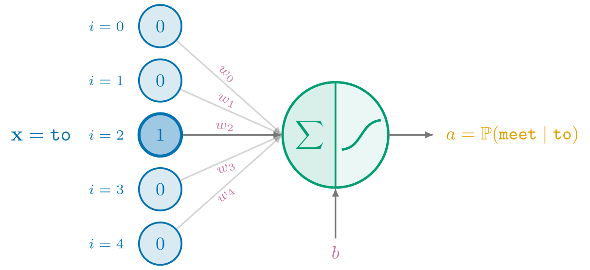

</div>
</div>
<small>Figure 1.3.1</small>

Scanning from left to right of the neuronal circuit depicted in Figure 1.3.1,
we first see that the input word `"to"` to the conditional probability that the logistic regression is modeling is some column vector $\mathbf{x}$ with support in $\reals^{|V|}$.
So, starting from the string `"to"`, we continue to map the string to it's index $i$ in the vocabulary $V$ with some hash map $I: V \to \N$, but then we need an extra step that maps the index $i \in \N$ to some vector $\mathbf{x} \in \reals^{|V|}$.
If you pay closer attention to the circuit, you will see that only $\mathbf{x}_{2}:=1$ whereas all the other $\mathbf{x}_{i}:=0$. This is called a **one-hot vector**<span class="defnote">**one-hot vector**</span>, which semantically represents the same positional information within the vocabulary $V$ except vectorizes that information continuously with support in $\reals^{|V|}$ rather than discretely in $\N$. Because of this, the conditional probability is denoted as $p(y|\mathbf{x})$.
Like [`1.2_bigram.ipynb`](https://github.com/j4orz/ateenysitp/blob/master/sitp/notebooks/1.2_bigram.ipynb), the first cell in [`1.3_logistic_regression.ipynb`](https://github.com/j4orz/ateenysitp/blob/master/sitp/notebooks/1.3_logistic_regression.ipynb) performs the data processing, except with the additional step of tensorizing integer indices over to one-hot vectors with `F.one_hot(torch.tensor(indices))`:

<div class="dual dual-margin">

{{#nb 1.3_logistic_regression.ipynb:1}}

{{#nb 1.2_bigram.ipynb:2}}


</div>

So far we in the logistic regression notebook we have the same `dataset`, `vocab` and `c2i`. But because logistic regression takes in continuous inputs rather than discrete,
one more step must be perform in its data processing,
namely mapping (tensorizing) integer indices to their one-hot vectors (local, however).
We construct list[int] first and convert to tensor's second,
for tensor.append()... (todo)

{{#nb 1.3_logistic_regression.ipynb:2}}


Where first five $\mathbf{x}^{(i)}$'s are plotted as a heatmap with [`plt.imshow`](https://matplotlib.org/stable/api/_as_gen/matplotlib.pyplot.imshow.html).
Continuing our left to right scan of the logistic regression model depicted in Figure 1.3.1,
the next aspect to the neuronal circuit is the core machinery which the one hot vectors are passed through, namely taking a weighted sum $\sum\limits_{i=1}^{|V|}w_i x_i$ whose real-valued output is then mapped to a number between 0 and 1 with a squashing function $\sigma(\cdot)$. That is, the logistic regression assumption is $P(Y=1|X=\mathbf{x}) := \sigma(\mathbf{w}^{\top}\mathbf{x})$.

piech
- maximum likelihood of parameters reduces to an optimization
- gradient descent
- core machinery that powers the architecture
- 01 case first
- decision on a probability
- evaluate model with random parameters
- include bias before piech

> [!WARNING]
>  WATCH half of chapter 1 from 15:54 to 36:52. watch the other half of chapter 1 (parameter estimation in the next section) <br style="clear: both;">

<div class="full-bleed">
  <iframe loading="lazy" height="500px" src="//player.bilibili.com/player.html?bvid=BV1kwBhY4EvW&p=24&t=954&high_quality=1&autoplay=false" title="Bilibili video player" scrolling="no" frameborder="no" allowfullscreen="true"></iframe>

  [Stanford CS109 Probability for Computer Scientists I Logistic Regression I 2022 I Lecture 24
  ](https://youtu.be/ILqZWvDWKEc?si=qyKk5_2o0487T9z-&t=952)
</div>

$$
\begin{alignedat}{2}
  \cfun{f_{\text{sum}}}: \reals^d &\to     &\;& \reals\\
  \cin{\mathbf{x}} &\mapsto              &\;& (\cparam{\mathbf{w}_1} \cin{\mathbf{x}_1} + \cparam{\mathbf{w}_2} \cin{\mathbf{x}_2} + \cdots + \cparam{\mathbf{w}_n} \cin{\mathbf{x}_n}) + \cparam{b} \\
                   &                     &\;& \mathord{=}\thickspace (\cfun{\sum_{i=1}^{d}} \cparam{\mathbf{w}_i} \cin{\mathbf{x}_i}) + \cparam{b}\\
                   &                     &\;& \mathord{=}\thickspace \cparam{\mathbf{w}^{\top}}\cin{\mathbf{x}} + \cparam{b}\\[1.2em]
  \cfun{f_{\text{squash}}}: \reals &\to  &\;& [0,1]\\
  z &\mapsto                             &\;& \cfun{\sigma}(z)\\
    &                                    &\;& \mathord{=}\thickspace \frac{1}{1 + \exp(-z)}\\[1.2em]
\end{alignedat}
$$


That is, we model $\hat{f}$ as follows:

$$
\begin{alignedat}{2}

\hat{f}_{\cparam{\mathbf{w}}}: \reals^{d} &\to &\;& \cout{[0,1]}\\
  \cin{\mathbf{x}} &\mapsto              &\;& \cfun{f_{\text{squash}}}(\cfun{f_{\text{sum}}}(\cin{\mathbf{x}}))
\end{alignedat}
$$

One small adjustment we can make to $f$ is to fold
the final bias term $b$ into the vector $\mathbf{w}$ as $\mathbf{w}_1$,
increasing the total dimensionality so that $\mathbf{w}\in \reals^{d+1}$, and adjusting
$\mathbf{x}$ accordingly so that $\mathbf{x}_1 := 1$ and $\mathbf{x} \in \reals^{d+1}$.
Then, the equation of our line with bias is simply parameterized as $f(\mathbf{x};\mathbf{w})$
$$
\begin{aligned}
  \cfun{f_{\text{sum}}} :\reals^{d+1} &\to \reals\\
  \cin{\mathbf{x}} &\mapsto \cparam{\mathbf{w}^{\top}}\cin{\mathbf{x}}
\end{aligned}
$$

$f(\mathbf{x};\mathbf{w}, b)$

{{#nb 1.3_logistic_regression.ipynb:3}}

#### 1.3.2 Loss Function with Cross Entropy Loss

<small>[$\hookleftarrow$ Table of Contents (§1.3 Parameterizing Classification)](#13-parameterizing-classifcation-with-logistic-regression)</small>

<div class="full-bleed">
<iframe height="500px" loading="lazy" src="https://www.youtube.com/embed/GlYgs6v2YfU?si=r8U_u9qGISOqDtyI&amp;controls=0"  title="YouTube video player" frameborder="0" allow="accelerometer; autoplay; clipboard-write; encrypted-media; gyroscope; picture-in-picture; web-share" referrerpolicy="strict-origin-when-cross-origin" allowfullscreen></iframe>
</div>

[But what is cross-entropy? | Compression is Intelligence Part 2 (3Blue1Brown 2026)](https://youtu.be/GlYgs6v2YfU?si=UDKTMTXXctsv10q4)

#### 1.3.3 Optimizing Loss with Iterative Reweighted Least Squares

<small>[$\hookleftarrow$ Table of Contents (§1.2 Next Token Prediction is Classification)](#12-next-token-prediction-is-classification-and-compression)</small>

#### 1.3.4 Probabilistic and Decision Theoretic Perspective <!-- Inference, Decision, and Discriminants -->

<small>[$\hookleftarrow$ Table of Contents (§1.2 Next Token Prediction is Classification)](#12-next-token-prediction-is-classification-and-compression)</small>

**discriminat function**<span class="defnote">**discriminant function**</span>
**generative model**<span class="defnote">**generative model**</span>
**discriminative model**<span class="defnote">**discriminative model**</span>

- def of conditional
- product rule: joint can evaluated with the chaining of conditionals
- bayes rule: posterior is prior*likelihood over the marginal
(what's the main purpose of this chapter?)
(predictive model vs discriminative model vs generative model?)


<div class="video-row">

  <div class="video-cell">
  <iframe loading="lazy" src="//player.bilibili.com/player.html?bvid=BV1kwBhY4EvW&p=24&t=952&high_quality=1&autoplay=false" title="Bilibili video player" scrolling="no" frameborder="no" allowfullscreen="true"></iframe>

  [Stanford CS109 Probability for Computer Scientists I Logistic Regression I 2022 I Lecture 24
  ](https://youtu.be/ILqZWvDWKEc?si=qyKk5_2o0487T9z-&t=952)

  </div>

  <div class="video-cell">
  <iframe loading="lazy" src="//player.bilibili.com/player.html?aid=972557194&bvid=BV1pp4y1t7Na&cid=324343001&p=5&t=801&high_quality=1&autoplay=false" title="Bilibili video player" scrolling="no" frameborder="no" allowfullscreen="true"></iframe>

  [Stanford CS229: Machine Learning | Summer 2019 | Lecture 5 - Perceptron and Logistic Regression](https://youtu.be/WViuTuAOPlM?si=2pITYwVPf_s8dJc6&t=802)

  </div>

  <div class="video-cell">
  <iframe loading="lazy" src="https://www.youtube.com/embed/8WDOAXaxwlU?si=9pUd5kyWMp1vEjpB&amp;start=1154" title="YouTube video player" frameborder="0" allow="accelerometer; autoplay; clipboard-write; encrypted-media; gyroscope; picture-in-picture; web-share" referrerpolicy="strict-origin-when-cross-origin" allowfullscreen></iframe>

  [Lesson 03 – Wiener’s cybernetics, Hebbian plasticity, and Rosenblatt’s perceptron](https://www.youtube.com/watch?v=8WDOAXaxwlU&t=2545s)

  </div>

  <div class="video-cell">
  <iframe loading="lazy" src="https://www.youtube.com/embed/ekZ9MoOOiR4?si=rZbeQmZ5Q7-ObydJ" title="YouTube video player" frameborder="0" allow="accelerometer; autoplay; clipboard-write; encrypted-media; gyroscope; picture-in-picture; web-share" referrerpolicy="strict-origin-when-cross-origin" allowfullscreen></iframe>

  [Perceptron (2) - Machine Learning 10-715 Fall 2015](https://youtu.be/ekZ9MoOOiR4?si=afIQvxmOiJ1ziFjq)

  </div>

</div>

#### 1.3.5 Evaluation with Bias Variance Tradeoff

<small>[$\hookleftarrow$ Table of Contents (§1.2 Next Token Prediction is Classification)](#12-next-token-prediction-is-classification-and-compression)</small>

### 1.4 Parameterizatnig Quantification with Linear Regression  <!-- with Least Squared Error -->
<small>[$\hookleftarrow$ Table of Contents](#i-table-of-contents)</small>

- why squared error loss from artem

Similarly to learning distributions $X$ from data, learning functions $f\colon \mathscr{X} \to \mathscr{Y}$ from data
roughly follows the three step process of selecting a model for the task $T$, a performance measure $P$, and optimizing such measure on experience $E$.
Let's take a look at the linearly modeling regression with squared error loss,
a problem which straddles tools from all three languages of probability theory, linear algebra, and calculus.

For the task of house price prediction, the input space $\mathscr{X}=\reals^d$ is the size in square feet, and the output space $\mathscr{Y}=\reals$ is the price,
meaning that the function which needs to be recovered has the type of $f\colon\reals^d \to \reals$.
An assumption about the structure of the data needs to be made, referred to as the *inductive bias*.
The simplest assumption to make is to *assume* that there exists some linear relationship between the data
$\mathbf{x}$ and parameters $\mathbf{w}$ so that $f$ ends up being modeled as an inner product plus bias,
parameterized as $f(\mathbf{x};\mathbf{w},b)$:
$$
\begin{aligned}
              f &:\reals^d \to \reals\\
f(\mathbf{x};\mathbf{w}, b)
  &\coloneqq (\mathbf{w}_1 \mathbf{x}_1 + \mathbf{w}_2 \mathbf{x}_2 + \cdots + \mathbf{w}_n \mathbf{x}_n) + b \\
  &= (\sum_{i=1}^{d} \mathbf{w}_i \mathbf{x}_i) + b\\
  &= \mathbf{w}^{\top}\mathbf{x} + b\\
\end{aligned}
$$

One small adjustment we can make to $f$ is to fold
the final bias term $b$ into the vector $\mathbf{w}$ as $\mathbf{w}_1$,
increasing the total dimensionality so that $\mathbf{w}\in \reals^{d+1}$, and adjusting
$\mathbf{x}$ accordingly so that $\mathbf{x}_1 := 1$ and $\mathbf{x} \in \reals^{d+1}$.
Then, the equation of our line with bias is simply parameterized as $f(\mathbf{x};\mathbf{w})$
$$
\begin{aligned}
              f &:\reals^{d+1} \to \reals\\
f(\mathbf{x};\mathbf{w}) &\coloneqq \mathbf{w}^{\top}\mathbf{x}
\end{aligned}
$$

Semantically speaking, each property of the input house $\mathbf{x}_i \in \reals^d$ is
weighted by some weight $\mathbf{w}_i$, adjusted accordingly during the learning process
so that it accurately reflects the property's influence on the output price $y \in \reals$
when evaluating a prediction $\hat{y}$. We can evaluate $f$ on all $\mathbf{x}^{(i)}\in \mathcal{D}$
with a randomly intialized $\mathbf{w}$ to ensure we've wired everything up correctly.

However, while specifying the equation of the linear regression model on ~~paper~~ screen
and subsequently evaluating the computation manually might have been sufficient
for pre-computational mathematicians such as Gauss and Legendre,
the discipline of statistical learning is entirely predicated on computational methods.
Let's continue to use PyTorch's core n-dimensional array datastructure with `torch.Tensor`,
this time modeling a function $f:\mathscr{X}\to\mathscr{Y}$ rather than some distribution $X$:

(todo: maybe change example to closure following `torch.nn`)
```python
{{#include ../../teeny/examples/2.2-regression.py:1:4}}
```

in which we can update the names of our `torch.Tensor` variables with the ranks of their vector
spaces<span class="sidenote-number"></span><span class="sidenote">*Referred to as [Shape Suffixes, described by Noam Shazeer](https://medium.com/@NoamShazeer/shape-suffixes-good-coding-style-f836e72e24fd), an engineer from Google*</span>
to clarify what dimensions these operations are evaluated on:

```python
{{#include ../../teeny/examples/2.2-regression.py:5:8}}
```

and finally, actually enforce them via runtime typechecking with the [`jaxtyping`](https://docs.kidger.site/jaxtyping/) package
(try swapping the return statements below to trigger a type error with the return type):

```python
{{#include ../../teeny/examples/2.2-regression.py:9:19}}
```

Let's now sanity-check that `f_typechecked` is wired up correctly
by evaluating it on all $\mathbf{x}^{(i)}\in \mathcal{D}$ with random parameter `w_D`.
(todo: use actual housing data)

```python
{{#include ../../teeny/examples/2.2-regression.py:29:41}}
```

```sh
random weight vector: tensor([-0.3343,  0.0768,  2.7828, -0.1331])
expected: $500000.0, actual: $-492.46
expected: $800000.0, actual: $-690.89
expected: $250000.0, actual: $-258.08
```

Clearly, these outputs are unintelligible, and will only become intelligible with a "good" choice of parameter $\mathbf{w}$.
Before we find such a parameter, let's make one more modification to our function $f$
to increase it's performance.
Rather then evaluating `f_typechecked` on every input `xi_D` in the dataset `zip(X_ND,Y_N)` sequentially with a loop,
we can evaluate all outputs with a single matrix-vector multiplication by updating $f$'s function definition to the following

$$
\begin{aligned}
f_{\text{batched}} &:\reals^{n\times d} \to \reals^n\\
f_{\text{batched}}(\mathbf{X};\mathbf{w}) &\coloneqq \mathbf{X}\mathbf{w} \\                                         
                                          &= \begin{bmatrix} \mathbf{x}_1^\top\mathbf{w} \\ \mathbf{x}_2^\top\mathbf{w} \\ \vdots \\ \mathbf{x}_n^\top\mathbf{w} \end{bmatrix}
\end{aligned}
$$

and the corresponding PyTorch updated to

```python
{{#include ../../teeny/examples/2.2-regression.py:21:27}}
```

Now that we've selected our model for the task $T$,
we can proceed with selecting our performance measure $P$
which the learner will improve on with experience $E$.

---

After the inductive bias on the family of functions has been made, the
learning algorithm must find the function $\hat{f}$ with a good fit.
Since artificial learning algorithms don't have visual cortex like biological humans[],
the notion of "good fit" needs to defined in a systematic fashion.
This is done by selecting the parameter $\theta \in \reals^m$ which *maximizes the likelihood of the data* $p(d;\theta)$.
Returning to the linear regression inductive bias we've selected to model the house price data,
we *assume* there exists *noise* $\epsilon^{(i)}$
in both our *model* (epistemic uncertainty) and *data* (aleatoric uncertainty),
so that $y^{(i)} = \theta^{\top}\mathbf{x}^{(i)} + \epsilon^{i}$ where $\epsilon^{(i)} \sim \mathcal{N(\mu, \sigma^2)}$

prices $y^{i}$ are *normally distributed conditioned* on seeing the features $\mathbf{x}^{i}$
with the *mean* being the equation of the line $\theta^{\top}\mathbf{x}^{(i)}$
where $y^{(i)}|\mathbf{x}^{(i)} \sim \mathcal{N}(\mu=\theta^{\top}\mathbf{x}^{(i)}, \sigma^2)$,
then we have that

$$
\begin{aligned}
p(y^{(i)}|\mathbf{x}^{(i)};\theta) &= \mathcal{N}(\theta^{\top}\mathbf{x}^{(i)}, \sigma^2) \\
                                  &= \frac{1}{\sqrt{2\pi\sigma^2}} \exp\left(-\frac{(y^{(i)}-\theta^{\top}\mathbf{x}^{(i)})^2}{2\sigma^2}\right)
\end{aligned}
$$

<!-- TODO: generate prose/exposition by repaging lecture/text in ram -->
<!-- <div class="full-bleed">
<iframe height="750px" loading="lazy" src="https://www.youtube.com/embed/q7seckj1hwM?si=YYH1Z3zRbx-K0AF-" title="YouTube video player" frameborder="0" allow="accelerometer; autoplay; clipboard-write; encrypted-media; gyroscope; picture-in-picture; web-share" referrerpolicy="strict-origin-when-cross-origin" allowfullscreen></iframe>
</div> -->

Returning to the linear regression model, we can solve this optimization with a *direct method* using normal equations.
QR factorization, or SVD.

```python
def fhatbatched(X_n: np.ndarray, m: float, b: float) -> np.ndarray: return X_n*m+b

if __name__ == "__main__":
  X, Y = np.array([1500, 2100, 800]), np.array([500000, 800000, 250000]) #  data

  X_b = np.column_stack((np.ones_like(X), X))              # [1, x]
  bhat, mhat = np.linalg.solve(X_b.T @ X_b, X_b.T @ Y)   # w = [b, m]

  yhats = fhatbatched(X, mhat, bhat) # yhat
  for y, yhat in zip(Y, yhats):
    print(f"expected: ${y:.0f}, actual: ${yhat:.2f}")
```

To summarize, we have selected and computed
1. an inductive bias with the family of linear functions $f(\mathbf{X};\theta)\coloneqq \mathbf{X}@\theta$
2. an inductive principle with the least squared loss $\mathscr{L}(\theta) \coloneqq \sum_{i=0}^{n} (y^{(i)}-\mathbf{X}@\theta)^2$
3. the parameters which minimze the empirical risk, denoted as $(\hat{\theta}) = \argmin \mathscr{L}(\theta)$

Together,
the inductive bias describes the relationship between the input and output spaces,
the inductive principle is the loss function that measures prediction accuracy,
and the minimization of the empirical risk finds the parameters for the best predictor.


<!-- TODO: video on bias variance tradeoff welsch -->

### 1.6 Summary
<small>[$\hookleftarrow$ Table of Contents](#i-table-of-contents)</small>


### 1.7 Further Reading
<small>[$\hookleftarrow$ Table of Contents](#i-table-of-contents)</small>

The primary texts consulted in the writing of this chapter were
[(Jurafsky and Martin 2026)](),
[(Eisenstein 2018)](),
[(Manning 2001)](),
and [(Cotterell 2024)]()
for statistical natural language processing;
[(Bishop 2006)](https://www.microsoft.com/en-us/research/people/cmbishop/prml-book/)
[(Hastie, Tibshirani, and Friedman 2009)](https://hastie.su.domains/ElemStatLearn/),
[(Murphy 2022)](https://probml.github.io/pml-book/book1.html),
[(Mohri et al., 2018)](https://cs.nyu.edu/~mohri/mlbook/),
and 
[(Bach 2025)](https://www.di.ens.fr/~fbach/ltfp_book.pdf),
for machine learning more generally.

### 1.8 Problems
<small>[$\hookleftarrow$ Table of Contents](#i-table-of-contents)</small>

{{#quiz ../quizzes/test.toml}}

<!-- {{#quiz ../quizzes/test2.toml}}

{{#quiz ../quizzes/test3.toml}} -->


## Intermezzo One: The Language of Continuous Mathematics
<small>[$\hookleftarrow$ Table of Contents](#i-table-of-contents)</small>

As you now know from [§1. Self-Supervised Sequence Learning with Single-Layer Networks](#1-sequence-learning), language models are next token predictors.
Whether these language models are bigram models, logistic regression models, or the GPT-2 like neural nets that we will see in
[Part II. Deep Neural Networks](./2.md),
they are all functions that produce an output distribution over the next word given some input sentence as the history.
That is, they are functions of type $f: \Sigma^{*} \to \Delta^{|\Sigma|}$
Before we dive into the internals of [`borscht`](https://github.com/j4orz/ateenysitp) itself in [§2. The Tensor](#2-from-ipls-array-to-apls-multidimensional-array) and implement our own framework capable of training the bigram and logistic regression models,
we will formally characterize our language model implementations from §1 using the language of calculus from high school, as well as probability and linear algebra which we will formally introduce now.
The one text which was heavily consulted over others was [Formal Aspects to Language Modelling (Cotterell et al., 2024)](https://arxiv.org/abs/2311.04329).
For more on formalization, please consult [§A. From Problems to Proof](./ap.md#a-from-problems-to-proof).

<div class="toc">

- [Intermezzo One: The Language of Probability]()
  - [I.1 Probability Spaces](#i1-probability-spaces)
  - [I.2 Random Variables and their Distributions](#i2-random-variables-and-their-distributions)
  - [I.3 Probabilities of Sums, Products, Conditionals]()
  - [I.4 Random Processes and their Kernels](#i3-random-processes-and-their-kernels)
  - [I.5 Measurable Spaces]()
  - [I.6 Vector Spaces](#i6-vector-spaces)
  - [I.7 Convex Sets]()
  - [I.8 Further Reading](#i7-bibliographic-notes)
</div>

### I.1 Probability Spaces
<small>[$\hookleftarrow$ Table of Contents (Intermezzo One)](#intermezzo-one-the-language-of-probability-theory-and-linear-algebra)</small>

Informally speaking, you intuitively understand the notion of a probability and a probability distribution.
That is, a probability is a number between 0 and 1 that represents the chance, likelihood, or belief of some event happening,
and a distribution is a list of such numbers.
Probability distributions come *from* the concept of **probability spaces**,
so before defining the former we must define the latter, which are **measures of the size of sets**.

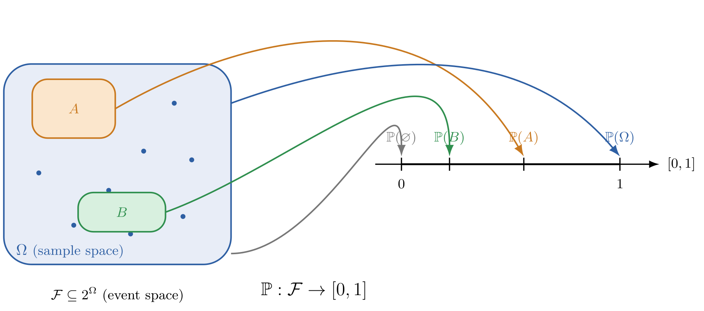
<small>Figure I.1</small>

Figure I.1 is comprised of three components. Namely, the blue box and it's blue dots, the colored boxes, and the mapping from the colored boxes to the $[0,1]$ number line
1. the sample space $\Omega$: the set of all possible outcomes in an experiment
2. the event space $\mathcal{F}$: the set of all subsets in the sample space
3. probability law $\mathbb{P}$: a mapping from the event space to a number between 0 and 1

Conceptually speaking, the language models we've seen in [§1. Sequence Learning](#1-sequence-learning)
such as GPT-2, the bigram model, and the logistic regression model which have type $f: \Sigma^* \to \Delta^{|\Sigma|}$
produce (on a *single evaluation*) concrete probability distributions with [`borscht.Tensor`](https://numpy.org/doc/stable/reference/generated/numpy.ndarray.html)
that come *from*
mathematically abstract probability spaces $(\Omega, \mathcal{F}, \mathbb{P})$
where the sample space $\Omega$ is the set *of words* in their vocabulary,
and their belief in a word occuring is represented by probability law $\mathbb{P}$ defined on event space $\mathcal{F}$.

> [!CAUTION]
>  Probability spaces are usually NOT implemented with code. For instance, GPT-2, bigram models, and logistic regression models do NOT instantiate and return Python `set()`s for the sample space $\Omega$, the event space $\mathcal{F}$, nor define some function `def probability_law(event_space: set) -> float` for $\mathbb{P}$. They return a probability distributions, which we define in [§I.2 Random Variables and their Distributions](#i2-random-variables-and-their-distributions). Rather, the purpose of probability spaces as a mathematical definition is conceptual clarity with  general definitions<span class="sidenote-number"></span><span class="sidenote">*Defining concepts without commiting to internal structure allows for a much broader class of objects to be considered. This is very much like type polymorphism (generics, traits, type classes), except the generality of mathematical concepts are usually "more" general than those that might be implemented with type polymorphism. For instance, this abstract definition of a probability space is generalized to cover any random experiment we'd like to model, from rolling dice, to generating language. However it's quite unusual to have a program need to progam both.*</span> and rigorous results with theorems.

Let us now precisely define each component of a probability space $(\Omega, \mathcal{F}, \mathbb{P})$,
starting with the sample space $\Omega$.

<div class="definition" data-title="Definition: Sample Space">

A **sample space** is the set of all possible outcomes in an experiment denoted by $\Omega$ ($\LaTeX$ code: `\Omega`).

</div>

<div class="example" data-title="Example 1.1: Gambling Sample Spaces">

- Consider flipping a coin. Then $\Omega := \{\text{H}, \text{T}\}$.
- Consider playing rock, paper, scissors. Then $\Omega := \{🪨, 📄, ✂ \}$.
- Consider rolling a die. Then $\Omega := \{⚀,⚁,⚂,⚃,⚄,⚅\}$.
- Consider drawing a card. Then $\Omega := \{ \\
  🂡,🂢,🂣,🂤,🂥,🂦,🂧,🂨,🂩,🂪,🂫,🂭,🂮, \\
  🂱,🂲,🂳,🂴,🂵,🂶,🂷,🂸,🂹,🂺,🂻,🂽,🂾, \\
  🃁,🃂,🃃,🃄,🃅,🃆,🃇,🃈,🃉,🃊,🃋,🃍,🃎, \\
  🃑,🃒,🃓,🃔,🃕,🃖,🃗,🃘,🃙,🃚,🃛,🃝,🃞 \\
  \}$.

</div>

<div class="example" data-title="Example 1.2 : Language Sample Space">

Consider generating a word from this very sentence.
Then, $\Omega := \{\text{a}, \text{consider}, \text{from}, \text{generating}, \text{this}, \text{sentence}, \text{very}, \text{word}\}$

</div>

So conceptually speaking, language models like GPT2, the bigram model, and the logistic regression model
of type $f: \Sigma^* \to \Delta^{|\Sigma|}$
which produce concrete distributions with [`borscht.Tensor`](https://numpy.org/doc/stable/reference/generated/numpy.ndarray.html) on a *single* evaluation come from
mathematically abstract probability spaces $(\Omega, \mathcal{F}, \mathbb{P})$ where the sample space $\Omega$ is the set *of words* in their vocabulary,
and their belief in a word occuring is represented by probability law $\mathbb{P}$ defined on event space $\mathcal{F}$.

> [!IMPORTANT]
>  Notice how we have NOT said anything about *multiple* evaluations of a language model's output distribution (and probability space) over *words* to generate a complete sentence (in the probablity space of sentences). We will see how they relate soon.  <br style="clear: both;">

<div class="definition" data-title="Definition: Event Space">

An **event space** is the set of all possible subsets of the sample space denoted by $\mathcal{F}$ ($\LaTeX$ code: `\mathcal{F}`).

</div>

<div class="example" data-title="Example: Event Space">

</div>

TODO: something to say here about event spaces? cardinality of them?


<div class="definition" data-title="Definition: Probability Law" data-refine="probability-law">

A **probability law** is a function $\mathbb{P}: \mathcal{F} \to [0,1]$ that sends an event to a number between 0 and 1.

</div>

<div class="example" data-title="Example: Probability Law">

Consider flipping a coin. Then we model the experiment with sample space $\Omega:= \{\text{H}, \text{T}\}$, event space $\mathcal{F}:= \{\emptyset, \{\text{H}\}, \{\text{T}\}, \Omega \}$, and probability law

$$
\begin{aligned}
\mathbb{P}: \mathcal{F} \to [0,1] \\
\mathbb{P}(\emptyset)=1, \mathbb{P}(\text{H})=\frac{1}{2}, \mathbb{P}(\text{T})=\frac{1}{2}, \mathbb{P}(\Omega)=1
\end{aligned}
$$

</div>

> [!QUESTION]
>  Why is the probability law $\mathbb{P}$ defined as a function on the event space $\mathcal{F}$ rather than the sample space $\mathcal{\Omega}$? Pause, think! Hint: Would something bad happen if we did such a thing? <br style="clear: both;">

<div class="definition" data-title="Definition: Probability Law Redefined" data-refine="probability-law">

A **probability law** is a function $\mathbb{P}: \mathcal{F} \to [0,1]$ that sends an event to a number between 0 and 1, satisfying three axioms:
<ol type="I">
<li><em>non-negativity</em>: $\mathbb{P({E})} \geq 0$</li>
<li><em>normalization</em>: $\mathbb{P(\Omega)}=1$</li>
<li><em>additivity</em>: $A \cap B = \emptyset \implies \mathbb{P}(A\cup B) = \mathbb{P}(A)+\mathbb{P}(B)$</li>
</ol>

</div>

<div style="display: flex; justify-content: space-between; align-items: center; gap: 1em; flex-wrap: wrap;">
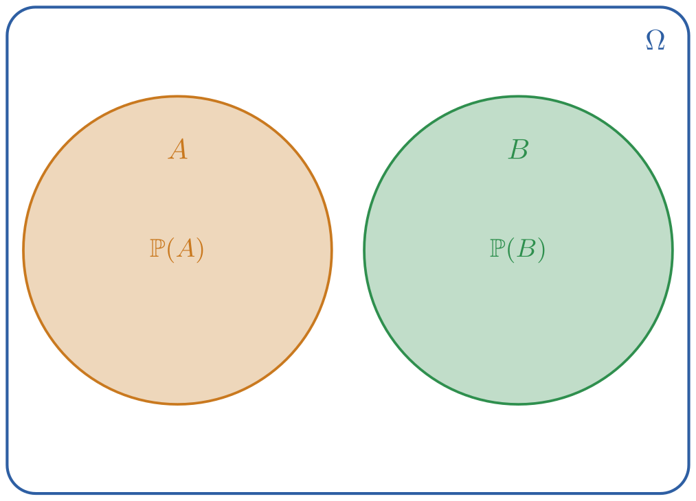
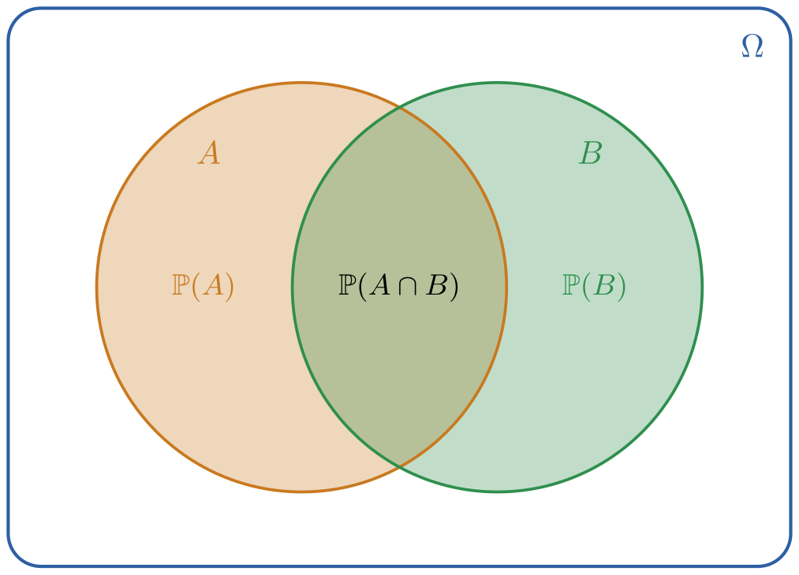
</div>

$$
\begin{aligned}
\mathbb{P}(\{\text{banana}, \text{bongo}\}) &= \mathbb{P}(\{\text{banana}\} \cup \{\text{bongo}\}) \\
                                            &= \mathbb{P}(\{\text{banana}\}) + \mathbb{P}(\{\text{bongo}\})
                                            && \text{[by additivity]}\\
&= 0.1 + 0.2 \\
&= 0.3
\end{aligned}
$$

However the event $C$ which contains all foobarbaz is composed of overlapping events
(corresponding to the right figure above), so the axiom of addivitiy does not apply.
We can evaluate the union of non-disjoint (overlapping) events with the following corollary,
known as the <span class="defnote defnote--prop">**sum rule**</span>**sum rule**:

$$
\mathbb{P}(A\cup B) = \mathbb{P}(A)+\mathbb{P}(B)- \mathbb{P}(A \cap B)
$$

We have now sharpened our intuitive notion of **chance**, **belief**, and **probability** by formally defining them
**as the measure of the size of sets**. These sets have a home, and the measure has a domain,
namely the sample space $\Omega$ and the event space $\mathcal{F}$ and together with the probability law $\mathbb{P}$,
comprise the definition of a probability space $(\Omega, \mathcal{F}, \mathbb{P})$, albeit abstractly so.
Let us now connnect this mathematically abstract space to the more concrete probability distributions
we used in [§1. Sequence Learning](#1-sequence-learning).

### I.2 Random Variables and their Distributions

<small>[$\hookleftarrow$ Table of Contents (Intermezzo One)](#intermezzo-one-the-language-of-probability-theory-and-linear-algebra)</small>

Probability distributions are the practical and concrete [`borscht.Tensor`](https://numpy.org/doc/stable/reference/generated/numpy.ndarray.html)s we used throughout [§1. Sequence Learning](#1-sequence-learning)
when implementing the bigram and logistic regression language models.
So how do these connect to the abstract concept of probability spaces just defined?
The answer is with **random variables** and their **probability mass functions**,
which are functions that map outcomes to states, and from states to probabilities.


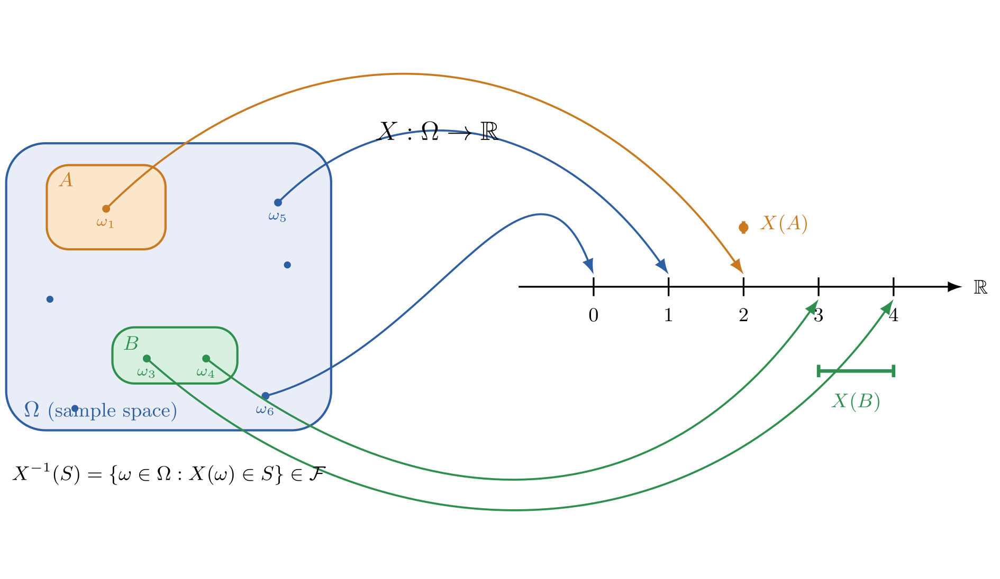

<small>Figure I.2</small>

(todo modify picture or include another picture to show distribution (probality assignment of variable taking on state))


Figure I.2 shows the same sample space $\Omega$ and event space $\mathcal{F}$ from [§I.1 Probability Spaces](#i1-probability-spaces), but rather than evaluate probabilities with the probability law $\mathbb{P}: \mathcal{F} \to [0,1]$
by mapping events to the [0,1] number line (displayed in [Figure I.1]()), we create one level of **indirection** with
- a random variable $X: \Omega \to \reals$ mapping outcomes in the sample space to states on the real number line and *then* defining
- a probability mass function $p_X(x): \reals \to [0,1]$ mapping states to their probabilities.

So, starting with a sample space, you have to map outcomes to their state space with a random variable
*before* you can evaluate their probabilities with a probability mass function, rather than evaluate them directly with a probability law.
In other words, **the two types are not equivalent $p_X(x):\reals \to [0,1] \neq \mathbb{P}: \mathcal{F} \to [0,1]$**.
For example, recall from [§1.1 From Certain to Uncertain Knowledge](#11-from-certain-to-uncertain-knowledge)
GPT-2's [`borscht.Tensor`](https://numpy.org/doc/stable/reference/generated/numpy.ndarray.html) output `probs` when passed the input string `"Hello world, nice to"`:

```python
import numpy as np

# GPT-2's output distribution when passed input "Hello world, nice to"
# Showing top 10 most likely words out of 50257.
tokens = [" see", " meet", " hear", " have", " be", " know", " you", " talk", " say", " get"]
probs = np.array([0.3169, 0.1268, 0.1246, 0.1046, 0.0471, 0.0352, 0.0320, 0.0128, 0.0114, 0.0067])
for i in np.argsort(-probs):
    print(f"{tokens[i]} : {probs[i]:.4f}")
```
 
Here, there is a random variable $X: \Omega \to \reals$
which maps outcomes from the *abstract* sample space
$\Omega:= \{\text{see}, \text{meet}, \text{hear}, \text{have}, \text{be}, \text{know}, \text{you}, \text{talk}, \text{say}, \text{get} \}$
to  *concrete* states $x$ in state space $\reals$. That is,

$$
\begin{aligned}
&X: \Omega \to \reals \\
&X(\text{see})\mapsto 0, X(\text{meet})\mapsto1, X(\text{hear})\mapsto2, X(\text{have})\mapsto3, X(\text{be})\mapsto4, X(\text{know})\mapsto5\\
&X(\text{you})\mapsto6, X(\text{talk})\mapsto7, X(\text{say})\mapsto8, X(\text{get})\mapsto9
\end{aligned}
$$


But notice the level of indirection with the random variable. All we've done is translate from sample space to state space.
To obtain actual probabilities, we need to map from the state space $\reals$ to probabilities $[0,1]$ with the probability mass function $p_X(x): \reals \to [0,1]$.
That is,

$$
\begin{aligned}
&p_X: \reals \to [0,1] \\
&p(0)\mapsto 0.3169, p(1)\mapsto 0.1268, p(2)\mapsto 0.1246, p(3)\mapsto 0.1046, p(4)\mapsto 0.0471, p(5)\mapsto 0.0352\\
&p(6)\mapsto 0.0320, p(7)\mapsto 0.0128, p(8)\mapsto 0.0114, p(9)\mapsto 0.0067\\
\end{aligned}
$$

In other words, starting from sample space $\Omega$ we compose $X: \Omega \to \reals$ with $p_X(x): \reals \to [0,1]$
to obtain $p_X \circ X: \Omega \to [0,1]$ such that evaluating $p(X(\omega))$ results in the probability of outcome $\omega$.
(todo. this is wrong?)

But how is the multidimensional array `probs` with support in $\reals^{|V|}$ related to the abstract concept of a probability space?
You may have noticed that the definition of $p_X$ looks quite similar to that of the `probs`:

<div class="dual">

$$
\begin{aligned}
&p_X: \reals \to [0,1] \\
&p(0)\mapsto 0.3169, p(1)\mapsto 0.1268, p(2)\mapsto 0.1246, p(3)\mapsto 0.1046, p(4)\mapsto 0.0471, p(5)\mapsto 0.0352\\
&p(6)\mapsto 0.0320, p(7)\mapsto 0.0128, p(8)\mapsto 0.0114, p(9)\mapsto 0.0067\\
\end{aligned}
$$

```python
import numpy as np
probs = np.array([0.3169, 0.1268, 0.1246, 0.1046, 0.0471, 0.0352, 0.0320, 0.0128, 0.0114, 0.0067])
```

</div>

This is because an alternative conceptualization of $\reals^{10}$ is some function
$f: \{0,1,2,3,4,5,6,7,8,9\} \to \reals$<span class="sidenote-number"></span><span class="sidenote">*For conveniece sake we do store the outcomes in the `tokens` array so that we can print them next to their probabilities by looping over states $x \in \reals$ with `for i in np.argsort(-probs)`, but it's important to note that $p_X(x)$ is defined on real numbered states (represented with indices), and *not* on set-valued events.*</span> that has support in $\reals^{10}$, or more accurately, $\{0,1\}^{10}$ With these two views, an alternative conceptualization of $\reals^{10}$ is some function $f: \{0,1,2,3,4,5,6,7,8,9\} \to \reals$

- todo: rvs map from one measurable space to another. we happen to like $\reals$

On a single evaluation language models produce such probability mass functions
defined on a state space which are mapped over from an abstract sample space via random variable.
In practice, we forget about the concepts of sample spaces and random variables,
simply slugging around probability mass functions with [`borscht.Tensor`](https://numpy.org/doc/stable/reference/generated/numpy.ndarray.html)s that have support in
n-dimensional Euclidean space, where n is the size of sample space.
In other words, we keep two as conceptual mathematical definitions without implementing them with code.

At this point, you may be wondering what is the point of the random variable's indirection?
...
Now that you understand the notion of random variables and probability mass functions intuitively,
let's formally define them as concepts:


<!-- In summary, on a single evaluation language models of type $f: \Sigma^* \to \Delta^{|\Sigma|}$
produce concrete probability distributions $p_X(x): \reals \to [0,1]$ represented with `np.ndarray[index]: float`
which are mapped from sample spaces $\Omega$ via random variable $X: \Omega \to \reals$. -->

<div class="definition" data-title="Definition: Random Variable">

</div>

<div class="definition" data-title="Definition: Probability Mass Function">

</div>

<div class="definition" data-title="Definition: Probability Density Function">

</div>

somehow motivate global view

<div class="definition" data-title="Definition: Energy Function">

</div>

<div class="definition" data-title="Definition: Globally Normalized Energy Function">

</div>

<div class="definition" data-title="Definition: Locally Normalized Energy Function">

</div>

<div style="display: flex; justify-content: space-between; align-items: center; gap: 1em; flex-wrap: wrap;">

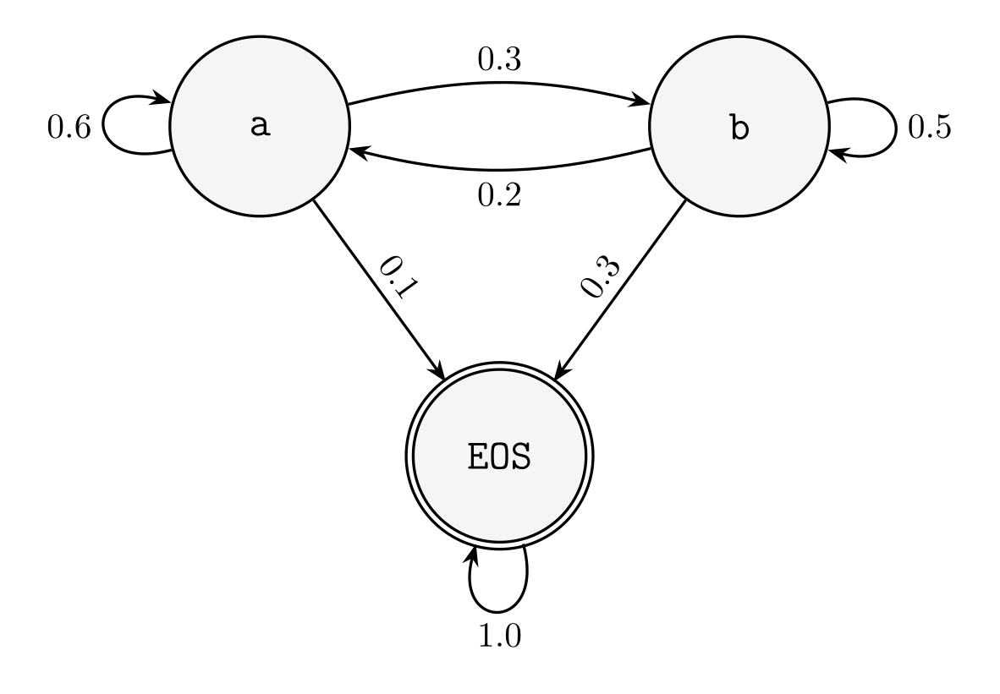


</div>

The intuition is very simple: every language model can be locally normalized.
The precise formulation however, is not.
proof with prefix probabilities

<div class="theorem" data-title="Theorem: Any distribution over sentences can be locally normalized.">

proof

</div>

however the converse direction is not a trivial result to establish
examples
- 2 state model (markov chain), non-tight
- 2 state model (markov chain), tight (absorbs)


### I.3 Probabilities of Sums, Products, Conditionals

### I.4 Random Processes and their Kernels
<small>[$\hookleftarrow$ Table of Contents (Intermezzo One)](#intermezzo-one-the-language-of-probability-theory-and-linear-algebra)</small>


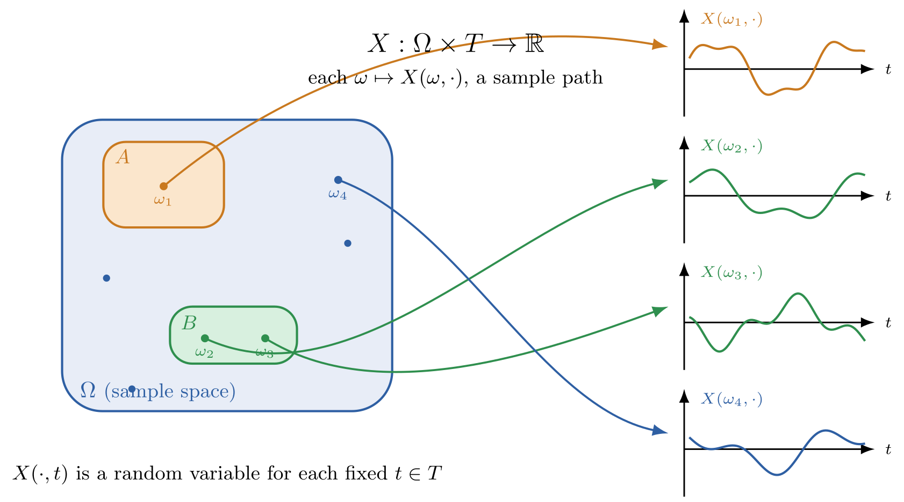


### I.5 Measurable Spaces

### I.6 Vector Spaces
<small>[$\hookleftarrow$ Table of Contents (Intermezzo One)](#intermezzo-one-the-language-of-probability-theory-and-linear-algebra)</small>


### I.7 Further Reading

The primary texts consulted in the writing of this chapter were
[(Bertsekas and Tsitsiklis 2008)](https://www.mit.edu/~dimitrib/probbook.html),
[(Chan 2021)](https://probability4datascience.com/),
[(Wasserman 2004)](https://www.stat.cmu.edu/~brian/valerie/617-2022/0%20-%20books/2004%20-%20wasserman%20-%20all%20of%20statistics.pdf),
and [(Durrett (2019)](https://sites.math.duke.edu/~rtd/PTE/pte.html)
for probability theory;
[(Strang 2026)](https://math.mit.edu/~gs/linearalgebra/ila6/indexila6.html),
[(Strang 2019)](https://math.mit.edu/~gs/learningfromdata/),
and [(Axler 2026)](https://linear.axler.net/)
for linear algebra;
[(Boyd and Vandenberghe 2004)](https://web.stanford.edu/~boyd/cvxbook/)
and [(Kochenderfer and Wheeler 2019)](https://algorithmsbook.com/optimization/)
for optimization.

## 2. The Massively Parallel Multidimensional Tensor

<div class="toc">

- [2. The Massively Parallel Multidimensional Tensor](#2-from-ipls-array-to-apls-multidimensional-array)
  - [2.1 The Three Language Problem]()
  - [2.2 Virtualizing Shapes with Strides]()
  - [2.3 Accelerating Matrix Multiplication on CPUs](#23-accelerating-matrix-multiplication-on-cpus) <!-- with computation and communication of rooflines -->
  - [2.4 Accelerating Matrix Multiplication on GPUs]() <!-- simd to simt -->
  - [2.5 Accelerating Matrix Multiplication on TPUs]() <!-- gpu to tpu -->
  - [2.6 From Strides to Layouts]()
  - [2.7 From Abstract to Numerical Linear Algebra]()
  - [2.11 Summary]()
  - [2.12 Further Reading]()
  - [2.13 Problems]()

</div>

### 2.1 The Three Language Problem
<small>[$\hookleftarrow$ Table of Contents](#i-table-of-contents)</small>

- justify native for eager performance
- pyo3 https://github.com/j4orz/ateenysitp/blob/master/ARCHITECTURE.md#level-1-borschts-build-configuration-and-development-environment
- native components using cpython as encapsulation boundary
- freethreaded python eliminates multithreading problem


```rust
/// SGEMM with the classic BLAS signature (row-major, no transposes):
/// C = alpha * A * B + beta * C
fn sgemm(
  m: usize, n: usize, k: usize,
  alpha: f32, a: &[f32], lda: usize,
  b: &[f32], ldb: usize,
  beta: f32, c: &mut [f32], ldc: usize) {
  assert!(m > 0 && n > 0 && k > 0, "mat dims must be non-zero");
  assert!(lda >= k && a.len() >= m * lda);
  assert!(ldb >= n && b.len() >= k * ldb);
  assert!(ldc >= n && c.len() >= m * ldc);

  for i in 0..m {
    for j in 0..n {
      let mut acc = 0.0f32;
      for p in 0..k { acc += a[i * lda + p] * b[p * ldb + j]; }
      let idx = i * ldc + j;
      c[idx] = alpha * acc + beta * c[idx];
    }
  }
}

fn main() {
  use std::time::Instant;

  for &n in &[16usize, 32, 64, 128, 256] {
    let (m, k) = (n, n);
    let (a, b, mut c) = (vec![1.0f32; m * k], vec![1.0f32; k * n], vec![0.0f32; m * n]);

    let t0 = Instant::now();
    sgemm(m, n, k, 1.0, &a, k, &b, n, 0.0, &mut c, n);
    let secs = t0.elapsed().as_secs_f64().max(std::f64::MIN_POSITIVE);
    let gflop = 2.0 * (m as f64) * (n as f64) * (k as f64) / 1e9;
    let gflops = gflop / secs;

    println!("m=n=k={n:4} | {:7.3} ms | {:6.2} GFLOP/s", secs * 1e3, gflops);
  }
}
```

### 2.2 Virtualizing Shapes with Strides

<small>[$\hookleftarrow$ Table of Contents (§2. The Massively Parallel Multidimensional Tensor)](#2-the-multidimensional-tensor)</small>


<div class="full-bleed">
<iframe height="500px" loading="lazy" src="https://www.youtube.com/embed/usuerv3xyww?si=TEmmOVJsqPT_HxZa" title="YouTube video player" frameborder="0" allow="accelerometer; autoplay; clipboard-write; encrypted-media; gyroscope; picture-in-picture; web-share" referrerpolicy="strict-origin-when-cross-origin" allowfullscreen></iframe>
</div>

[MiniTorch - Tensors (2.1)](https://youtu.be/usuerv3xyww?si=uS0jGXFToh2tB533)

<!-- Thus far in our journey we've successfully made the transition
from programming software 1.0 which involves specifying of discrete data structures — like sets, associations, lists, trees, graphs, — with the determinism of types
to programming software 2.0 which involves reovering continous data structures — like vectors, matrices, and tensors — with the stochasticity of probabilities.
If you showed the mathematical equations for your models, loss functions, and optimizers to our mathematical cousins<span class="sidenote-number"></span><span class="sidenote">*In particular, the physicists whom realized describing reality as minimizing free-energy was fruitful, such as [Helmholtz with energy](https://en.wikipedia.org/wiki/Helmholtz_free_energy), [Gibbs with enthalpy](https://en.wikipedia.org/wiki/Gibbs_free_energy), and [Boltzmann with entropy](https://en.wikipedia.org/wiki/Boltzmann%27s_entropy_formula).*</span> who also made the same transition,
they would understand the mathematical equations and even algorithms<span class="sidenote-number"></span><span class="sidenote">*as until recently, algorithms were understood to be a sequence of instructions to be carried out by a human. i.e [Egyptian Multiplication](https://en.wikipedia.org/wiki/Ancient_Egyptian_multiplication), [Euclid's Greatest Common Divisor](https://en.wikipedia.org/wiki/Euclidean_algorithm)*</span>.
But they wouldn't understand how the code we've programmed thus far with Python and Numpy is being automatically calculated by the mechanical machine we call computers.
For that we need to transition from *users* of the `numpy` framework to implementors our own framework, which we'll call `borscht`.
This requires us moving from the beautiful abstraction of mathematics to the assembly heart and soul of our machines.
This book uses Rust<span class="sidenote-number"></span><span class="sidenote">*To backtrack to familiarize yourself with Rust, take a look at the experimental version of [The Rust Programming Language](https://rust-book.cs.brown.edu/), by from Will Crichton and Shriram Krishnamurthi, originally written by Steve Klabnik, Carol Nichols, and Chris Krycho.*</span>, but feel free to follow along with C/C++<span class="sidenote-number"></span><span class="sidenote">*In that case, take a look at "The C Programming Language by Brian Kernighan and Dennis Ritchie.*</span> — what's fundamental to the purpose of accelerating said basic linear algebra subroutines on the CPU is
is choosing a language that 1. forgoes the dynamic memory management overhead of garbage collection and
2. has a compiled implementation which allows us to analyze and tune the actual instructions which an underlying processor executes.
Using Rust will allow us to start uncovering what is really happening under the hood of accelerated Tensors
<span class="sidenote-number"></span><span class="sidenote">*To sidetrack to familiarize yourself with systems programming in the context of software 1.0 , read the classic of [Computer Systems A Programmer's Perspective](https://csapp.cs.cmu.edu/)*</span>with instruction set architectures, microarchitecture, memory hierarchies

- instruction set architecture
- computation: control path, data path
- communication: memory, input/output

In the last chapter we developed `borscht.Tensor` by virtualizing physical 1D storage buffers into
arbitrarily-shaped logical ND arrays by specifying an iteration space with strides,
and started our journey in accelerating the basic linear algebra subroutines defined on the `Tensor` with Rust,
which speeds up the throughput performance of SGEMM from `10MFLOP/S` to `1GFLOP/S`.
Simply executing a processor's native code — referred to as assembly code — rather than Python's bytecode
results in an increase of two orders of magnitude.

Now that the code that is being executed is native assembly,
we can dive deeper into the architecture of the machine in order to reason and improve
the performance of `borscht`'s `BLAS`. -->

<!--  -->

### 2.3 Accelerating Matrix Multiplication on CPUs

<small>[$\hookleftarrow$ Table of Contents (§2. The Massively Parallel Multidimensional Tensor)](#2-the-multidimensional-tensor)</small>

> In which we ...

<div class="toc">

- [2.3 Accelerating Matrix Multiplication on CPUs]()
  - [2.3.1 Instruction Sets, Pipelines, and Hierarchies]()
  - [2.3.1 Anatomy of High Performance Matrix Multiplication]()

</div>

#### 2.3.1 Instruction Sets, Pipelines, and Hierarchies

<div class="full-bleed">

<iframe width="560" height="315" src="https://www.youtube.com/embed/knTLy1j-rco?si=Q212WAwitdSOAdqZ" title="YouTube video player" frameborder="0" allow="accelerometer; autoplay; clipboard-write; encrypted-media; gyroscope; picture-in-picture; web-share" referrerpolicy="strict-origin-when-cross-origin" allowfullscreen></iframe>

</div>

[]()

Loop Reordering, Register and Cache Blocking


Instruction Level Parallelism via Loop Unrolling

<!-- <div class="full-bleed">
<iframe src="./assets/rooflinejupiter.html" width="100%" height="900" style="border:none; border-radius:12px;" loading="lazy"></iframe>
</div> -->

<!-- ### 3.9 Accelerating Computation of `GEMM` with Data Level Parallelism via Vector Extensions -->
<!-- <small>[$\hookleftarrow$ Table of Contents](#i-table-of-contents)</small> -->
<!-- simd -->
<!-- <small>[$\hookleftarrow$ Table of Contents](#i-table-of-contents)</small> -->
<!-- cache blocking -->

<!-- ### 3.10 Accelerating Computation of `GEMM` with Thread Level Parallelism
<small>[$\hookleftarrow$ Table of Contents](#i-table-of-contents)</small> -->
<!-- tlp -->
<!-- https://sci-hub.box/10.1109/IPDPS.2014.110 -->

### 2.4 Accelerating Matrix Multiplication on GPUs
<small>[$\hookleftarrow$ Table of Contents (§2. The Multidimensional Tensor)](#2-the-multidimensional-tensor)</small>

- [2.4.1 How to Design Parallel Programs]()

<div class="full-bleed">
<iframe height="500px" loading="lazy" src="https://www.youtube.com/embed/oIk3R-sMX5o?si=Bu_Vpe4bhZG1RtaR"  title="YouTube video player" frameborder="0" allow="accelerometer; autoplay; clipboard-write; encrypted-media; gyroscope; picture-in-picture; web-share" referrerpolicy="strict-origin-when-cross-origin" allowfullscreen></iframe>
</div>

<div class="video-row">

<div class="video-cell">
<iframe loading="lazy" src="//player.bilibili.com/player.html?bvid=BV1du17YfE5G&p=1&high_quality=1&autoplay=false" title="Bilibili video player" scrolling="no" frameborder="no" allowfullscreen="true"></iframe>

[Stanford CS149 I Parallel Computing I 2023 I Lecture 1 - Why Parallelism? Why Efficiency?](https://youtu.be/V1tINV2-9p4?si=qFWi_sGVCVGaE1k5)

</div>

<div class="video-cell">
<iframe loading="lazy" src="https://www.youtube.com/embed/YoKpLBeRVWY?si=4aTGhdN6WVzZ89Nf" title="YouTube video player" frameborder="0" allow="accelerometer; autoplay; clipboard-write; encrypted-media; gyroscope; picture-in-picture; web-share" referrerpolicy="strict-origin-when-cross-origin" allowfullscreen></iframe>

[MIT 6.S894 - Accelerated Computing, Fall 2025 Lecture 1 - The PDP-11 Problem](https://youtu.be/CKmNpAO5rS4?si=oehGUkRxBj6yymzO)

</div>

<div class="video-cell">
<iframe loading="lazy" src="//player.bilibili.com/player.html?bvid=BV1PS421978D&p=2&high_quality=1&autoplay=false" title="Bilibili video player" scrolling="no" frameborder="no" allowfullscreen="true"></iframe>

[UC Berkeley CS267 I Applications of Parallel Computers I Spring 2022 I Lecture 2 - Memory Hierarchies and Matrix Multiplication](https://www.bilibili.com/video/BV1PS421978D?p=2)

</div>

</div>

### 2.5 Accelerating Matrix Multiplication on TPUs
<small>[$\hookleftarrow$ Table of Contents (§2. The Multidimensional Tensor)](#2-the-multidimensional-tensor)</small>

### 2.6 From Strides to Layouts
<small>[$\hookleftarrow$ Table of Contents (§2. The Multidimensional Tensor)](#2-the-multidimensional-tensor)</small>

### 2.7 From the BLAS to LAPACK

### 2.11 Summary

One quick way to summarize the milestones in high performance computing, compilers and architecture is to list the Turing Award winners: Alan Perlis (1966) for his influence on advanced programming techniques and compiler construction, including his role in designing ALGOL and establishing the discipline of programming languages as a field; John Backus (1977) for designing FORTRAN — the first high-level language to achieve widespread practical adoption — and formalizing language syntax through Backus-Naur Form; Tony Hoare (1980) for axiomatic semantics, giving programmers a formal logical framework for reasoning about program correctness; Niklaus Wirth (1984) for designing a sequence of clean, teachable languages — EULER, ALGOL-W, Pascal, and Modula — that shaped how programming languages are structured and implemented; John Cocke (1987) for pioneering optimizing compilers and the Reduced Instruction Set Computer (RISC) architecture, showing that simpler instruction sets allow faster hardware; 
William Kahan (1989) for fundamental contributions to numerical analysis, most consequentially the IEEE 754 floating-point standard
that made reliable numerical computation reproducible across hardware;
Frederick Brooks (1999) for landmark contributions to computer architecture — most notably the IBM System/360 — and for articulating the enduring lessons of large-scale software engineering; Frances Allen (2006) for foundational contributions to the theory and practice of optimizing compilers, including dataflow analysis and the program dependence graph; John Hennessy and David Patterson (2017) for a systematic, quantitative approach to designing and evaluating computer architectures, whose RISC principles underpin billions of processors and the open RISC-V standard; and Alfred Aho and Jeffrey Ullman (2020) for foundational contributions to programming language theory and compiler construction, most durably codified in the Dragon Book;
and finally,Jack Dongarra (2021) for pioneering the numerical libraries — BLAS,
LAPACK, and MPI — that became the substrate of high-performance scientific computing and
modern deep learning accelerators;


### 2.12 Further Reading

The primary texts consulted in the writing of this chapter were

### 2.13 Problems
