<small>*Plato's Cave (Jan Pietersz Saenredam after Cornelis Cornelisz van Haarlem 1604)*</small>

<div class="mobile-only">

> You are viewing this on a mobile device, but SITP is best viewed on a desktop — the book includes various multimedia lecture videos, visualizers, any tufte-style sidenotes with many external hyperlinks to other resources.

</div>

# II. Neural Networks

<br>

<!-- By now, you understand that fuzzy phenomena such as house prices or language sentiment
are better described with *continuous stochastic* descriptions like linear regression and linear classification.
1. The functions of software 2.0 are *continuous* in nature because
data is represented with higher dimensional coordinates rather than some discrete type
so functions for the case of regression and classification
have the form $f\colon\reals^d \to \reals$ and $f\colon\reals^d \to [0,1]$, respectively.
2. They are also *stochastic* in nature because the function bodies
are assigned conditional distributions $f(\mathbf{x}):=p_{\theta}(Y=y|X=x)$.
That is, rather than *declaring* a deterministic function that is computable by a Turing Machine
with control flow and assignment, the functions are *recovered* via
parameter estimation of $\theta$ through iterative optimization. -->

<div class="dropcap">

Welcome young hacker! Glad to see you here. In [Part I. Elements of Networks](./1.md)
you have developed a foundation in the mathematical preliminaries and statistical models used
throughout the machine learning approach to artificial intelligence.
You now understand that rather than program software line by line
with the logical and discretely finite descriptions of software 1.0,
the discipline of statistical learning writ large recovers such a program from data
by specifying a parameterized architecture scored by a loss function and optimizing such loss
with stochastic and infintely continuous descriptions of software 2.0.

</div>

That is, although using the precise tools of mathematics to specify architectures, loss functions,
and optimizers, the *essence* of the discipline is more akin to synthetic chemistry or microbiology which
"grow" chemicals and cells.
The deep learning revolution started bearing fruit throughout the 2010s
with magical technology such as Google Translate, Apple Siri, and Tesla Autopilot,
but most recently with OpenAI's ChatGPT and Anthropics' Claude whose core loss function you already understand
to be the cross entropy loss $\mathscr{L}$ on next token prediction,
which corresponds to maximizing the likelihood $p(d|\mathbf{w})$.
It's amazing how close you are to deep neural nets and the transformer architecture
powering ChatGPT without even knowing. This is what we'll cover in this second part of SITP.

In [§3. Self-Supervised Sequence Learning with Deep Networks](),
you will increase the expressivity of the linear models implemented in [Part I](./1.md)
with non-linearities to get a class of models known as deep neural networks.
We will start from **feedforward neural networks (FFN)**<span class="defnote">**FFN**</span>,
and move on to other architecture variants with **convolutional neural networks (CNN)**<span class="defnote">**CNN**</span>,
**recurrent neural networks (RNN)**<span class="defnote">**RNN**</span>, and finally, **generative pre-trained transformers (GPTs)**<span class="defnote">**GPT**</span>,
specifically by reproducing GPT2<span class="sidenote-number"></span><span class="sidenote">*Presented in [Language Models are Unsupervised Multitask Learners (Raford et al. 2019)](https://cdn.openai.com/better-language-models/language_models_are_unsupervised_multitask_learners.pdf)*</span> following [`karpathy/nanogpt`](https://github.com/karpathy/nanogpt).
These various neural network architectures express and implement different inductive biases,
which were all explored during the 2012-2019 time period of what is coloquially known as the **age of research**<span class="defnote">**age of research**</span>.

Then, in [§4. The Engine of Automatic Differentiation](#4-the-engine-of-automatic-differentiation),
you will evolve the implementation of [`borscht`](https://github.com/j4orz/borscht) from a numerical linear algebra library like `numpy`
from [§2. The Multidimensional Parallelized Tensor](./1.md#2-the-massively-parallel-multidimensional-tensor) into
a full blown batteries-included deep learning framework like `torch` which will be able to run the training and inference of the said nets just trained in [§3]().
This means implementing the **optimizers**<span class="defnote">**optimizers**</span>
for neural network primitives whose evaluations are accelerated with massively parallel processors known as
**GPUs**<span class="defnote">**GPU**</span>
and whose gradients are automatically evaluated with an **automatic differentation**<span class="defnote">**automatic differentiation**</span> engine.

After completing [Part II. Neural Networks](./2.md), you will be ready for [Part III. Scaling Networks](./3.md) of the book where we finally achieve our quest of building our own **[ChatGPT](https://chatgpt.com/)**
following [`karpathy/nanochat`](https://github.com/karpathy/nanogpt) and subsequently, **[PyTorch 2](https://pytorch.org/get-started/pytorch-2-x/)** with [`borscht.compile()`]() and [`borscht.distributed()`]().
Part three follows the *2020-2025* time period of what is colloquially known as the
the **age of scaling**<span class="defnote">**age of scaling**</span>
where researchers focused on scaling up the generality of transformer architecture
by adding additional phases after **pre-training**<span class="defnote">**pre-training**</span>
stochastic parrots, namely the **mid-training**<span class="defnote">**mid-training**</span>
and **post-training**<span class="defnote">**post-training**</span> phases
which respectively produce helpful **assistants**<span class="defnote">**assistants**</span> with
reinforcement learning from human feedback and slow thinking **reasoners**<span class="defnote">**reasoners**</span> with verifiable rewards.

But before we get there we have some work to do.<br>
Let's go.

## II. Table of Contents

<div class="toc">

- [3. Self-Supervised Sequence Learning with Deep Networks](#3-self-supervised-sequence-learning-with-deep-networks)
  - [3.1 Learning Representations with FFNs](#31-learning-representations-with-ffns)
    - [3.1.1 Linear Architectures on Non-Linear Data]()
    - [3.1.2 From Localist to Distributional Representations]()
    - [3.1.3 From Perceptrons to Multi Layer Perceptron]()
    - [3.1.4 Loss Function with Cross Entropy]()
    - [3.1.5 Optimization with Gradient Descent via Backpropagation]()
  - [3.2 Iterative Optimization](#32-iterative-optimization)
    - [3.2.1 Taylor Series and their Derivatives, Gradients, and Hessians]()
    - [3.2.2 Second Order Optimization with Newton's Method]()
    - [3.2.3 Second Order Optimization with Gauss Newton Method]()
    - [3.2.4 First Order Optimization with Steepest Descent]()
    - [3.2.5 First Order Optimization with Gradient Descent]()
  - [3.3 Learning Representations with CNNs](#33-learning-representations-with-cnns)
  - [3.4 Learning Representations with RNNs](#34-learning-representations-with-rnns)
  - [3.5 Learning Representations with GPTs](#35-learning-representations-with-gpts)
    - [3.5.1 Architecture with Attention and FFN]()
    - [3.5.2 Loss Function with Cross Entropy]()
    - [3.5.3 Optimization with Stochastic Gradient Descent]()
  - [3.6 Double Descent]()
- [Intermezzo Three: The Language of Transformers](#intermezzo-three-the-language-of-transformers)
  - [I3.1 Superposition]()
- [4. The Engine of Automatic Differentiation](#4-the-engine-of-automatic-differentiation)
  - [4.1 From Sequential Machines to Parallel Machines](#41-from-sequential-machines-to-parallel-machines)
  - [4.2 Network Primitives]()
    - [4.1.1 Representing Models with `Graph<``borscht.Tensor>`]()
    - [4.1.2 Implementing Forward Pass for `borscht.nn.Embedding()`]()
    - [4.1.3 Implementing Forward Pass for `borscht.nn.Linear()`]()
    - [4.1.4 Implementing Forward Pass for `borscht.nn.Tanh()`]()
  - [4.3 Gradient-Based Optimization with Automatic Differentiation]() <!-- tensor.forward, tensor.backward, tensor.optim -->
    - [4.2.1 Forward Mode with `borscht.forward()`]()
    - [4.2.2 Backward Mode with `borscht.backward()`]()
    - [4.2.3 Stochastic Gradient Descent with `borscht.optim.sgd()`]()
    - [4.2.4 Adam with `borscht.optim.adamw()`]()
  - [4.4 Accelerating Matrix Multiplication on GPUs]() <!-- simd to simt -->
    - [4.3.1 From Multi Core CPUs to Many Core GPUs]()
    - [4.3.2 From `CUDA Rust` to `PTX`]()
    - [4.3.3 Accelerating `SGEMV` on `sm80` (Ampere)]()
    - [4.3.4 Accelerating `SGEMM` on `sm90` (Hopper)]()
    - [4.3.5 Accelerating `SGEMM` on `sm90` (Hopper)]()
    - [4.3.6 Accelerating `SGEMM` on `sm100` (Blackwell)]()
    - [4.3.7 Automating Kernels with Autoresearch]()
  - [4.5 Accelerating Matrix Multiplication on TPUs]() <!-- gpu to tpu  -->
  - [4.6 From Strides to Layouts]()
  - [4.7 Accelerating Attention]()

</div>


## 3. Self-Supervised Sequence Learning with Deep Networks
<small>[$\hookleftarrow$ Table of Contents](#ii-table-of-contents)</small>

### 3.1 Learning Representations with FFNs
<small>[$\hookleftarrow$ Table of Contents](#ii-table-of-contents)</small><span class="gutter-figure gutter-figure-left" style="--margin-note-raise: 48px"><span class="gutter-figure-caption">[Yoshua Bengio](https://en.wikipedia.org/wiki/Yoshua_Bengio)</span></span><span class="gutter-figure gutter-figure-right">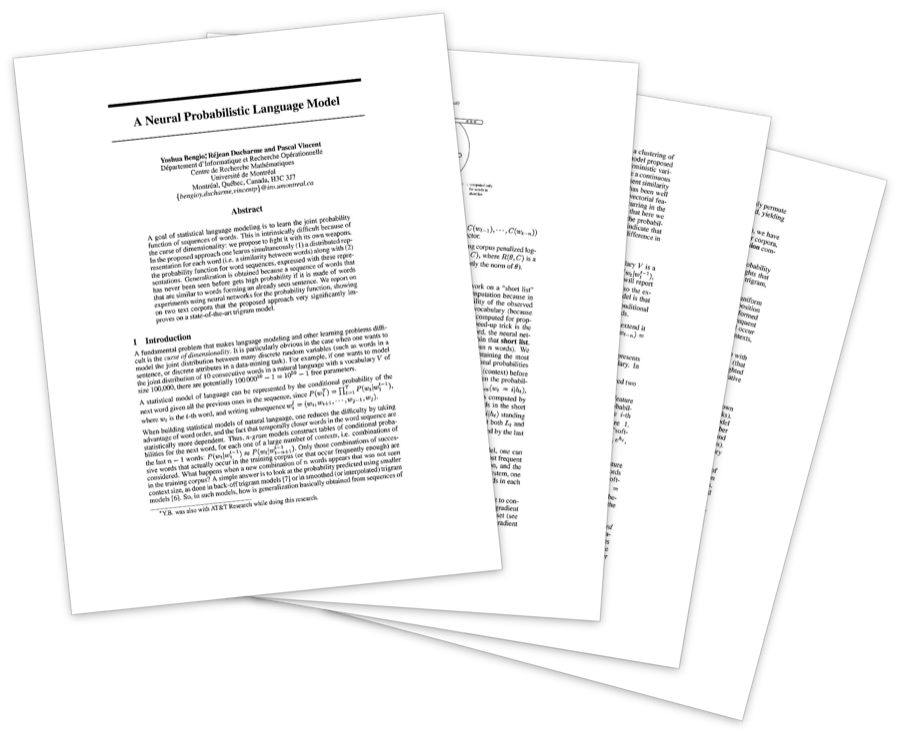<span class="gutter-figure-caption">[*A Neural Probabilistic Language Model* (2000)](https://papers.nips.cc/paper_files/paper/2000/hash/728f206c2a01bf572b5940d7d9a8fa4c-Abstract.html)</span></span>


> In which we increase the expressivity of the architecture from linear to non-linear models, namely by composing many layers of logistic regression to form of a neural network.

<div class="toc">

- [3.1 Learning Representations with FFNs](#32-learning-representations-with-ffns)
  - [3.1.1 Linear Architectures on Non-Linear Data]()
  - [3.1.2 From Localist to Distributional Representations]()
  - [3.1.3 From Perceptrons to Multi Layer Perceptron]()
  - [3.1.4 Loss Function with Cross Entropy]()
  - [3.1.5 Optimization with Gradient Descent via Backpropagation]()

</div>

#### 3.1.1 Linear Architectures on Non-Linear Data
<small>[$\hookleftarrow$ Table of Contents (§3.1 Learning Representations with FFNs)](#31-learning-representations-with-ffns)</small>

#### 3.1.2 From Perceptron Architecture to Multi Layer Perceptron
<small>[$\hookleftarrow$ Table of Contents (§3.2 Learning Representations with FFNs)](#12-next-token-prediction-is-classification-and-compression)</small>

Recall that the task of house price prediction and sentiment classification which can be modelled
by functions of the form $f\colon\reals^d \to \reals$ and $f\colon\reals^d \to [0,1]$ respectively.
The simplest inductive bias was made, in a which a linear relationship was assumed to hold between the input and output spaces,
and where the output was subsequently modeled as an inner product $<,>: \reals^d \times \reals^d \to \reals$
between an input vector and a weight vector.
For the case of regression, we have $y=f(\mathbf{x};\theta):= \theta^{\top}\mathbf{x}$,
and for the case of classification, we have $y=f(\mathbf{x};\theta):= \sigma(\theta^{\top}\mathbf{x})$,
todo:glm,exp.
The key entry point into the function class of **deep neural networks**<span class="defnote">**deep neural network**</span><span class="lecnote">*<span class="fa-svg"><svg xmlns="http://www.w3.org/2000/svg" viewBox="0 0 512 512"><!--! Font Awesome Free 6.2.0 by @fontawesome - https://fontawesome.com License - https://fontawesome.com/license/free --><path d="M512 256c0 141.4-114.6 256-256 256S0 397.4 0 256S114.6 0 256 0S512 114.6 512 256zM188.3 147.1c-7.6 4.2-12.3 12.3-12.3 20.9V344c0 8.7 4.7 16.7 12.3 20.9s16.8 4.1 24.3-.5l144-88c7.1-4.4 11.5-12.1 11.5-20.5s-4.4-16.1-11.5-20.5l-144-88c-7.4-4.5-16.7-4.7-24.3-.5z"/></svg></span> [Stanford CS109 | Deep Learning | Lecture 25](https://www.youtube.com/watch?v=MSfI6TTgyl4&list=PLoROMvodv4rOpr_A7B9SriE_iZmkanvUg&index=26)*</span><span class="lecnote">*<span class="fa-svg"><svg xmlns="http://www.w3.org/2000/svg" viewBox="0 0 512 512"><!--! Font Awesome Free 6.2.0 by @fontawesome - https://fontawesome.com License - https://fontawesome.com/license/free --><path d="M512 256c0 141.4-114.6 256-256 256S0 397.4 0 256S114.6 0 256 0S512 114.6 512 256zM188.3 147.1c-7.6 4.2-12.3 12.3-12.3 20.9V344c0 8.7 4.7 16.7 12.3 20.9s16.8 4.1 24.3-.5l144-88c7.1-4.4 11.5-12.1 11.5-20.5s-4.4-16.1-11.5-20.5l-144-88c-7.4-4.5-16.7-4.7-24.3-.5z"/></svg></span> [Stanford CS229: Machine Learning | Lecture 10 - Deep learning I](https://www.youtube.com/watch?v=mpJ2bFF6o8s&list=PLoROMvodv4rNH7qL6-efu_q2_bPuy0adh&index=11)*</span><span class="lecnote">*<span class="fa-svg"><svg xmlns="http://www.w3.org/2000/svg" viewBox="0 0 512 512"><!--! Font Awesome Free 6.2.0 by @fontawesome - https://fontawesome.com License - https://fontawesome.com/license/free --><path d="M512 256c0 141.4-114.6 256-256 256S0 397.4 0 256S114.6 0 256 0S512 114.6 512 256zM188.3 147.1c-7.6 4.2-12.3 12.3-12.3 20.9V344c0 8.7 4.7 16.7 12.3 20.9s16.8 4.1 24.3-.5l144-88c7.1-4.4 11.5-12.1 11.5-20.5s-4.4-16.1-11.5-20.5l-144-88c-7.4-4.5-16.7-4.7-24.3-.5z"/></svg></span> [Stanford CS229: Machine Learning | Lecture 11 - Deep Learning II](https://www.youtube.com/watch?v=4wmqDaFhs9E&list=PLoROMvodv4rNH7qL6-efu_q2_bPuy0adh&index=12)*</span><span class="lecnote">*<span class="fa-svg"><svg xmlns="http://www.w3.org/2000/svg" viewBox="0 0 512 512"><!--! Font Awesome Free 6.2.0 by @fontawesome - https://fontawesome.com License - https://fontawesome.com/license/free --><path d="M512 256c0 141.4-114.6 256-256 256S0 397.4 0 256S114.6 0 256 0S512 114.6 512 256zM188.3 147.1c-7.6 4.2-12.3 12.3-12.3 20.9V344c0 8.7 4.7 16.7 12.3 20.9s16.8 4.1 24.3-.5l144-88c7.1-4.4 11.5-12.1 11.5-20.5s-4.4-16.1-11.5-20.5l-144-88c-7.4-4.5-16.7-4.7-24.3-.5z"/></svg></span> [Stanford CS224N: NLP with Deep Learning | Lecture 1 - Intro and Word Vectors](https://youtu.be/DzpHeXVSC5I?list=PLoROMvodv4rOaMFbaqxPDoLWjDaRAdP9D&t=1702)*</span> is that of logistic regression,
because the log odds produced by the inner product (which are indeed *affine*)
required a mapping into a valid probability via sigmoid function
$\sigma: \reals \to [0,1]$, where $\sigma(x):= \frac{1}{1+e(-x)}$ which is in fact not *linear* nor *affine*.

The next natural question to ask then is whether the logistic regression model is considered a deep neural network?
The answer is that technically *yes*, it can be considered a *degenerative* deep neural network with $0$ *hidden layers*<span class="sidenote-number"></span><span class="sidenote">*In the same way that a *list* can be considered a degenerative binary tree or graph*</span>.
These so-called hidden layers automate the construction of the *representation* through *learning*,
so that the model not only discovers the mapping from representation to output, but also the representation itself.
The functions of deep neural networks will take the form of $f(\mathbf{x}):= g \circ \phi(\mathbf{x})$
with $g$ being a linear classifier on feature extractor
$\phi: \reals^{d_1} \to \reals^{d_n}$,
$\phi(\mathbf{x}):= h^{[l]} \circ h^{[l-1]} \circ \cdots h^{[1]} \circ h^{[0]}(\mathbf{x})$
where $l$ is the number of compositional *layers*, and each intermediate function $h^{[i]}$ has the form of $h^{[i]}: \reals^{d_i} \to \reals^{d_{i+1}}$.
Each hidden layer successively and gradually lifts the complexity and abstraction of the data's representation<span class="sidenote-number"></span><span class="sidenote">*Chris Olah, cofounder of Anthropic and the lead of it's interpretability research wrote an excellent article on how software 2.0's representation learning loosely correspond to software 1.0's types in [Neural Networks, Types, and Functional Programming](https://colah.github.io/posts/2015-09-NN-Types-FP/)*</span>.

**Together, these two aspects of learning *non-linear*, *representations* form the essence of *deep learning*.**

<div class="full-bleed">

<div class="dual">

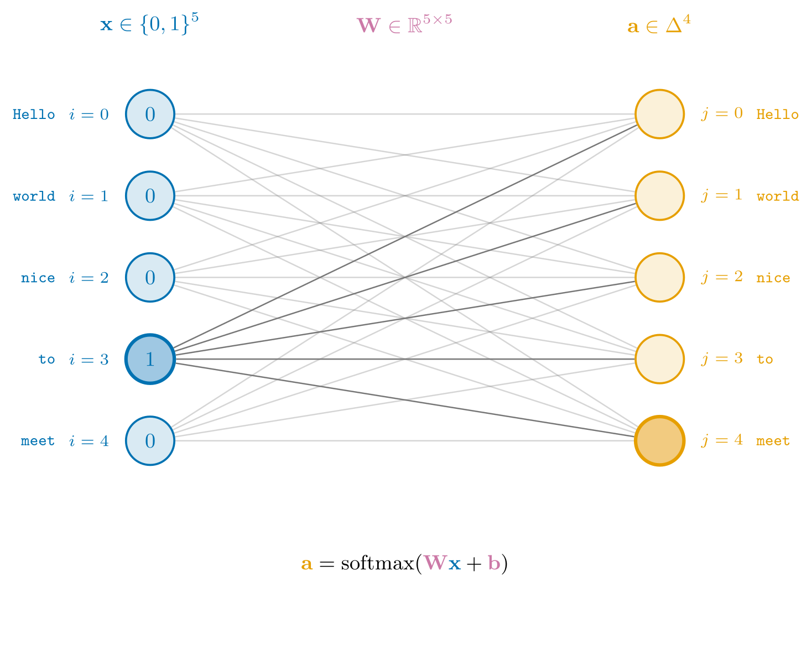

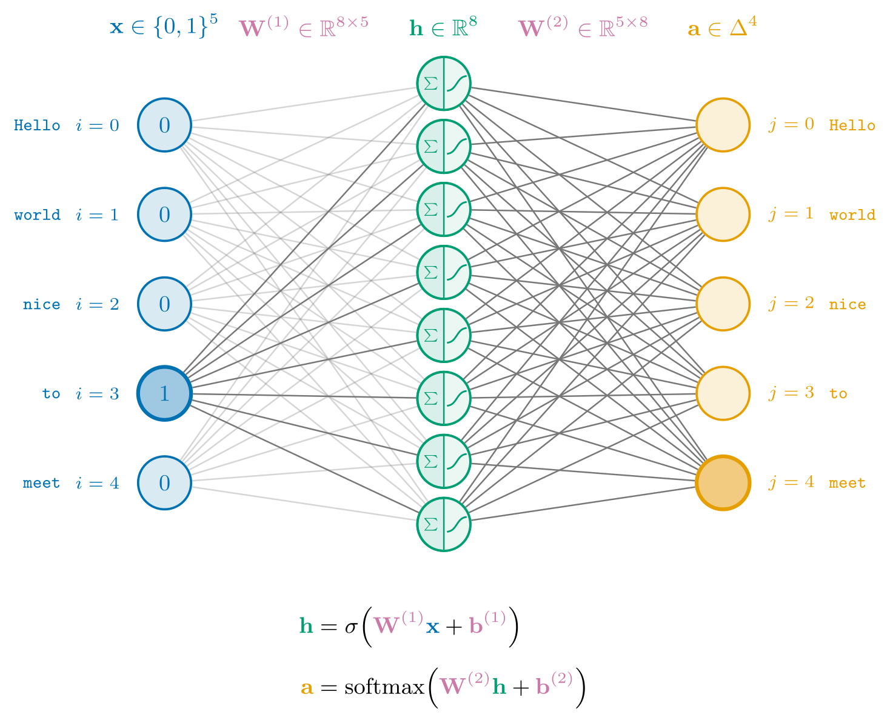

</div>
</div>

<div class="full-bleed">

<div class="dual">

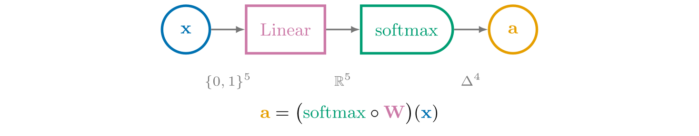
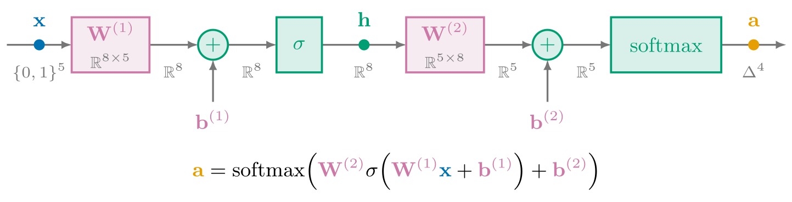

</div>
</div>


Lorem ipsum dolor sit amet, consectetur adipiscing elit. Proin finibus interdum arcu, ut venenatis dolor rutrum eget. Nulla nec urna tellus. Donec sollicitudin hendrerit sollicitudin. Proin sagittis, velit commodo congue rhoncus, metus turpis hendrerit nisi, a accumsan quam ante ultricies sem. Orci varius natoque penatibus et magnis dis parturient montes, nascetur ridiculus mus. Ut aliquet ut justo non posuere. Quisque in rutrum nunc. Phasellus vehicula tortor mi, vehicula placerat diam ultrices eget. Aliquam et consequat eros, quis fermentum tortor. Sed eu nisl viverra, auctor velit vel, elementum ante. Orci varius natoque penatibus et magnis dis parturient montes, nascetur ridiculus mus. Proin aliquet metus sit amet nulla cursus maximus in feugiat mi. Praesent vehicula magna sed scelerisque elementum. Nulla euismod rutrum turpis sed hendrerit.


<div class="full-bleed">
<iframe height="500px" loading="lazy" src="https://www.youtube.com/embed/aircAruvnKk?si=fx6nMsSz_2ehG9DP"  title="YouTube video player" frameborder="0" allow="accelerometer; autoplay; clipboard-write; encrypted-media; gyroscope; picture-in-picture; web-share" referrerpolicy="strict-origin-when-cross-origin" allowfullscreen></iframe>
</div>

<span class="fa-svg video-icon"><svg xmlns="http://www.w3.org/2000/svg" viewBox="0 0 512 512"><!--! Font Awesome Free 6.2.0 by @fontawesome - https://fontawesome.com License - https://fontawesome.com/license/free (Icons: CC BY 4.0) --><path d="M512 256c0 141.4-114.6 256-256 256S0 397.4 0 256S114.6 0 256 0S512 114.6 512 256zM188.3 147.1c-7.6 4.2-12.3 12.3-12.3 20.9V344c0 8.7 4.7 16.7 12.3 20.9s16.8 4.1 24.3-.5l144-88c7.1-4.4 11.5-12.1 11.5-20.5s-4.4-16.1-11.5-20.5l-144-88c-7.4-4.5-16.7-4.7-24.3-.5z"/></svg></span>[But what is a neural network? | Deep learning chapter 1 (3Blue1Brown 2017)](https://youtu.be/IHZwWFHWa-w?si=0Rn6f86aVCGYZ5zD)

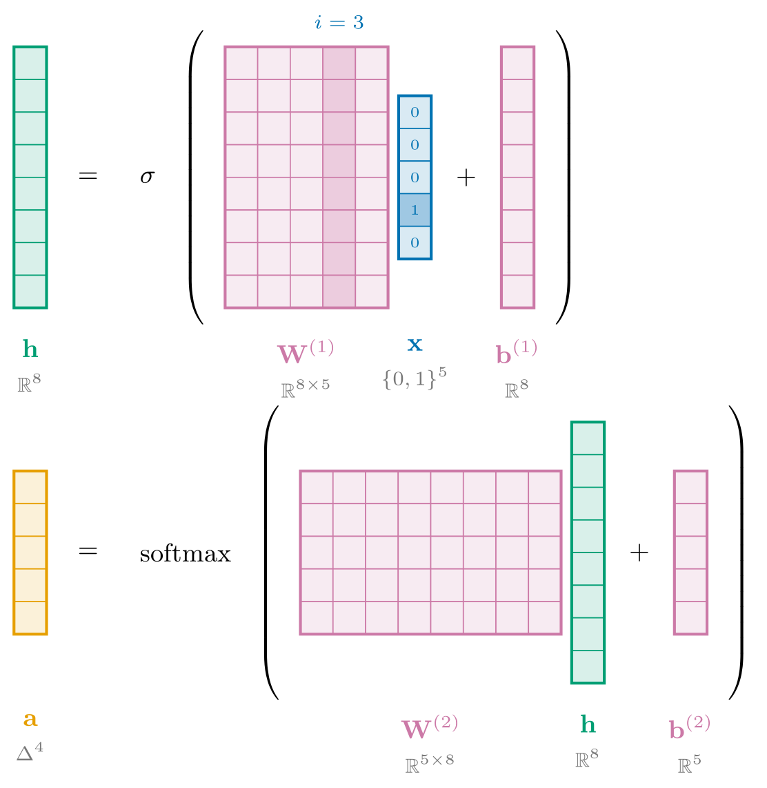

Let's now turn out attention to the function bodies of these $h^{[i]}$'s with a deep neural netork of $1$ hidden layer,
carrying out the task of price regression and sentiment classification so that $f$ has the form $f\colon\reals^d\to\reals$.
With the statistical learning foundation from part one, we will simply present the
forward pass $f(\mathbf{x})$, the loss function $\mathscr{L}(d, \theta)$, and the backward pass $\ell'(y,\hat{y},\theta)$.

*Forward Pass*

The functions of deep neural networks will take the form of $f(\mathbf{x}):= g \circ \phi(\mathbf{x})$
with $g$ being a linear classifier on feature extractor

$$
\begin{aligned}
\phi&: \reals^{d_1} \to \reals^{d_n} \\
\phi(\mathbf{x})&:= h^{[l]} \circ h^{[l-1]} \circ \cdots h^{[1]} \circ h^{[0]}(\mathbf{x})
\end{aligned}
$$
where $l$ is the number of compositional *layers*, and each intermediate function $h^{[i]}$ has the form of $h^{[i]}: \reals^{d_i} \to \reals^{d_{i+1}}$.

*Loss Function*

*Backward Pass*

<!-- <div class="full-bleed">
<iframe height="750px" loading="lazy" src="https://www.youtube.com/embed/l-9ALe3U-Fg?si=ifeERfdy_onDdlpj" title="YouTube video player" frameborder="0" allow="accelerometer; autoplay; clipboard-write; encrypted-media; gyroscope; picture-in-picture; web-share" referrerpolicy="strict-origin-when-cross-origin" allowfullscreen></iframe>
</div> -->

{{#nb 3.1_ffn.ipynb:1}}

<div class="full-bleed">
<iframe height="500px" loading="lazy" src="https://www.youtube.com/embed/qx7hirqgfuU?si=EAPTizMLo2wDeesv" title="YouTube video player" frameborder="0" allow="accelerometer; autoplay; clipboard-write; encrypted-media; gyroscope; picture-in-picture; web-share" referrerpolicy="strict-origin-when-cross-origin" allowfullscreen></iframe>
</div>

<!-- With a solid understanding of how statistical learning recovers stochastic maps of data in higher dimensional coordinate spaces,
you are now ready to start training your first deep neural networks. The subdiscipline of training deep neural nets follows the same
practice of given some dataset $d=\{(x^{(i)},y^{(i)})\}_{i=1}^n$, declaring your model's forward pass $\hat{y}=f(\mathbf{x};\theta)$, it's scoring function $\ell(y,\hat{y}, \theta)$
and resulting backward pass $\ell'(y,\hat{y},\theta)$, and iteratively optimizing such score with gradient descent,
where $\theta^{t+1} := \theta^{t} - \eta\nabla\mathscr{L}(d, \theta)$.
The only difference as we'll shortly see soon is that the inductive bias used to model the function $f$ includes *non-linearities* $\varphi$ with many layers of *composition*.
This second part of the book focuses on the unsupervised/self-supervised
task of *sequence learning* building up to the transformer architecture behind GPT2,
but let's train our first nets using the same tasks from part one to ensure we understand the core foundation of deep neural nets. -->

<!-- In part 1 of the book we trained generalized linear models of the form ___.
In part 2 we modify and increase the expressivity of the function class by including non-linearities $\varphi$.
The feedforward neural network simply put is a series of linear and non-linear layers
of the form $f\colon\reals^{d_0} \to \reals^{d_{l-1}}$ so
$$
f(\mathbf{x};w) := W^{(l-1)} \circ (\varphi \circ W^{(l-2)}) \circ \cdots \circ (\varphi \circ W^{(0)}) \circ \mathbf{x}
$$

where $W^{(i)} \in \reals^{d_{i-1}\times d_i}$, $\varphi:\reals^{d_i} \to \reals^{d_{i+1}}$ is an elementwise nonlinearity, and $w := (W^{(0)}, \dots , W^{(l-1)})$. Conceptually, the
linear layers are performing linear transformations that rotate, reflect, shear, and scale space, whereas the nonlinear transformations perform transformations that squash and twist space.

We will now use the same model of the feedforward neural network to accomplish two other goals.
Namely, representation learning, and sequence learning.

- representation learning
  - https://colah.github.io/posts/2015-09-NN-Types-FP/
  - https://arxiv.org/abs/1311.2901
- non-linear: playground.tensorflow -->

<!-- <div class="full-bleed">
<iframe height="750px" loading="lazy" src="https://www.youtube.com/embed/TCH_1BHY58I?si=pyOwJBGyDinoif5i" title="YouTube video player" frameborder="0" allow="accelerometer; autoplay; clipboard-write; encrypted-media; gyroscope; picture-in-picture; web-share" referrerpolicy="strict-origin-when-cross-origin" allowfullscreen></iframe>
</div> -->

<!-- A sequence model, simply put, is the conditional probability distribution of an output token given an input token $p(x^{(i)}|y^{(i)})$.
A sequence of tokens can be a sentence of words in the domain of language,
a series of pixels in the domain of vision, or a stream of waves in the domain of audio.

Since we are modeling language as stochastic phenomena, we use the formal language of probability theory,
where a probability space is a measurable space $(\Omega, \mathcal{F})$ with a measure $\mathbb{P}: \Omega \to \lbrack 0,1\rbrack$.
In the domain of language, the measurable space consists of a
sample space $\Omega$ which is the set of all *tokens* modelling a *vocabulary*,
and the event space $\mathcal{F}$ is the set of all *token combinations* which model a *language*.
The measure $\mathbb{P}: \mathcal{F} \to \lbrack 0,1\rbrack$
is the measure of the weight of a particular token combination (sentence, really) as an event
with respect to the set of all possible token combinations (sentences) as the entire event space.
Once we use a random variable $X$ to map events to $\reals$,
we can forget about the probability space and focus our attention on language models
which are joint probability distribution over all sequences of tokens. -->

Lorem ipsum dolor sit amet, consectetur adipiscing elit. Proin finibus interdum arcu, ut venenatis dolor rutrum eget. Nulla nec urna tellus. Donec sollicitudin hendrerit sollicitudin. Proin sagittis, velit commodo congue rhoncus, metus turpis hendrerit nisi, a accumsan quam ante ultricies sem. Orci varius natoque penatibus et magnis dis parturient montes, nascetur ridiculus mus. Ut aliquet ut justo non posuere. Quisque in rutrum nunc. Phasellus vehicula tortor mi, vehicula placerat diam ultrices eget. Aliquam et consequat eros, quis fermentum tortor. Sed eu nisl viverra, auctor velit vel, elementum ante. Orci varius natoque penatibus et magnis dis parturient montes, nascetur ridiculus mus. Proin aliquet metus sit amet nulla cursus maximus in feugiat mi. Praesent vehicula magna sed scelerisque elementum. Nulla euismod rutrum turpis sed hendrerit.

#### 3.1.3 Loss Function with Cross Entropy
<small>[$\hookleftarrow$ Table of Contents (§3.1 Learning Representations with FFNs)](#31-learning-representations-with-ffns)</small>

#### 3.1.4 Optimization with Stochastic Gradient Descent
<small>[$\hookleftarrow$ Table of Contents (§3.1 Learning Representations with FFNs)](#31-learning-representations-with-ffns)</small>

Lorem ipsum<span class="lecnote">*<span class="fa-svg"><svg xmlns="http://www.w3.org/2000/svg" viewBox="0 0 512 512"><!--! Font Awesome Free 6.2.0 by @fontawesome - https://fontawesome.com License - https://fontawesome.com/license/free --><path d="M512 256c0 141.4-114.6 256-256 256S0 397.4 0 256S114.6 0 256 0S512 114.6 512 256zM188.3 147.1c-7.6 4.2-12.3 12.3-12.3 20.9V344c0 8.7 4.7 16.7 12.3 20.9s16.8 4.1 24.3-.5l144-88c7.1-4.4 11.5-12.1 11.5-20.5s-4.4-16.1-11.5-20.5l-144-88c-7.4-4.5-16.7-4.7-24.3-.5z"/></svg></span> [Stanford CS224N: NLP with Deep Learning | Lecture 3 - Backpropagation, Neural Network](https://www.youtube.com/watch?v=HnliVHU2g9U&list=PLoROMvodv4rOaMFbaqxPDoLWjDaRAdP9D&index=4)*</span> dolor sit amet, consectetur adipiscing elit. Proin finibus interdum arcu, ut venenatis dolor rutrum eget. Nulla nec urna tellus. Donec sollicitudin hendrerit sollicitudin. Proin sagittis, velit commodo congue rhoncus, metus turpis hendrerit nisi, a accumsan quam ante ultricies sem. Orci varius natoque penatibus et magnis dis parturient montes, nascetur ridiculus mus. Ut aliquet ut justo non posuere. Quisque in rutrum nunc. Phasellus vehicula tortor mi, vehicula placerat diam ultrices eget. Aliquam et consequat eros, quis fermentum tortor. Sed eu nisl viverra, auctor velit vel, elementum ante. Orci varius natoque penatibus et magnis dis parturient montes, nascetur ridiculus mus. Proin aliquet metus sit amet nulla cursus maximus in feugiat mi. Praesent vehicula magna sed scelerisque elementum. Nulla euismod rutrum turpis sed hendrerit.


<div class="full-bleed">
<iframe height="500px" loading="lazy" src="https://www.youtube.com/embed/IHZwWFHWa-w?si=ZRADNXbpRFy99oMp"  title="YouTube video player" frameborder="0" allow="accelerometer; autoplay; clipboard-write; encrypted-media; gyroscope; picture-in-picture; web-share" referrerpolicy="strict-origin-when-cross-origin" allowfullscreen></iframe>
</div>

Lorem ipsum dolor sit amet, consectetur adipiscing elit. Proin finibus interdum arcu, ut venenatis dolor rutrum eget. Nulla nec urna tellus. Donec sollicitudin hendrerit sollicitudin. Proin sagittis, velit commodo congue rhoncus, metus turpis hendrerit nisi, a accumsan quam ante ultricies sem. Orci varius natoque penatibus et magnis dis parturient montes, nascetur ridiculus mus. Ut aliquet ut justo non posuere. Quisque in rutrum nunc. Phasellus vehicula tortor mi, vehicula placerat diam ultrices eget. Aliquam et consequat eros, quis fermentum tortor. Sed eu nisl viverra, auctor velit vel, elementum ante. Orci varius natoque penatibus et magnis dis parturient montes, nascetur ridiculus mus. Proin aliquet metus sit amet nulla cursus maximus in feugiat mi. Praesent vehicula magna sed scelerisque elementum. Nulla euismod rutrum turpis sed hendrerit.

### 3.2 Iterative Optimization
<small>[$\hookleftarrow$ Table of Contents](#ii-table-of-contents)</small><span class="gutter-figure gutter-figure-left" style="--margin-note-raise: 48px"><span class="gutter-figure-caption">[Geoffrey Hinton](https://en.wikipedia.org/wiki/Geoffrey_Hinton)</span></span><span class="gutter-figure gutter-figure-right">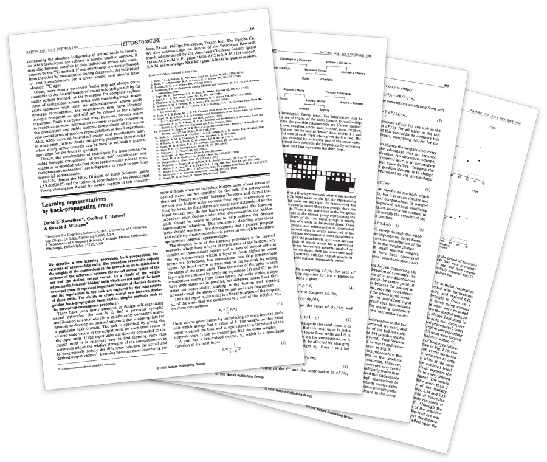<span class="gutter-figure-caption">[*Learning representations by back-propagating errors* (1986)](https://www.cs.toronto.edu/~hinton/absps/naturebp.pdf)</span></span>

> In which we transition from direct to iterative optimization methods, given that neural networks we will encounter are highly non-convex.

<div class="toc">

- [3.1 Optimization with Gradient Descent](#31-optimization-with-gradient-descent)
  - [3.2.1 Taylor Series and their Derivatives, Gradients, and Hessians]()
  - [3.2.2 Second Order Optimization with Newton's Method]()
  - [3.2.3 Second Order Optimization with Gauss Newton Method]()
  - [3.2.4 First Order Optimization with Steepest Descent]()
  - [3.2.5 First Order Optimization with Gradient Descent]()

</div>

#### 3.2.1 Taylor Series and their Derivatives, Gradients, and Hessians

<br>

<div class="dropcap">

By now, you understand that the discipline of machine learning recovers parameterized functions $f_{\theta}: \mathscr{X} \to \mathscr{Y}$ from dataset $d:= \{(\mathbf{x}^{(i)}, \mathbf{y}^{(i)})\}_{i=1}^{n}$,
and in the particular case of language modeling, such input space and output space is the set of all sentences $X:= V^{*}$ and the set of all words $Y := V$, the regime of learning is that of classification.
That is, a language model $f$ is a next token predictor $f: V^{*} \to V$ which generates sequences by chaining the classifications of individual words with the product rule.

</div>

In [§1. Self-Supervised Sequence Learning with Single-Layer Networks](./1.md#1-self-supervised-sequence-learning-with-single-layer-networks), we became familar with two approaches to model $\hat{f}$, namely the bigram and logistic regression models
corresponding to a stochastic matrix $P$ and a squashed weighted sum $\sigma(w^{\top}\mathbf{x})$
respectively, which in turn are composed with decision boundary to decide on the final output $v \in V$.
That is, $f:=$ and $f_{\theta}:=$ (expand).
Particularly with the parameterized logistic regression $f_{\theta}$,
we specified a loss function $\mathscr{L}(\theta)$ (expand, loss.mle) of such parameters and optimized it with
iterative reweighted least squares.
Before we move onto increasing the expressivity of our models $\hat{f}$
from single layer networks to multi layer networks,
let us first introduce a new method of optimizing the loss function,
namely **gradient descent**<span class="defnote">**gradient descent**</span>
which is the fundamental optmization technique for training neural nets.
It wouldn't be an overstatement to call it the $F=ma$ of deep learning.

The intuition behind gradient descent is quite simple<span class="sidenote-number"></span><span class="sidenote">*In the case of $\reals^2$ and $\reals^3$ which correspond to our physical intuition. We will see how this breaks down in higher dimensions $\reals^d$.*</span>.

$\theta_{i+1} := \theta_{i} - \eta \nabla \mathscr{L(\theta)}$

(pseudocode)
(borschtcode `borscht.backwards()`)

#### 3.2.2 Second Order Optimization with Newton's Method
#### 3.2.3 Second Order Optimization with Gauss Newton Method
#### 3.2.4 First Order Optimization with Steepest Descent
#### 3.2.5 First Order Optimization with Gradient Descent

### 3.3 Learning Representations with CNNs
<small>[$\hookleftarrow$ Table of Contents](#ii-table-of-contents)</small><span class="gutter-figure gutter-figure-left" style="--margin-note-raise: 48px"><span class="gutter-figure-caption">[Yann LeCun](https://en.wikipedia.org/wiki/Yann_LeCun)</span></span><span class="gutter-figure gutter-figure-right">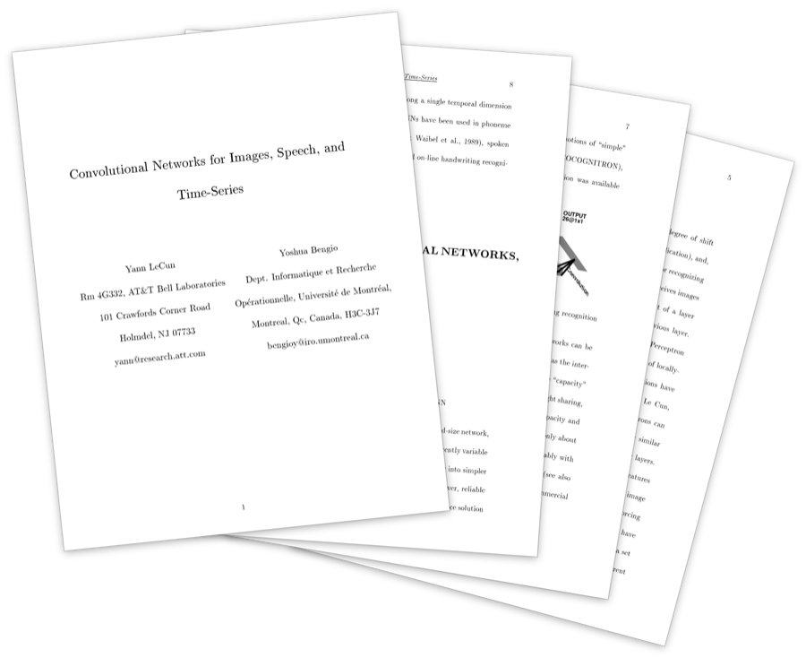<span class="gutter-figure-caption">[*Convolutional Networks for Images, Speech, and Time-Series* (1995)](http://yann.lecun.com/exdb/publis/pdf/lecun-bengio-95a.pdf)</span></span>

Lorem ipsum dolor sit amet, consectetur adipiscing elit. Proin finibus interdum arcu, ut venenatis dolor rutrum eget. Nulla nec urna tellus. Donec sollicitudin hendrerit sollicitudin. Proin sagittis, velit commodo congue rhoncus, metus turpis hendrerit nisi, a accumsan quam ante ultricies sem. Orci varius natoque penatibus et magnis dis parturient montes, nascetur ridiculus mus. Ut aliquet ut justo non posuere. Quisque in rutrum nunc. Phasellus vehicula tortor mi, vehicula placerat diam ultrices eget. Aliquam et consequat eros, quis fermentum tortor. Sed eu nisl viverra, auctor velit vel, elementum ante. Orci varius natoque penatibus et magnis dis parturient montes, nascetur ridiculus mus. Proin aliquet metus sit amet nulla cursus maximus in feugiat mi. Praesent vehicula magna sed scelerisque elementum. Nulla euismod rutrum turpis sed hendrerit.

```python
# Near copy paste of the layers we have developed in Part 3

# -----------------------------------------------------------------------------------------------
class Linear:
  
  def __init__(self, fan_in, fan_out, bias=True):
    self.weight = torch.randn((fan_in, fan_out)) / fan_in**0.5 # note: kaiming init
    self.bias = torch.zeros(fan_out) if bias else None
  
  def __call__(self, x):
    self.out = x @ self.weight
    if self.bias is not None:
      self.out += self.bias
    return self.out
  
  def parameters(self):
    return [self.weight] + ([] if self.bias is None else [self.bias])

# -----------------------------------------------------------------------------------------------
class BatchNorm1d:
  
  def __init__(self, dim, eps=1e-5, momentum=0.1):
    self.eps = eps
    self.momentum = momentum
    self.training = True
    # parameters (trained with backprop)
    self.gamma = torch.ones(dim)
    self.beta = torch.zeros(dim)
    # buffers (trained with a running 'momentum update')
    self.running_mean = torch.zeros(dim)
    self.running_var = torch.ones(dim)
  
  def __call__(self, x):
    # calculate the forward pass
    if self.training:
      if x.ndim == 2:
        dim = 0
      elif x.ndim == 3:
        dim = (0,1)
      xmean = x.mean(dim, keepdim=True) # batch mean
      xvar = x.var(dim, keepdim=True) # batch variance
    else:
      xmean = self.running_mean
      xvar = self.running_var
    xhat = (x - xmean) / torch.sqrt(xvar + self.eps) # normalize to unit variance
    self.out = self.gamma * xhat + self.beta
    # update the buffers
    if self.training:
      with torch.no_grad():
        self.running_mean = (1 - self.momentum) * self.running_mean + self.momentum * xmean
        self.running_var = (1 - self.momentum) * self.running_var + self.momentum * xvar
    return self.out
  
  def parameters(self):
    return [self.gamma, self.beta]

# -----------------------------------------------------------------------------------------------
class Tanh:
  def __call__(self, x):
    self.out = torch.tanh(x)
    return self.out
  def parameters(self):
    return []

# -----------------------------------------------------------------------------------------------
class Embedding:
  
  def __init__(self, num_embeddings, embedding_dim):
    self.weight = torch.randn((num_embeddings, embedding_dim))
    
  def __call__(self, IX):
    self.out = self.weight[IX]
    return self.out
  
  def parameters(self):
    return [self.weight]

# -----------------------------------------------------------------------------------------------
class FlattenConsecutive:
  
  def __init__(self, n):
    self.n = n
    
  def __call__(self, x):
    B, T, C = x.shape
    x = x.view(B, T//self.n, C*self.n)
    if x.shape[1] == 1:
      x = x.squeeze(1)
    self.out = x
    return self.out
  
  def parameters(self):
    return []

# -----------------------------------------------------------------------------------------------
class Sequential:
  
  def __init__(self, layers):
    self.layers = layers
  
  def __call__(self, x):
    for layer in self.layers:
      x = layer(x)
    self.out = x
    return self.out
  
  def parameters(self):
    # get parameters of all layers and stretch them out into one list
    return [p for layer in self.layers for p in layer.parameters()]

# original network
# n_embd = 10 # the dimensionality of the character embedding vectors
# n_hidden = 300 # the number of neurons in the hidden layer of the MLP
# model = Sequential([
#   Embedding(vocab_size, n_embd),
#   FlattenConsecutive(8), Linear(n_embd * 8, n_hidden, bias=False), BatchNorm1d(n_hidden), Tanh(),
#   Linear(n_hidden, vocab_size),
# ])

# hierarchical network
n_embd = 24 # the dimensionality of the character embedding vectors
n_hidden = 128 # the number of neurons in the hidden layer of the MLP
model = Sequential([
  Embedding(vocab_size, n_embd),
  FlattenConsecutive(2), Linear(n_embd * 2, n_hidden, bias=False), BatchNorm1d(n_hidden), Tanh(),
  FlattenConsecutive(2), Linear(n_hidden*2, n_hidden, bias=False), BatchNorm1d(n_hidden), Tanh(),
  FlattenConsecutive(2), Linear(n_hidden*2, n_hidden, bias=False), BatchNorm1d(n_hidden), Tanh(),
  Linear(n_hidden, vocab_size),
])

# parameter init
with torch.no_grad():
  model.layers[-1].weight *= 0.1 # last layer make less confident

parameters = model.parameters()
print(sum(p.nelement() for p in parameters)) # number of parameters in total
for p in parameters:
  p.requires_grad = True
```


Lorem ipsum dolor sit amet, consectetur adipiscing elit. Proin finibus interdum arcu, ut venenatis dolor rutrum eget. Nulla nec urna tellus. Donec sollicitudin hendrerit sollicitudin. Proin sagittis, velit commodo congue rhoncus, metus turpis hendrerit nisi, a accumsan quam ante ultricies sem. Orci varius natoque penatibus et magnis dis parturient montes, nascetur ridiculus mus. Ut aliquet ut justo non posuere. Quisque in rutrum nunc. Phasellus vehicula tortor mi, vehicula placerat diam ultrices eget. Aliquam et consequat eros, quis fermentum tortor. Sed eu nisl viverra, auctor velit vel, elementum ante. Orci varius natoque penatibus et magnis dis parturient montes, nascetur ridiculus mus. Proin aliquet metus sit amet nulla cursus maximus in feugiat mi. Praesent vehicula magna sed scelerisque elementum. Nulla euismod rutrum turpis sed hendrerit.

### 3.4 Learning Representations with RNNs
<small>[$\hookleftarrow$ Table of Contents](#ii-table-of-contents)</small>

Lorem ipsum dolor sit amet, consectetur adipiscing elit. Proin finibus interdum arcu, ut venenatis dolor rutrum eget. Nulla nec urna tellus. Donec sollicitudin hendrerit sollicitudin. Proin sagittis, velit commodo congue rhoncus, metus turpis hendrerit nisi, a accumsan quam ante ultricies sem. Orci varius natoque penatibus et magnis dis parturient montes, nascetur ridiculus mus. Ut aliquet ut justo non posuere. Quisque in rutrum nunc. Phasellus vehicula tortor mi, vehicula placerat diam ultrices eget. Aliquam et consequat eros, quis fermentum tortor. Sed eu nisl viverra, auctor velit vel, elementum ante. Orci varius natoque penatibus et magnis dis parturient montes, nascetur ridiculus mus. Proin aliquet metus sit amet nulla cursus maximus in feugiat mi. Praesent vehicula magna sed scelerisque elementum. Nulla euismod rutrum turpis sed hendrerit.

```python
class RNNCell(nn.Module):
  """
  the job of a 'Cell' is to:
  take input at current time step x_{t} and the hidden state at the
  previous time step h_{t-1} and return the resulting hidden state
  h_{t} at the current timestep
  """
  def __init__(self, config):
    super().__init__()
    self.xh_to_h = nn.Linear(config.n_embd + config.n_embd2, config.n_embd2)

  def forward(self, xt, hprev):
    xh = torch.cat([xt, hprev], dim=1)
    ht = F.tanh(self.xh_to_h(xh))
    return ht

class RNN(nn.Module):
  def __init__(self, config, cell_type):
    super().__init__()
    self.block_size = config.block_size
    self.vocab_size = config.vocab_size
    self.start = nn.Parameter(torch.zeros(1, config.n_embd2)) # the starting hidden state
    self.wte = nn.Embedding(config.vocab_size, config.n_embd) # token embeddings table
    if cell_type == 'rnn':
        self.cell = RNNCell(config)
    elif cell_type == 'gru':
        self.cell = GRUCell(config)
    self.lm_head = nn.Linear(config.n_embd2, self.vocab_size)

  def get_block_size(self):
    return self.block_size

  def forward(self, idx, targets=None):
    device = idx.device
    b, t = idx.size()

    # embed all the integers up front and all at once for efficiency
    emb = self.wte(idx) # (b, t, n_embd)

    # sequentially iterate over the inputs and update the RNN state each tick
    hprev = self.start.expand((b, -1)) # expand out the batch dimension
    hiddens = []
    for i in range(t):
      xt = emb[:, i, :] # (b, n_embd)
      ht = self.cell(xt, hprev) # (b, n_embd2)
      hprev = ht
      hiddens.append(ht)

    # decode the outputs
    hidden = torch.stack(hiddens, 1) # (b, t, n_embd2)
    logits = self.lm_head(hidden)

    # if we are given some desired targets also calculate the loss
    loss = None
    if targets is not None:
      loss = F.cross_entropy(logits.view(-1, logits.size(-1)), targets.view(-1), ignore_index=-1)

    return logits, loss
```


Lorem ipsum dolor sit amet, consectetur adipiscing elit. Proin finibus interdum arcu, ut venenatis dolor rutrum eget. Nulla nec urna tellus. Donec sollicitudin hendrerit sollicitudin. Proin sagittis, velit commodo congue rhoncus, metus turpis hendrerit nisi, a accumsan quam ante ultricies sem. Orci varius natoque penatibus et magnis dis parturient montes, nascetur ridiculus mus. Ut aliquet ut justo non posuere. Quisque in rutrum nunc. Phasellus vehicula tortor mi, vehicula placerat diam ultrices eget. Aliquam et consequat eros, quis fermentum tortor. Sed eu nisl viverra, auctor velit vel, elementum ante. Orci varius natoque penatibus et magnis dis parturient montes, nascetur ridiculus mus. Proin aliquet metus sit amet nulla cursus maximus in feugiat mi. Praesent vehicula magna sed scelerisque elementum. Nulla euismod rutrum turpis sed hendrerit.


### 3.5 Learning Representations with GPTs
<small>[$\hookleftarrow$ Table of Contents](#ii-table-of-contents)</small><span class="gutter-figure gutter-figure-left">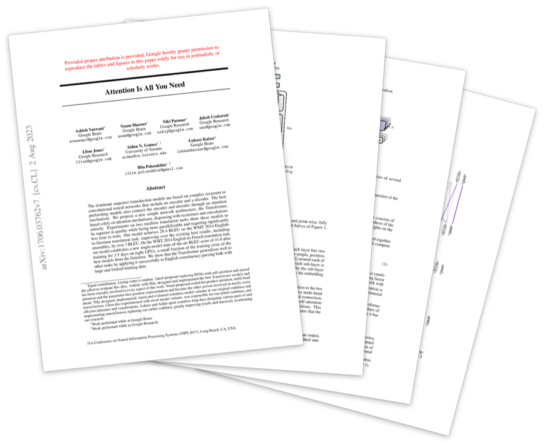<span class="gutter-figure-caption">[*Attention Is All You Need* (2017)](https://arxiv.org/abs/1706.03762)</span></span><span class="gutter-figure gutter-figure-right" style="--margin-note-raise: 48px"><span class="gutter-figure-caption">[Ashish Vaswani](https://en.wikipedia.org/wiki/Ashish_Vaswani)</span></span>

> In which we transition from long-range depencies of recurrent neural nets to the ___ of transformer-based neural nets.

<div class="toc">

- [3.5 Learning Representations with GPTs]()
  - [3.5.1 Architecture Overview]()
  - [3.5.2 Embedding $W_{E}$ and Unembedding $W_{U}$]()
  - [3.5.3 Attention: Keys $W_{K}$, Queries $W_{Q}$, and Values $W_{V}$]()
  - [3.5.4 FFN: Up and Down Projections]()
  - [3.5.4 Final Output]()
  - [3.5.5 Loss Function with Cross Entropy]()
  - [3.5.6 Optimization with Stochastic Gradient Descent]()

</div>

<div class="full-bleed">
  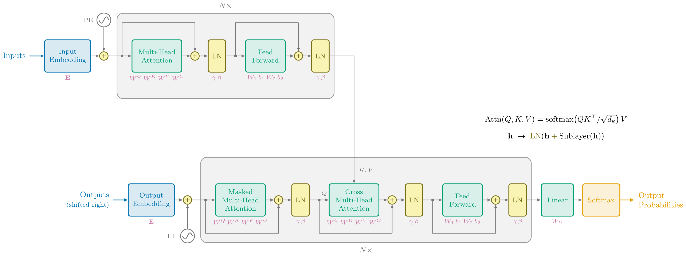
</div>

#### 3.5.2 Embedding $W_{E}$ and Unembedding $W_{U}$

<small>[$\hookleftarrow$ Table of Contents (§3.5 Learning Representations with GPTs)](#35-learning-representations-with-gpts)</small>

Lorem ipsum dolor sit amet, consectetur adipiscing elit. Proin finibus interdum arcu, ut venenatis dolor rutrum eget. Nulla nec urna tellus. Donec sollicitudin hendrerit sollicitudin. Proin sagittis, velit commodo congue rhoncus, metus turpis hendrerit nisi, a accumsan quam ante ultricies sem. Orci varius natoque penatibus et magnis dis parturient montes, nascetur ridiculus mus. Ut aliquet ut justo non posuere. Quisque in rutrum nunc. Phasellus vehicula tortor mi, vehicula placerat diam ultrices eget. Aliquam et consequat eros, quis fermentum tortor. Sed eu nisl viverra, auctor velit vel, elementum ante. Orci varius natoque penatibus et magnis dis parturient montes, nascetur ridiculus mus. Proin aliquet metus sit amet nulla cursus maximus in feugiat mi. Praesent vehicula magna sed scelerisque elementum. Nulla euismod rutrum turpis sed hendrerit.

<div class="full-bleed">
<iframe height="500px" loading="lazy" src="https://www.youtube.com/embed/wjZofJX0v4M?si=pLsG2dhvjadEHahl" title="YouTube video player" frameborder="0" allow="accelerometer; autoplay; clipboard-write; encrypted-media; gyroscope; picture-in-picture; web-share" referrerpolicy="strict-origin-when-cross-origin" allowfullscreen></iframe>
</div>

<span class="fa-svg video-icon"><svg xmlns="http://www.w3.org/2000/svg" viewBox="0 0 512 512"><!--! Font Awesome Free 6.2.0 by @fontawesome - https://fontawesome.com License - https://fontawesome.com/license/free (Icons: CC BY 4.0) --><path d="M512 256c0 141.4-114.6 256-256 256S0 397.4 0 256S114.6 0 256 0S512 114.6 512 256zM188.3 147.1c-7.6 4.2-12.3 12.3-12.3 20.9V344c0 8.7 4.7 16.7 12.3 20.9s16.8 4.1 24.3-.5l144-88c7.1-4.4 11.5-12.1 11.5-20.5s-4.4-16.1-11.5-20.5l-144-88c-7.4-4.5-16.7-4.7-24.3-.5z"/></svg></span>[Transformers, the tech behind LLMs | Deep Learning Chapter 5 (3Blue1Brown 2024)](https://youtu.be/wjZofJX0v4M?si=y4i1t4gMsPuvk_ll)

Lorem ipsum dolor sit amet, consectetur adipiscing elit. Proin finibus interdum arcu, ut venenatis dolor rutrum eget. Nulla nec urna tellus. Donec sollicitudin hendrerit sollicitudin. Proin sagittis, velit commodo congue rhoncus, metus turpis hendrerit nisi, a accumsan quam ante ultricies sem. Orci varius natoque penatibus et magnis dis parturient montes, nascetur ridiculus mus. Ut aliquet ut justo non posuere. Quisque in rutrum nunc. Phasellus vehicula tortor mi, vehicula placerat diam ultrices eget. Aliquam et consequat eros, quis fermentum tortor. Sed eu nisl viverra, auctor velit vel, elementum ante. Orci varius natoque penatibus et magnis dis parturient montes, nascetur ridiculus mus. Proin aliquet metus sit amet nulla cursus maximus in feugiat mi. Praesent vehicula magna sed scelerisque elementum. Nulla euismod rutrum turpis sed hendrerit.

#### 3.5.3 Attention: Keys $W_{K}$, Queries $W_{Q}$, and Values $W_{V}$

<small>[$\hookleftarrow$ Table of Contents (§3.5 Learning Representations with GPTs)](#35-learning-representations-with-gpts)</small>

<div class="full-bleed">
<iframe height="500px" loading="lazy" src="https://www.youtube.com/embed/eMlx5fFNoYc?si=5dr2YFW3KMSl1WRF" title="YouTube video player" frameborder="0" allow="accelerometer; autoplay; clipboard-write; encrypted-media; gyroscope; picture-in-picture; web-share" referrerpolicy="strict-origin-when-cross-origin" allowfullscreen></iframe>
</div>


```python
class NewGELU(nn.Module):
  """
  Implementation of the GELU activation function currently in Google BERT repo (identical to OpenAI GPT).
  Reference: Gaussian Error Linear Units (GELU) paper: https://arxiv.org/abs/1606.08415
  """
  def forward(self, x):
    return 0.5 * x * (1.0 + torch.tanh(math.sqrt(2.0 / math.pi) * (x + 0.044715 * torch.pow(x, 3.0))))

class CausalSelfAttention(nn.Module):
  """
  A vanilla multi-head masked self-attention layer with a projection at the end.
  It is possible to use torch.nn.MultiheadAttention here but I am including an
  explicit implementation here to show that there is nothing too scary here.
  """

  def __init__(self, config):
    super().__init__()
    assert config.n_embd % config.n_head == 0
    # key, query, value projections for all heads, but in a batch
    self.c_attn = nn.Linear(config.n_embd, 3 * config.n_embd)
    # output projection
    self.c_proj = nn.Linear(config.n_embd, config.n_embd)
    # causal mask to ensure that attention is only applied to the left in the input sequence
    self.register_buffer("bias", torch.tril(torch.ones(config.block_size, config.block_size))
                                  .view(1, 1, config.block_size, config.block_size))
    self.n_head = config.n_head
    self.n_embd = config.n_embd

  def forward(self, x):
    B, T, C = x.size() # batch size, sequence length, embedding dimensionality (n_embd)

    # calculate query, key, values for all heads in batch and move head forward to be the batch dim
    q, k ,v  = self.c_attn(x).split(self.n_embd, dim=2)
    k = k.view(B, T, self.n_head, C // self.n_head).transpose(1, 2) # (B, nh, T, hs)
    q = q.view(B, T, self.n_head, C // self.n_head).transpose(1, 2) # (B, nh, T, hs)
    v = v.view(B, T, self.n_head, C // self.n_head).transpose(1, 2) # (B, nh, T, hs)

    # causal self-attention; Self-attend: (B, nh, T, hs) x (B, nh, hs, T) -> (B, nh, T, T)
    att = (q @ k.transpose(-2, -1)) * (1.0 / math.sqrt(k.size(-1)))
    att = att.masked_fill(self.bias[:,:,:T,:T] == 0, float('-inf'))
    att = F.softmax(att, dim=-1)
    y = att @ v # (B, nh, T, T) x (B, nh, T, hs) -> (B, nh, T, hs)
    y = y.transpose(1, 2).contiguous().view(B, T, C) # re-assemble all head outputs side by side

    # output projection
    y = self.c_proj(y)
    return y

class Block(nn.Module):
  """ an unassuming Transformer block """

  def __init__(self, config):
    super().__init__()
    self.ln_1 = nn.LayerNorm(config.n_embd)
    self.attn = CausalSelfAttention(config)
    self.ln_2 = nn.LayerNorm(config.n_embd)
    self.mlp = nn.ModuleDict(dict(
        c_fc    = nn.Linear(config.n_embd, 4 * config.n_embd),
        c_proj  = nn.Linear(4 * config.n_embd, config.n_embd),
        act     = NewGELU(),
    ))
    m = self.mlp
    self.mlpf = lambda x: m.c_proj(m.act(m.c_fc(x))) # MLP forward

  def forward(self, x):
    x = x + self.attn(self.ln_1(x))
    x = x + self.mlpf(self.ln_2(x))
    return x

class Transformer(nn.Module):
  """ Transformer Language Model, exactly as seen in GPT-2 """

  def __init__(self, config):
    super().__init__()
    self.block_size = config.block_size

    self.transformer = nn.ModuleDict(dict(
        wte = nn.Embedding(config.vocab_size, config.n_embd),
        wpe = nn.Embedding(config.block_size, config.n_embd),
        h = nn.ModuleList([Block(config) for _ in range(config.n_layer)]),
        ln_f = nn.LayerNorm(config.n_embd),
    ))
    self.lm_head = nn.Linear(config.n_embd, config.vocab_size, bias=False)

    # report number of parameters (note we don't count the decoder parameters in lm_head)
    n_params = sum(p.numel() for p in self.transformer.parameters())
    print("number of parameters: %.2fM" % (n_params/1e6,))

  def get_block_size(self):
    return self.block_size

  def forward(self, idx, targets=None):
    device = idx.device
    b, t = idx.size()
    assert t <= self.block_size, f"Cannot forward sequence of length {t}, block size is only {self.block_size}"
    pos = torch.arange(0, t, dtype=torch.long, device=device).unsqueeze(0) # shape (1, t)

    # forward the GPT model itself
    tok_emb = self.transformer.wte(idx) # token embeddings of shape (b, t, n_embd)
    pos_emb = self.transformer.wpe(pos) # position embeddings of shape (1, t, n_embd)
    x = tok_emb + pos_emb
    for block in self.transformer.h:
        x = block(x)
    x = self.transformer.ln_f(x)
    logits = self.lm_head(x)

    # if we are given some desired targets also calculate the loss
    loss = None
    if targets is not None:
        loss = F.cross_entropy(logits.view(-1, logits.size(-1)), targets.view(-1), ignore_index=-1)

    return logits, loss
```

<!-- <div class="full-bleed">
<iframe height="750px" loading="lazy" src="https://www.youtube.com/embed/9-Jl0dxWQs8?si=-XzJJ3h4Dp4TqVD4" title="YouTube video player" frameborder="0" allow="accelerometer; autoplay; clipboard-write; encrypted-media; gyroscope; picture-in-picture; web-share" referrerpolicy="strict-origin-when-cross-origin" allowfullscreen></iframe>
</div>

<div class="full-bleed-side">
<iframe width="560" height="315" loading="lazy" src="https://www.youtube.com/embed/D8GOeCFFby4?si=VW2DHR4JfSBNgYgx" title="YouTube video player" frameborder="0" allow="accelerometer; autoplay; clipboard-write; encrypted-media; gyroscope; picture-in-picture; web-share" referrerpolicy="strict-origin-when-cross-origin" allowfullscreen></iframe>
</div> -->

## Intermezzo Three. The Language of Transformers

### I3.1 Superposition

<div class="full-bleed">
<iframe height="500px" loading="lazy" src="https://www.youtube.com/embed/9-Jl0dxWQs8?si=dT7VvcycWcHzdIDc"  title="YouTube video player" frameborder="0" allow="accelerometer; autoplay; clipboard-write; encrypted-media; gyroscope; picture-in-picture; web-share" referrerpolicy="strict-origin-when-cross-origin" allowfullscreen></iframe>
</div>

## 4. The Engine of Automatic Differentiation

<small>[$\hookleftarrow$ Table of Contents](#ii-table-of-contents)</small>

<div class="toc">

- [4. The Engine of Automatic Differentiation](#4-the-engine-of-automatic-differentiation)
  - [4.1 From Sequential Machines to Parallel Machines](#41-from-sequential-machines-to-parallel-machines)
  - [4.2 Network Primitives]()
    - [4.1.1 Representing Models with `Graph<``borscht.Tensor>`]()
    - [4.1.2 Implementing Forward Pass for `borscht.nn.Embedding()`]()
    - [4.1.3 Implementing Forward Pass for `borscht.nn.Linear()`]()
    - [4.1.4 Implementing Forward Pass for `borscht.nn.Tanh()`]()
  - [4.3 Gradient-Based Optimization with Automatic Differentiation]() <!-- tensor.forward, tensor.backward, tensor.optim -->
    - [4.2.1 Forward Mode with `borscht.forward()`]()
    - [4.2.2 Backward Mode with `borscht.backward()`]()
    - [4.2.3 Stochastic Gradient Descent with `borscht.optim.sgd()`]()
    - [4.2.4 Adam with `borscht.optim.adamw()`]()
  - [4.4 Accelerating Matrix Multiplication on GPUs]() <!-- simd to simt -->
    - [4.3.1 From Multi Core CPUs to Many Core GPUs]()
    - [4.3.2 From `CUDA Rust` to `PTX`]()
    - [4.3.3 Accelerating `SGEMV` on `sm80` (Ampere)]()
    - [4.3.4 Accelerating `SGEMM` on `sm90` (Hopper)]()
    - [4.3.5 Accelerating `SGEMM` on `sm90` (Hopper)]()
    - [4.3.6 Accelerating `SGEMM` on `sm100` (Blackwell)]()
    - [4.3.7 Automating Kernels with Autoresearch]()
  - [4.5 Accelerating Matrix Multiplication on TPUs]() <!-- gpu to tpu  -->
  - [4.6 From Strides to Layouts]()
  - [4.7 Accelerating Attention]()

</div>

<br>

<div class="dropcap">

The Era of Research, roughly spanning the time period of 2012-2019,
was a period which you've discovered, invented, and constructed for yourself
throughout [Part I. Elements of Networks](./1.md) and [Part II. Neural Networks](./2.md) which compose together into a unified coverage of both deep learning *architecture* and deep learning *systems*.
We have now built foundation in the art of tensor programs, specifically the tensor program of the transformer, which although is a single architecture variant, is extremely general across any domain which can be casted as autoregressive next-token prediction.
Although this is the final chapter where we evolve our implementation of [`borscht`](https://github.com/j4orz/borscht) from a numerical library to a full-blown bateries included deep learning framework like `torch`,
let us briefly recall our journey led us to this very moment.

</div>

After [§1. Self-Supervised Sequence Learning with Single-Layer Networks](./1.md#1-self-supervised-sequence-learning-with-single-layer-networks) and [§3. Self-Supervised Sequence Learning with Deep Networks](#3-self-supervised-sequence-learning-with-deep-networks),
we have now built foundation in the *architecture* of deep neural networks, which culminated in implementing the training and inference loops for `nanogpt` in [§3.5 Learning Representations with GPTs](#35-learning-representations-with-gpts).

First, we understand that language models such as [`nanogpt`](https://github.com/karpathy/nanogpt), [`Chat`](https://chatgpt.com/), and [`Claude`](https://claude.ai)
are *specified* as next-token predictors $f: V^{*} \to V$ which although *decide* on a final classifying token $\mathbf{y} \in V$ for the given context $(\mathbf{x}_1,\mathbf{x}_2,\dots,\mathbf{x}_t)\in V^{*}$ (todo $V^{t}$?), have a step of *inference* by modeling language *stochastically* with a conditional random variable $Y|X_1,X_2,\dots,X_N$ endowed with a probability distribution $p_{Y|X_1,X_2,\dots,X_N}(\mathbf{y}|\mathbf{x}_1,\mathbf{x}_2,\dots,\mathbf{x}_t)$ where such distribution corresponds to an array $\mathbf{y} \in \reals^{V}$
which can be represented by a [`borscht.Tensor`](https://github.com/j4orz/borscht) with `.shape` of `(V)`.
This was the first step in our transition from classical software 1.0 to the jazz of software 2.0,
namely, by transitioning from *variables* to *random variables* in [§1.1 From Certain to Uncertain Knowledge](./1.md#11-from-certain-to-uncertain-knowledge).

Second, we understanding that such language models probabilistically specified as autoregressive next-token predictors $f$ are *implemented* by estimating the parameterization of their functions with weights $\mathbf{w}$ and bias $b$ so that $f_{\theta}$ where $\theta:= \{\mathbf{w}, b\}$ is a function that takes in a one-hot vector $\mathbf{x}$ as input (expand, context?), evaluates the weighted sum with $\mathbf{w}$ which is the standard inner product of the dot product, and then either uses the dot product directly in the case of linear regression with [§1.3 Parameterizing Classification with Linear Regression](./1.md#13-parameterizing-classification-with-linear-regression)
or further composes the output with a squashing function $\sigma(\cdot)$
in [§1.4 Parameterizing Classification with Logistic Regression](./1.md#13-parameterizing-classification-with-linear-regression). In either case, both models $f$ are specified *dimensionally* with linear algebra and implemented with the *optimization* of differential calculus.

Third, we increased the expressivity of such *implementations* by transitioning from *localist representations* of one hot vectors to *distributional representations* of feature map $\phi(\mathbf{x})$. We started with a vanilla multi-layer perceptron also known as a feedforward neural net.

Fourth, we explored various inductive biases, exploring FFNs, CNNs, RNNs, culminating in GPTs
with their core attention mechanism.

Moreover, after [§2. The Parallelized Multidimensional Tensor](./1.md#2-the-massively-parallel-multidimensional-tensor),
we also have foundation in the *systems* of deep neural networks, which culminated in implementing the training and inference loops for `nanogpt` in [§3.5 Learning Representations with GPTs](#35-learning-representations-with-gpts).

First, layer -1
implemented our own [`borscht.Tensor`](https://github.com/j4orz/borscht)
by [§2.1 Virtualizing Shapes with Strides](./1.md#21-virtualizing-shapes-with-strides)

and layer 0 [§2.2 Accelerating Basic Linear Algebra on CPUs](./1.md#22-accelerating-basic-linear-algebra-on-cpus).


**parallel programming**<span class="defnote">**parallel programming**</span>
**massively parallel processors**<span class="defnote">**massively parallel processors**</span>
**graphics processing unit (GPU)**<span class="defnote">**GPU**</span>
**CUDA Rust**<span class="defnote">**CUDA Rust**</span>
**PTX**<span class="defnote">**PTX**</span>
**SASS**<span class="defnote">**SASS**</span>

Finish strong young hacker.

### 4.1 From Sequential Machines to Parallel Machines
<small>[$\hookleftarrow$ Table of Contents](#ii-table-of-contents)</small><span class="gutter-figure gutter-figure-left" style="--margin-note-raise: 48px">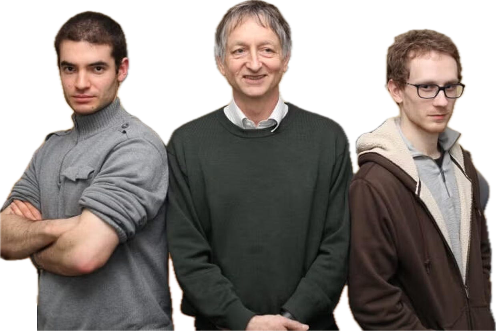<span class="gutter-figure-caption">[Ilya Sutskever](https://en.wikipedia.org/wiki/Ilya_Sutskever), [Geoffrey Hinton](https://en.wikipedia.org/wiki/Geoffrey_Hinton) and [Alex Krizhevsky](https://en.wikipedia.org/wiki/Alex_Krizhevsky)</span></span><span class="gutter-figure gutter-figure-right">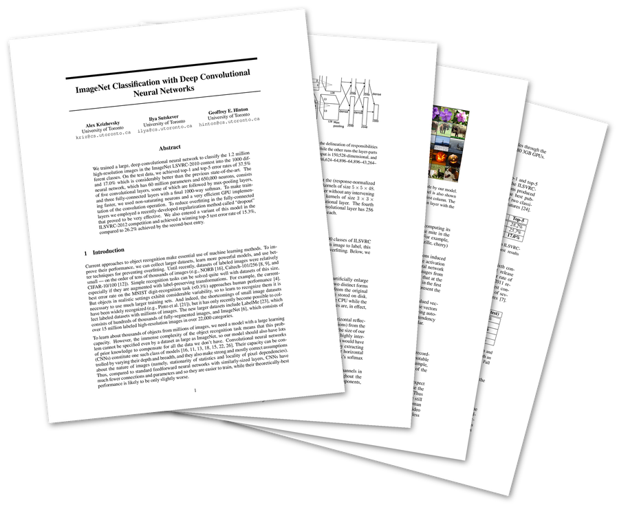<span class="gutter-figure-caption">[*ImageNet Classification with Deep Convolutional Neural Networks* (2012)](https://papers.nips.cc/paper_files/paper/2012/hash/c399862d3b9d6b76c8436e924a68c45b-Abstract.html)</span></span>

<br>

<div class="dropcap">

The opening call to adventure in [Part I. Elements of Networks](./1.md)
invited the programmers of Silicon Valley to take a similar journey between the tension of the finite and infinite that the Ancient Greeks took. That is,
to contribute towards this new approach of augmenting and amplifying human intelligence, they must climb back down from their current pitch in programming algorithms of *sets, maps, lists, trees, and graphs* on serial machines
to optimizing the distributions of *scalars, vectors, matrices, tensors, and neural networks* on massively parallel machines. Now is the time to add that final element. That of parallel programming on NVIDIA GPUs with CUDA Rust.

</div>

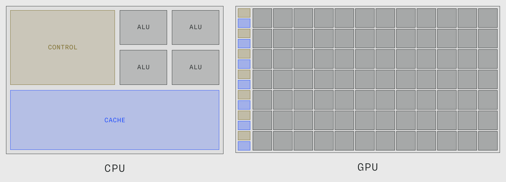

<small>From [Modal GPU Glossary (Streaming Multiprocessor)](https://modal.com/gpu-glossary/device-hardware/streaming-multiprocessor), modified from a diagram in Fabien Sanglard's blog, itself likely modified from a diagram in the CUDA C Programming Guide.</small>

Lorem ipsum dolor sit amet, consectetur adipiscing elit. Donec aliquam varius mi, pharetra scelerisque nulla vehicula ut. Cras ac faucibus dolor. Nunc tempus efficitur ultricies. Nullam non fermentum elit, et tincidunt ante. Donec hendrerit metus ac urna semper, in facilisis leo egestas. Integer sit amet quam ultrices, dapibus sem a, volutpat velit. Pellentesque eget ipsum consequat sem luctus blandit a et nibh. Mauris gravida felis ut dignissim volutpat. Quisque volutpat pulvinar enim in venenatis. Integer posuere tincidunt leo vel congue. Sed ex velit, posuere ut nibh nec, ultrices malesuada nibh. Fusce scelerisque mollis neque id fringilla. Etiam rhoncus quam a leo ultrices rutrum non vitae est. Donec bibendum, arcu sagittis consequat vestibulum, lectus elit bibendum libero, non rhoncus lorem lorem a neque. Sed ex felis, rutrum non consequat eget, tincidunt ac lacus.

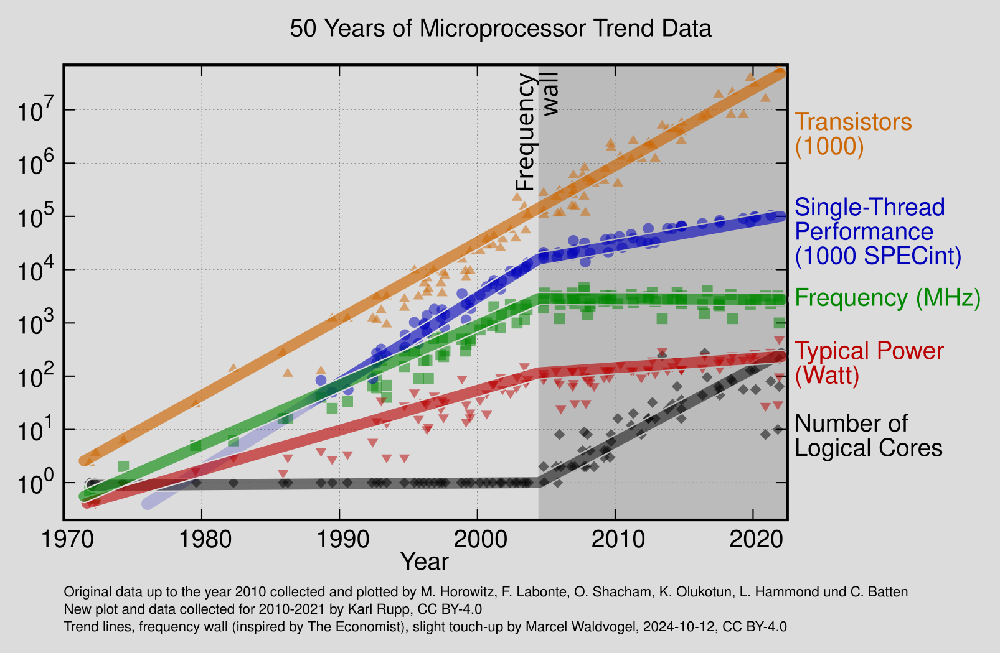

Nulla quis dictum diam, a cursus nibh. Pellentesque magna ante, lobortis a aliquam at, imperdiet eget magna. Nam pharetra dolor lectus, eu hendrerit ipsum tincidunt molestie. Cras eget viverra ipsum. Cras consequat metus quis nibh fermentum, egestas vestibulum odio lacinia. Donec ut ante hendrerit, convallis sem pulvinar, pulvinar magna. Etiam consequat mattis turpis non mollis. Sed consequat et sem quis interdum. Vivamus blandit elementum tortor non convallis. Duis quis nunc nisi. Fusce scelerisque felis pellentesque ex elementum imperdiet. Nulla facilisi. Nunc molestie urna sit amet nisl ullamcorper, at convallis augue tempor.

https://nvlabs.github.io/cuda-oxide/getting-started/hello-gpu.html#install-cargo-oxide

<!-- The first two steps of selecting a architecture and it's loss is the *specification*,
while the third step of optimization is the *implementation*.
That is, even though software 2.0 shares the same mathematical tools of precision as software 1.0 in it's specification albeit continuous rather than discrete,
the implementation could not be any more different, for the process of optimization is more similar in essence to *growing* a system in *synth*etic chemistry or *evolution*ary biology.
Throughout such transition you've become increasingly familiar with the different uses of the [`borscht.Tensor`](https://github.com/j4orz/borscht) in the art of programming continuous mathematics. -->


<div class="full-bleed">
<iframe height="500px" loading="lazy" src="https://www.youtube.com/embed/YoKpLBeRVWY?si=TEXfcpggkC5bd5FE"  title="YouTube video player" frameborder="0" allow="accelerometer; autoplay; clipboard-write; encrypted-media; gyroscope; picture-in-picture; web-share" referrerpolicy="strict-origin-when-cross-origin" allowfullscreen></iframe>
</div>

So with that all said and done, let us extend the mixed source of Python and Rust for [`borscht`](https://github.com/j4orz/borscht) with a third language for the **device**<span class="defnote">**device**</span>.

Recall that in [§2.1.1 From Virtual to Physical Machines](./1.md#211-from-virtual-to-physical-machines) we installed the Rust toolchain so that `rustc` could translate our program into the machine language of a physical processor. That toolchain is still necessary, but it is no longer sufficient, because the physical machine we are now targeting is not the one running our program. A GPU program is really *two* programs — the **host**<span class="defnote">**host**</span> program which runs on the CPU and orchestrates memory and launches, and the **device**<span class="defnote">**device**</span> program of **kernels**<span class="defnote">**kernels**</span> which runs on the GPU. The two are compiled by two different compilers, for two different instruction sets, and then stitched back together.

Historically the device half of that pair was written in CUDA C++ and compiled by NVIDIA's `nvcc`, which meant that a Rust deep learning framework had to reach across a foreign function interface to say anything to the GPU at all. We will not do that. Instead we will keep host and device in the same file and the same language by way of **cuda-oxide**<span class="defnote">**cuda-oxide**</span><span class="sidenote-number"></span><span class="sidenote">*See [NVlabs/cuda-oxide](https://github.com/NVlabs/cuda-oxide). It is explicitly alpha software: expect bugs and API breakage.*</span>, a **codegen backend**<span class="defnote">**codegen backend**</span> for `rustc` which compiles functions annotated `#[kernel]` down to **PTX**<span class="defnote">**PTX**</span>, the virtual instruction set of NVIDIA GPUs<span class="sidenote-number"></span><span class="sidenote">*`PTX` is virtual in exactly the sense of [§2.1.1](./1.md#211-from-virtual-to-physical-machines) — it is not what the silicon executes. The driver finishes the job, lowering `PTX` to the **SASS**<span class="defnote">**SASS**</span> of your particular chip at load time.*</span>. Note that this is the same turtle we met in Part I: `rustc` never emitted `x86` directly either, it emitted `LLVM`. Here it emits `LLVM` too, only the backend of that backend is `NVPTX` instead of `X86`.

So the toolchain grows a device half:

| | host | device |
|---|---|---|
| compiler | `rustc` | `rustc` + `rustc-codegen-cuda` |
| target | `x86-64`, `ARM`, `RISC-V` | `PTX` → `SASS` |
| driver | `cargo` | `cargo oxide` |
| runtime | — | CUDA Toolkit + NVIDIA driver |

Concretely, you need five things. A **Linux** machine with an NVIDIA GPU and a **driver**<span class="defnote">**driver**</span> new enough for your toolkit. The **CUDA Toolkit**<span class="defnote">**CUDA Toolkit**</span> (12.x or newer), which supplies `nvcc`, `libNVVM`, `nvJitLink` and `libdevice`. **LLVM 21 or newer**, whose `llc` performs the final lowering from `LLVM IR` to `PTX`<span class="sidenote-number"></span><span class="sidenote">*This floor is not negotiable for modern chips. The backend emits `TMA`, `tcgen05` and `WGMMA` intrinsics that `llc` from LLVM 20 and earlier cannot lower — simple kernels may survive on an older `llc`, but anything Hopper or Blackwell will not.*</span>. **Clang 21** with its development headers, because the host bindings are generated by `bindgen`, which loads `libclang` and wants clang's own `stddef.h`. And a **Rust nightly**, pinned by `rust-toolchain.toml`, carrying the `rust-src`, `rustc-dev` and `llvm-tools` components — nightly because a codegen backend plugs into `rustc`'s own internals, which are not a stable interface.

That is a long enough list that the honest advice is to not install it by hand. The repository ships a **development container**<span class="defnote">**development container**</span> which pins every one of the five, so the only things your host must provide are the NVIDIA driver and the [NVIDIA Container Toolkit](https://docs.nvidia.com/datacenter/cloud-native/container-toolkit/latest/install-guide.html)<span class="sidenote-number"></span><span class="sidenote">*Installing the container toolkit is not quite the whole story: it must also be registered with the container runtime, via `sudo nvidia-ctk runtime configure --runtime=docker` followed by a daemon restart. Without that step `--gpus=all` has no runtime to bind to and the container starts with no GPU.*</span>. The CUDA Toolkit itself never touches your machine.

```sh
> root@machine ~/ $ git clone https://github.com/NVlabs/cuda-oxide.git
> root@machine ~/ $ devcontainer up --workspace-folder cuda-oxide
> root@machine ~/ $ devcontainer exec --workspace-folder cuda-oxide bash
```

Those with Nix may prefer `nix develop`, which gives the same guarantee by a different road. Those who insist on installing to the metal should consult the project's [installation chapter](https://github.com/NVlabs/cuda-oxide/blob/main/cuda-oxide-book/getting-started/installation.md); the one step people trip on is LLVM, since most distributions do not package a version recent enough, and you will want [`llvm.sh`](https://apt.llvm.org/):

```sh
> root@machine ~/ $ wget https://apt.llvm.org/llvm.sh && chmod +x llvm.sh && sudo ./llvm.sh 21
> root@machine ~/ $ llc-21 --version | grep nvptx
    nvptx      - NVIDIA PTX 32-bit
    nvptx64    - NVIDIA PTX 64-bit
```

However you arrive, the toolchain is driven by `cargo oxide`, a **cargo subcommand**<span class="defnote">**cargo subcommand**</span> standing in the same relation to `cargo` that `cargo` stands to `rustc`. Inside the `cuda-oxide` repository it resolves through a workspace alias and works immediately; for a project of our own, such as [`borscht`](https://github.com/j4orz/borscht), it must be installed against the pinned nightly:

```sh
> root@machine ~/ $ cargo +nightly-2026-04-03 install --git https://github.com/NVlabs/cuda-oxide.git cargo-oxide
    Installing /usr/local/cargo/bin/cargo-oxide
     Installed package `cargo-oxide v0.2.1` (executable `cargo-oxide`)
```

Before writing a line of our own, ask it whether the machine is in order. `cargo oxide doctor` is the whole of the preceding discussion turned into a checklist, and it is worth reading line by line, because every entry is a piece of the pipeline we just described:

```sh
> root@machine ~/ $ cargo oxide doctor
cargo-oxide environment check
==============================
Rust nightly toolchain... ✓ rustc 1.96.0-nightly (55e86c996 2026-04-02)
rust-toolchain.toml... ✓ channel nightly-2026-04-03
Pinned toolchain active... ✓ nightly-2026-04-03-x86_64-unknown-linux-gnu
Required rustup components... ✓ rust-src, rustc-dev, rust-analyzer, clippy, rustfmt, llvm-tools
Codegen backend... - not built yet (run `cargo oxide setup`)
CUDA headers (cuda.h)... ✓ /usr/local/cuda/include/cuda.h
CUDA toolkit (nvcc)... ✓ Cuda compilation tools, release 13.0, V13.0.48
libNVVM (libnvvm.so)... ✓ libNVVM 2.0
nvJitLink (libnvJitLink.so)... ✓ nvJitLink 13.0
libdevice (libdevice.10.bc)... ✓ /usr/local/cuda/nvvm/libdevice/libdevice.10.bc
llc (LLVM)... ✓ Ubuntu LLVM version 21.1.8 (/usr/bin/llc-21)
clang / libclang resource dir... ✓ /usr/lib/llvm-21/lib/clang/21
NVIDIA driver / GPU... ✓ NVIDIA A100-SXM4-40GB (compute capability 8.0, driver 580.105.08)
cuda-gdb (optional)... ✓ /usr/local/cuda/bin/cuda-gdb
compute-sanitizer (optional)... ✓ Version 2025.3.0.0
✅ Environment looks good!
```

Two of those lines deserve a second look. The **compute capability**<span class="defnote">**compute capability**</span> `8.0` is the generation of the chip — `sm_80` is Ampere, `sm_90` Hopper, `sm_100` Blackwell — and it is what decides which instructions are available to us in [§4.4](#44-accelerating-matrix-multiplication-on-gpus); you will meet it again as the thing that makes a kernel fast on one machine and illegal on another. And the codegen backend reported as *not built yet* is not an error: it is a compiler, `rustc-codegen-cuda`, and `cargo oxide` will build and cache it for you on first use.

Now we can scaffold, exactly as `maturin new` scaffolded the Python and Rust halves of [`borscht`](https://github.com/j4orz/borscht) back in [§2.1.2](./1.md#212-the-architecture-of-a-deep-learning-framework):

```sh
> root@machine ~/ $ cargo oxide new borscht-cuda
✓ Created cuda-oxide project 'borscht-cuda'

  cd borscht-cuda
  cargo oxide doctor
  cargo oxide run

> root@machine ~/ $ cd borscht-cuda && ls
Cargo.toml
README.md
rust-toolchain.toml
src
```

<div class="full-bleed">

<div class="dual">

<div>

<div class="code-file">borscht-cuda/Cargo.toml</div>

```toml
[package]
name = "borscht-cuda"
version = "0.1.0"
edition = "2024"

[workspace]

[dependencies]
cuda-device = { git = "https://github.com/NVlabs/cuda-oxide.git" }
cuda-host = { git = "https://github.com/NVlabs/cuda-oxide.git" }
cuda-core = { git = "https://github.com/NVlabs/cuda-oxide.git" }
```

</div>

<div>

<div class="code-file">borscht-cuda/rust-toolchain.toml</div>

```toml
[toolchain]
channel = "nightly-2026-04-03"
components = [
    "rust-src",
    "rustc-dev",
    "rust-analyzer",
    "clippy",
    "rustfmt",
    "llvm-tools",
]
```

</div>

</div>

</div>

The three dependencies partition the problem the same way the machine does. `cuda-device` is the vocabulary of the device — `#[kernel]`, `thread::index_1d()`, the indexing types — and it is the crate whose code `rustc-codegen-cuda` will consume. `cuda-core` is the host-side runtime of contexts, streams and buffers. `cuda-host` supplies `#[cuda_module]`, the macro that welds the two halves together by embedding the compiled device artifact into the host binary and generating a typed launch method for each kernel. And the pinned `rust-toolchain.toml` is what makes the earlier `+nightly-2026-04-03` unnecessary from here on: `rustup` reads it and selects the toolchain on every `cargo` invocation, fetching `llvm-tools` on first use.

The generated `src/main.rs` is the smallest complete example of the shape all of our kernels will take, and it repays a careful reading before we write our own:

<div class="code-file">borscht-cuda/src/main.rs</div>

```rust
use cuda_device::{kernel, launch_bounds, launch_contract, thread, DisjointSlice};
use cuda_host::cuda_module;
use cuda_core::{CudaContext, DeviceBuffer, LaunchConfig1D};

#[cuda_module]
mod kernels {
    use super::*;

    #[kernel]
    #[launch_bounds(256)]
    #[launch_contract(domain = 1, block = (256, 1, 1))]
    pub fn vecadd(a: &[f32], b: &[f32], mut c: DisjointSlice<f32>) {
        let idx = thread::index_1d();
        let idx_raw = idx.get();
        if let Some(c_elem) = c.get_mut(idx) {
            *c_elem = a[idx_raw] + b[idx_raw];
        }
    }
}

fn main() -> Result<(), Box<dyn std::error::Error>> {
    let ctx = CudaContext::new(0)?;
    let stream = ctx.default_stream();

    const N: usize = 1024;
    let a_host: Vec<f32> = (0..N).map(|i| i as f32).collect();
    let b_host: Vec<f32> = (0..N).map(|i| (i * 2) as f32).collect();

    let a_dev = DeviceBuffer::from_host(&stream, &a_host)?;
    let b_dev = DeviceBuffer::from_host(&stream, &b_host)?;
    let mut c_dev = DeviceBuffer::<f32>::zeroed(&stream, N)?;

    // SAFETY: this package owns the embedded device bundle produced for the
    // kernels module above.
    let module = unsafe { kernels::load(&ctx)? };
    let prepared = module.prepare_vecadd(LaunchConfig1D::new((N as u32).div_ceil(256), 256, 0))?;
    module.vecadd(&stream, &prepared, &a_dev, &b_dev, &mut c_dev)?;

    let c_host = c_dev.to_host_vec(&stream)?;
    println!("{:?}", &c_host[..5]);
    Ok(())
}
```

Everything above the `fn main` runs on the GPU and everything below it runs on the CPU, in one file, in one language, built by one command. Notice that the ownership we learned in Part I has followed us across the bus: `a_dev` and `b_dev` are borrowed immutably by the launch while `c_dev` is borrowed mutably, and the `DisjointSlice<f32>` in the kernel signature is the device-side statement that no two threads will write the same element. The data race that is the traditional first lesson of GPU programming is here a **borrow checker**<span class="defnote">**borrow checker**</span> error.

Building it will take a moment the first time, because `cargo oxide` must build the codegen backend before it can build anything with it:

```sh
> root@machine ~/ $ cargo oxide run
Building rustc-codegen-cuda backend...
    Finished `dev` profile [unoptimized + debuginfo] target(s) in 1m 06s
✓ Backend built: .../librustc_codegen_cuda.so
Detected GPU arch: sm_80 (via nvidia-smi)
    Finished `release` profile [optimized] target(s) in 22.04s
     Running `target/release/borscht-cuda`
[0.0, 3.0, 6.0, 9.0, 12.0]
```

Four numbers added on a hundred billion transistors. It is not much, but every matrix multiplication in [§4.4](#44-accelerating-matrix-multiplication-on-gpus) is that same skeleton with a better kernel inside it, and it is worth knowing two more subcommands before we go there, since we will lean on both: `cargo oxide inspect` prints the `PTX` that came out the far end of the pipeline, and `cargo oxide pipeline` prints every intermediate along the way, from Rust MIR through `dialect-mir` and `LLVM IR` to `PTX`. When a kernel is slow or wrong, that is where you look.


<div class="full-bleed">
<iframe height="500px" loading="lazy" src="https://www.youtube.com/embed/_DYbj3n21S8?si=NYgwSTMt7gr2Al02"  title="YouTube video player" frameborder="0" allow="accelerometer; autoplay; clipboard-write; encrypted-media; gyroscope; picture-in-picture; web-share" referrerpolicy="strict-origin-when-cross-origin" allowfullscreen></iframe>
</div>

<span class="lecnote">*<span class="fa-svg"><svg xmlns="http://www.w3.org/2000/svg" viewBox="0 0 512 512"><!--! Font Awesome Free 6.2.0 by @fontawesome - https://fontawesome.com License - https://fontawesome.com/license/free --><path d="M512 256c0 141.4-114.6 256-256 256S0 397.4 0 256S114.6 0 256 0S512 114.6 512 256zM188.3 147.1c-7.6 4.2-12.3 12.3-12.3 20.9V344c0 8.7 4.7 16.7 12.3 20.9s16.8 4.1 24.3-.5l144-88c7.1-4.4 11.5-12.1 11.5-20.5s-4.4-16.1-11.5-20.5l-144-88c-7.4-4.5-16.7-4.7-24.3-.5z"/></svg></span> [GPU MODE Lecture 3: Getting Started With CUDA for Python Programmers](https://www.youtube.com/watch?v=4sgKnKbR-WE)*</span>

<span class="lecnote">*<span class="fa-svg"><svg xmlns="http://www.w3.org/2000/svg" viewBox="0 0 512 512"><!--! Font Awesome Free 6.2.0 by @fontawesome - https://fontawesome.com License - https://fontawesome.com/license/free --><path d="M512 256c0 141.4-114.6 256-256 256S0 397.4 0 256S114.6 0 256 0S512 114.6 512 256zM188.3 147.1c-7.6 4.2-12.3 12.3-12.3 20.9V344c0 8.7 4.7 16.7 12.3 20.9s16.8 4.1 24.3-.5l144-88c7.1-4.4 11.5-12.1 11.5-20.5s-4.4-16.1-11.5-20.5l-144-88c-7.4-4.5-16.7-4.7-24.3-.5z"/></svg></span> [GPU MODE Lecture 5: Going Further with CUDA for Python Programmers](https://www.youtube.com/watch?v=wVsR-YhaHlM)*</span>

<span class="lecnote">*<span class="fa-svg"><svg xmlns="http://www.w3.org/2000/svg" viewBox="0 0 512 512"><!--! Font Awesome Free 6.2.0 by @fontawesome - https://fontawesome.com License - https://fontawesome.com/license/free --><path d="M512 256c0 141.4-114.6 256-256 256S0 397.4 0 256S114.6 0 256 0S512 114.6 512 256zM188.3 147.1c-7.6 4.2-12.3 12.3-12.3 20.9V344c0 8.7 4.7 16.7 12.3 20.9s16.8 4.1 24.3-.5l144-88c7.1-4.4 11.5-12.1 11.5-20.5s-4.4-16.1-11.5-20.5l-144-88c-7.4-4.5-16.7-4.7-24.3-.5z"/></svg></span> [GPU MODE Lecture 2: Ch1-3 PMPP book
](https://www.youtube.com/watch?v=wVsR-YhaHlM)*</span>

<span class="lecnote">*<span class="fa-svg"><svg xmlns="http://www.w3.org/2000/svg" viewBox="0 0 512 512"><!--! Font Awesome Free 6.2.0 by @fontawesome - https://fontawesome.com License - https://fontawesome.com/license/free --><path d="M512 256c0 141.4-114.6 256-256 256S0 397.4 0 256S114.6 0 256 0S512 114.6 512 256zM188.3 147.1c-7.6 4.2-12.3 12.3-12.3 20.9V344c0 8.7 4.7 16.7 12.3 20.9s16.8 4.1 24.3-.5l144-88c7.1-4.4 11.5-12.1 11.5-20.5s-4.4-16.1-11.5-20.5l-144-88c-7.4-4.5-16.7-4.7-24.3-.5z"/></svg></span> [GPU MODE Lecture 4: Compute and Memory Basics (Ch4-5 PMPP)](https://www.youtube.com/watch?v=wVsR-YhaHlM)*</span>


```rust
enum Device {
    Cpu,
    Gpu
}

enum Dtype {
    Float64(f64),
    Float32(f32),
    Float16(f16),
    Bfloat16(bf16),
}

struct Tensor {
    shape: Vec<u8>,
    stride: Vec<u8>,
    device: Device,
    dtype: Dtype,
    storage: Vec<Dtype>
}
```


### 4.2 Network Primitives
<small>[$\hookleftarrow$ Table of Contents](#ii-table-of-contents)</small><span class="gutter-figure gutter-figure-left" style="--margin-note-raise: 48px"><span class="gutter-figure-caption">[Soumith Chintala](https://soumith.ch/)</span></span><span class="gutter-figure gutter-figure-right">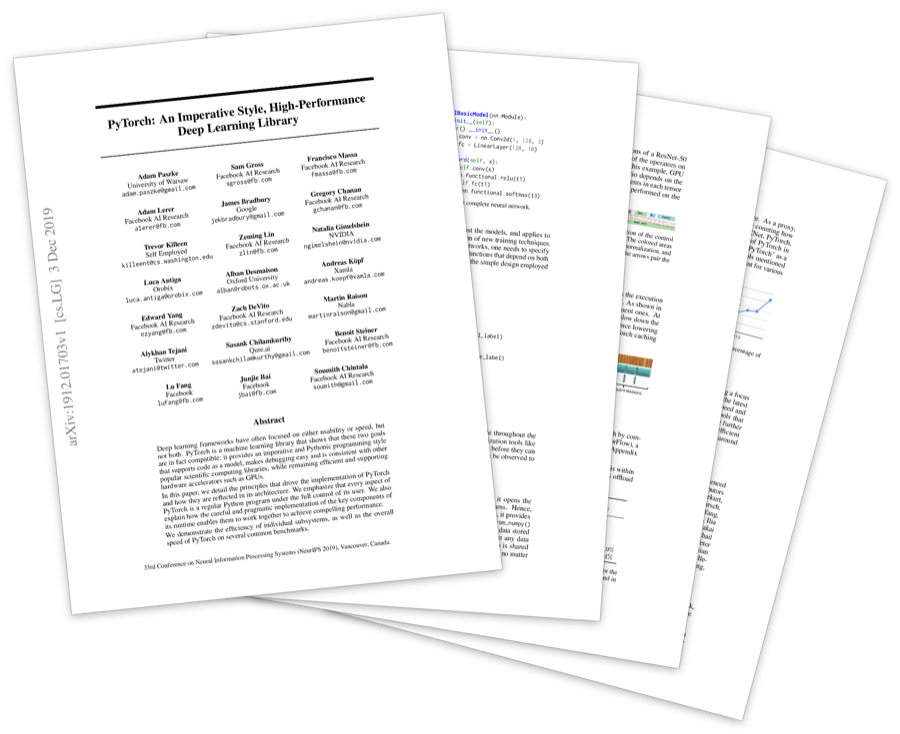<span class="gutter-figure-caption">[*PyTorch: An Imperative Style, High-Performance Deep Learning Library* (2019)](https://arxiv.org/abs/1912.01703)</span></span>


> In which we ...

<div class="toc">

- [4.1.1 Representing Models with `Graph<``borscht.Tensor>`]()
  - [4.1.2 Implementing Forward Pass Primitives for FFN]()
  - [4.1.3 Implementing Forward Pass Primitives for CNN]()
  - [4.1.4 Implementing Forward Pass Primitives for RNN]()
  - [4.1.5 Implementing Forward Pass Primitives for GPT]()

</div>

#### 4.1.1 Representing Models with `Graph<``borscht.Tensor>`

#### 4.1.2 Implementing Forward Pass for FFN

In which we implement the forward pass for `class MLP(nn.Module)`
with
`borscht.nn.Embedding()`
`borscht.nn.Linear()`
`borscht.nn.Tanh()`

<div class="full-bleed">


</div>

{{#nb 4.1_makemore.ipynb:3 hl=14,17-20,32,37,43}}


#### 4.1.3 Implementing Forward Pass for CNN

#### 4.1.4 Implementing Forward Pass for RNN

#### 4.1.5 Implementing Forward Pass for GPT

<div class="full-bleed">
  
</div>

<div class="full-bleed">
<div class="dual">

{{#nb 4.1_makemore.ipynb:1 hl=1-2,11,24,26,28-29,45}}
{{#nb 4.1_makemore.ipynb:2 hl=6,8-11,29-33,35,48,62}}

</div>
</div>

### 4.3 Gradient-Based Optimization with Automatic Differentation <!-- borscht.forward(), borscht.backward() -->
<small>[$\hookleftarrow$ Table of Contents](#ii-table-of-contents)</small><span class="gutter-figure gutter-figure-left" style="--margin-note-raise: 48px"><span class="gutter-figure-caption">[Matthew Johnson](https://github.com/mattjj)</span></span><span class="gutter-figure gutter-figure-right">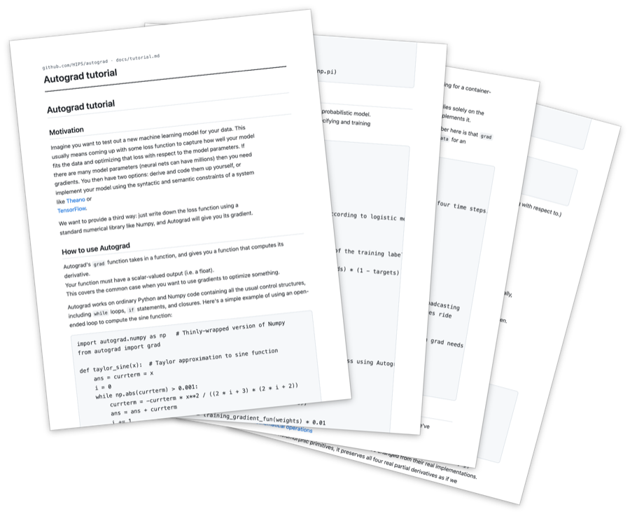<span class="gutter-figure-caption">[*Autograd tutorial*](https://github.com/HIPS/autograd/blob/master/docs/tutorial.md)</span></span>


> In which we implement the engine of automatic differentiation, the magic spell AI researchers cast to receive $\nabla \mathscr{L}(\theta)$ just from the specifcation of $\mathscr{L}$.

<div class="toc">

- [4.2 Automatic Differentiation](#41-automatic-differentation)
  - [4.2.1 Forward Mode with `borscht.forward()`]()
  - [4.2.2 Backward Mode with `borscht.backward()`]()
  - [4.2.1 Stochastic Gradient Descent with `borscht.optim.sgd()`]()
  - [4.2.2 Adam with `borscht.optim.adamw()`]()

</div>


#### 4.1.1  `borscht.forward()`

<small>[$\hookleftarrow$ Table of Contents (§4.1 Automatic Differentiation)](#11-from-certain-to-uncertain-knowledge)</small>

<div class="full-bleed">
<iframe height="750px" loading="lazy" src="https://www.youtube.com/embed/VkHfRKewkWw?si=ctIS6a1CxJrUBCxI" title="YouTube video player" frameborder="0" allow="accelerometer; autoplay; clipboard-write; encrypted-media; gyroscope; picture-in-picture; web-share" referrerpolicy="strict-origin-when-cross-origin" allowfullscreen></iframe>
</div>


<div class="full-bleed-side">
<iframe width="560" height="315" loading="lazy" src="https://www.youtube.com/embed/YG15m2VwSjA?si=z6eEC7e_4qDckMeB" title="YouTube video player" frameborder="0" allow="accelerometer; autoplay; clipboard-write; encrypted-media; gyroscope; picture-in-picture; web-share" referrerpolicy="strict-origin-when-cross-origin" allowfullscreen></iframe>
<iframe width="560" height="315" loading="lazy" src="https://www.youtube.com/embed/tIeHLnjs5U8?si=_DkzRHubxKOI4kW1" title="YouTube video player" frameborder="0" allow="accelerometer; autoplay; clipboard-write; encrypted-media; gyroscope; picture-in-picture; web-share" referrerpolicy="strict-origin-when-cross-origin" allowfullscreen></iframe>
</div>

Consider the function $f\colon \reals, \reals \to \reals$ where $f \colonequals \exp(x_1) * \sin^2x_2$,
and translate it to it's computational counterpart in python with one-dimensional `Tensor`s:
```python
import picograd as pg

def f(x1: pg.Tensor, x2: pg.Tensor) -> pg.Tensor:
  a = pg.exp(x1)
  b = pg.sin(x2)
  c = b**2
  d = a*c
  return d
```
<small>Figure 1. Python source for the function $f\colon \reals, \reals \to \reals$ where $f \colonequals \exp(x_1) * \sin^2x_2$</small>

Here we've broken up the function to render the subexpressions more clearly.
But this isn't necessary — automatic differentiation will work if the function was expressed in one line.
In part one, the development of `picograd` followed that of [`numpy`](https://numpy.org/) —
an array programming language similar to Matlab but embedded in the host language of Python,
that could evaluate functions of the form $f(\mathbf{x})$
where `Tensor` objects stored their values $f(\mathbf{x})$ with the `value:` field
and the function types that produced their values with `Op`.
For instance, evaluating the specified function `f` from above with 9 and 10

```python
if __name__ == "__main__":
  print(f(9, 10))
```

populates the `Tensor.value` fields.
In part one of the book we verified this with a REPL-interface,
but we can also represent the entire expression being evaluated with a
graph of vertices and edges where the vertices are `Tensors`
(along with their `Op`s and `value`s) and the edges are their data dependencies:

Here you can see that even if the function was specified in one line,
the graph of the expression always parses into `Tensor` vertices, and data dependency edges.
You may have noticed the `Tensor.grad` fields, which supposedly store the values of derivatives $f'(\mathbf{x})$.
The question now remains in how to populate these fields.

Taking a step back to differential calculus,
deriving the derivative of $f \colonequals \exp(x_1) * \sin^2x_2$
involves the application of the chain rule where $f(x) := g(h(x)) \implies f'(x) = g'(h(x))h'(x)$.
Evaluating the derivative of the function with respect to its inputs $f'(x_1)$ and $f'(x_2)$ results in

$$f'(x_1) = \frac{\partial}{\partial x_1} \lbrack \exp(x_1) * \sin^2x_2 \rbrack
                                  = \frac{\partial}{\partial x_1} \lbrack \exp(x_1)\rbrack * \sin^2x_2
                                  = \exp(x_1)(1)*(\sin^2x_2)$$
$$f'(x_2) = \frac{\partial}{\partial x_2} \lbrack \exp(x_1) * \sin^2x_2 \rbrack
                                  = \exp(x_1) * \frac{\partial}{\partial x_2} \lbrack \sin^2x_2 \rbrack
                                  = \exp(x_1)* 2\sin x_2\cos x_2$$

symbolic and numeric differentiattion
symbolic differentiation has *performance* issues since a large unrolled expression must be constructed in order to differentiate[^0],
whereas numerical differentiation has *correctness* issues since evaluating finite differences requires evaluating functions to a precision point resulting in numerical instability.
(trace through EXAMPLE for both. talking nets widrow)


To populate the `Tensor.grad` fields, the simplest idea would be
to literally translate the manual derivation of the derivative into code.
The translation from math to code involves a design decision:
*should we evaluate from outputs to inputs (symbolically outside-in, graphically right-to-left) or from inputs to outputs (symbolically inside-out, graphically left-to-right)?*
Although the former order seems more natural with symbolic expressions,
there's nothing illegal about the latter.

```python
import picograd as pg

def f(x1: pg.Tensor, x2: pg.Tensor) -> pg.Tensor:
  a = pg.exp(x1)
  b = pg.sin(x2)
  c = b**2
  d = a*c
  return d

# dict[f(x), f'(x)] of local derivatives (adjoints)
dd_da, dd_dc = [c, a] # d(a,c):=a*c ==> d'(a)=c, d'(c)=a
da_dx1 = pg.exp(x1) # a(x1):=exp(x1) ==> a'(x1)=exp(x1)
dc_db = 2*b # c(b):=b^2 ==> c'(b)=2b
db_dx2 = pg.cos(x2) # b(x2):=sin(x2) ==> b'(x2)=cos(x2)

# outputs to inputs: outside-in symbolically, right-to-left graphically
dd_dd = pg.Tensor(1) # base case
dd_da, dd_dc = [dd_dd*dd_da, dd_dd*dd_dc]
dd_dx1 = dd_da*da_dx1 # DONE for the x1->d path

dd_db = dd_dc*dc_db
dd_dx1 = dd_db*db_dx2 # DONE for x2->path

# inputs to outputs: inside-out symbolically, left-to-right graphically
dx1_dx1, dx2_dx2 = [pg.Tensor(1), pg.Tensor(1)] # base case
da_dx1 = da_dx1*dx1_dx1
dd_dx1 = dd_da*da_dx1 # DONE for the x1->d path

db_dx2 = db_dx2*dx2_dx2
dc_dx2 = dc_dc*db_dx2
dd_dx2 = dd_dc*dc_dx_2 # DONE for the x2->d path
```

*Do you notice any difference in the number of evaluations between the two orders?*

The outputs-to-input ordering takes 6 arithmetic operations (including the destructuring),
whereas the input-to-output ordering take 7 arithmetic operations.
This is because the former can *reuse* `dd_dd`
as a dynamic programming solution to a subproblem for the two inputs, whereas the latter cannot.
And taking a step back, we only want to reuse the output because the shape of the function
is of $f\colon\reals^2 \to \reals$. Alternatively, if $f$ had type $f\colon\reals \to \reals^2$,
then the input-to-output ordering would be able to reuse results.
This distinction is referred to as "forward-mode" vs "reverse-mode", and reflects
the fact that for some function $f\colon\reals^n \to \reals^m$ 
the time complexity of forward-mode differentiation is proportional to $n$,
whereas that of forward-mode differentiation is proportional to $m$.
If the expression graph *fans-in* so that $n > m$, reverse-mode is preferred.
If the expression graph *fans-out* so that $m > n$, forward-mode is preferred.
However, if we take a step with a graph-theory lens, we can see that the derivative is the *sum of paths*,
where each path is a product of local derivatives from the input source to the output sink.
From a combinatorics perspective, we are calculating all the possible (ors) ways (ands)
on how the inputs perturb the output. That is:

$$\frac{\partial f}{\partial x_i } = \sum\prod \frac{\partial v_j}{\partial v_k} $$

and as long as the operations along this path are *associative* — $(AB)C = A(BC)$ —
then we can choose the order in how we perform these path products to minimize the number of operations.
Finding the optimal ordering is an NP-hard problem because ____.
For instance, if the expression graph is diamond-shaped, evaluating the derivative
with forward-mode for the left-half and reverse-mode for the right-half would be more performant.
In practice, we use reverse-mode as a heuristic, since most of the functions
that are differentiated (so they can be optimized) in the field of machine learning are neural networks of the form $f\colon\reals^n \to \reals$

*How can we generalize this into an algorithm?*<br/>
All we need are 1. mappings from $f(\mathbf{x}) \to f'(\mathbf{x})$ and 2. a topological sort

For the derivative rules, the same way that optimizing compilers
implement an optimization "manually" once which then gets reused many times,
the authors of deep learning frameworks also implement derivatives manually
which then become reused many times through automatic differentiation.
In theory, we can differentiate any expression with f'(x) with only a few derivative
rules for addition and multiplication, but in practice most frameworks provide sugar for complex derivatives.

For topological sort, we can simply reversed the ordering produced by a depth-first-search:
```python
def toposort(self):
  order: list[Op] = []
  visited: set[Op] = set()

  def dfs(node: Op) -> None:
    if node in visited: return
    visited.add(node)
    for src in node.src: dfs(src)
    order.append(node)

  dfs(self)
  return order

class Tensor():
  def backward():
    for t in reversed(topo):
      t.backward()
```


We will now use this idea to modify the interpretation of our deep learning framework
to not only evaluate $f(\mathbf{x})$, but $f'(\mathbf{x})$ as well. This is done
by dynamically overloading the operators at runtime[^0] to trace the expression graph
```python
chain_rules = PatternMatcher([
  (Pattern(OpCode.MATMUL, name="input"), lambda output_grad, input: (_____,)),
  (Pattern(OpCode.MATVEC, name="input"), lambda output_grad, input: (_____,)),
  (Pattern(OpCode.RECIPROCAL, name="input"), lambda output_grad, input: (-output_grad * input * input,)),
  (Pattern(OpCode.SIN, name="input"), lambda output_grad, input: ((math.pi/2 - input.src[0]).sin() * output_grad,)),
  (Pattern(OpCode.LOG2, name="input"), lambda output_grad, input: (output_grad / (input.src[0] * math.log(2)),)),
  (Pattern(OpCode.EXP2, name="input"), lambda output_grad, input: (input * output_grad * math.log(2),)),
  (Pattern(OpCode.SQRT, name="input"), lambda output_grad, input: (output_grad / (input*2),)),
  (Pattern(OpCode.ADD), lambda output_grad: (1.0*output_grad, 1.0*output_grad)),
  (Pattern(OpCode.MUL, name="input"), lambda output_grad, input: (input.src[1]*output_grad, input.src[0]*output_grad)),
])

class Tensor:
  def _forward(self, f:Callable, *other:Tensor) -> Tensor: #extra_args=(), **kwargs)
    out_tensor = evaluator.eval_uop([self, other], out_uop)

  def backward(self, grad:Tensor|None=None) -> Tensor:
    """
    backward performs by collecting tensors, computing gradients with automatic differentiation, and updating said tensors.
    """
    # 1. collect all tensors that requires grad by topologically sorting the graph of uops and filter
    all_uops = self.uop.toposort()
    tensors_require_grad: list[Tensor] = [t for tref in all_tensors if (t:=tref()) is not None and t.uop in all_uops and t.requires_grad]
    uops_require_grad = [t.uop for t in tensors_require_grad]
    assert grad is not None or self.shape == tuple(), "when no gradient is provided, backward must be called on a scalar tensor"
    if not (self.is_floating_point() and all(t.is_floating_point() for t in tensors_require_grad)): raise RuntimeError("only float Tensors have gradient")
    
    # 2. compute the gradient with a map of tensors to partials
    if grad is None: grad = Tensor(1.0, dtype=self.dtype, device=self.device, requires_grad=False) # base case is 1.0
    tens2grads = Tensor._automatically_differentiate(self.uop, grad.uop, set(uops_require_grad)) # skipping materializing zerod grads for now
    grads = [Tensor(g, device=t.device) for t,g in zip(tens2grads.keys, tens2grads.values)] # initialize tensor grads on device
    
    # 3. update the tensors that require grad with the gradient's partials
    for t,g in zip(tensors_require_grad, grads):
      assert g.shape == t.shape, f"grad shape must match tensor shape, {g.shape!r} != {t.shape!r}"
      t.grad = g if t.grad is None else (t.grad + g) # accumulate if t.grad exists
    return self

  @staticmethod
  def _automatically_differentiate(root:Op, root_grad:Op, targets:set[Op]) -> dict[Op, Op]:
    """
    _differentiate backpropagates partials on a topologically sorted expression graph with the chain rule
    and produces the gradient in the form of a map of ops to their partials (which, in turn, are ops)
    """
    tens2grads = {root: root_grad}

    # 1. topological sort
    in_target_path: dict[Op, bool] = {}
    for u in root.toposort(): in_target_path[u] = any(x in targets or in_target_path[x] for x in u.src)
    dfs = list(root.toposort()) # lambda node: node.op not in {OpCode.DETACH, OpCode.ASSIGN} and in_target_path[node])) # don't flow through DETACH/ASSIGN or anything not in target path

    # 2. backpropagation with the chain rule
    for tensor in reversed(dfs):
      if tensor not in tens2grads: continue

      local_grads: tuple[Op|None, ...]|None = cast(tuple[Op, ...]|None, chain_rules.rewrite(tensor, ctx=tens2grads[tensor]))
      if local_grads is None: raise RuntimeError(f"failed to compute gradient for {tensor.op}\n\nin {str(tensor)[0:1000]}...")
      assert len(local_grads) == len(tensor.src), f"got {len(local_grads)} gradient, expected {len(tensor.src)}"

      for tensor,local_grad in zip(tensor.src, local_grads): # <--------------------- MOOOSE: why are we accumulating inside ad()? don't we do it in backward()??
        if local_grad is None: continue
        if tensor in tens2grads: tens2grads[tensor] = tens2grads[tensor] + local_grad # accumulate if tensor exists
        else: tens2grads[tensor] = local_grad # o/w initialize
```

To implement automatic differentiation with `Tensor.backward()`,
there is a design decision to be made
— the choice of implementing it dynamically or just-in-time[^3],
similar to the decision of how to implement types for general programming languages[^4].
This stands in contrast to the alternative of performing a just-in-time, source-to-source transformation.

Let's now move onto automatically differentiating the functions of neural networks,
specifically the FFN language model from earlier. (johnson/ryan adams ordering)
n^2 vs n^3 

<iframe src="https://videolectures.net/embed/videos/deeplearning2017_johnson_automatic_differentiation?part=1" width="100%" frameborder="0" allowfullscreen style="aspect-ratio:16/9"></iframe>


<!-- So far we've been training feedforward neural networks using the magical
`Tensor.backward()` function in order to materialize the gradient of the loss on our
parameter weights $w = (W^{(0)}, \dots , W^{(l-1)})$ which gradient descent uses in it's update rule
$\theta^{t+1} \coloneqq \theta^{t} - \alpha\nabla\mathscr{L}(\theta)$.
We will now dive deeper into how `.backward()` is implemented. -->


#### 4.1.2  `borscht.backward()`

<small>[$\hookleftarrow$ Table of Contents (§4.1 Automatic Differentiation)](#11-from-certain-to-uncertain-knowledge)</small>

### 4.4 Accelerating Matrix Multiplication on GPUs

<small>[$\hookleftarrow$ Table of Contents](#ii-table-of-contents)</small>


> In which we ...

<div class="toc">

- [4.3 Accelerating the BLAS on GPUs]()
  - [4.3.1 From Multi Core CPUs to Many Core GPUs]()
  - [4.3.2 From `CUDA Rust` to `PTX`]()
  - [4.3.3 Accelerating `SGEMV` on `sm80` (Ampere)]()
  - [4.3.4 Accelerating `SGEMM` on `sm90` (Hopper)]()
  - [4.3.5 Accelerating `SGEMM` on `sm90` (Hopper)]()
  - [4.3.6 Accelerating `SGEMM` on `sm100` (Blackwell)]()
  - [4.3.7 Automating Kernels with Autoresearch]()

</div>

#### 4.3.1 From Multi Core CPUs to Many Core GPUs

```rust
// gpu_host.rs
use cudarc::{driver::{self, PushKernelArg}, nvrtc};
use src_device::T; // shared type with device code
static PTX: &str = include_str!(concat!(env!("OUT_DIR"), "/gpu_device.ptx")); // Embed the PTX code as a static string.

pub fn cudars_helloworld() -> Result<(), Box<dyn std::error::Error>> {
  // initialize device context and stream via driver api
  let process = driver::CudaContext::new(0)?; // device 0
  let queue = process.default_stream();
  
  // load ptx via nvrtc
  let dylib = process.load_module(nvrtc::Ptx::from_src(PTX))?;
  let add_kernel = dylib.load_function("add")?;

  // allocate on device
  let (a, b): ([T; _], [T; _]) = ([1.0, 2.0, 3.0, 4.0], [2.0, 3.0, 4.0, 4.0]);
  let (a_gpu, b_gpu, mut c_gpu) = (queue.clone_htod(&a)?, queue.clone_htod(&b)?, queue.alloc_zeros::<T>(a.len())?);
  let (a_len, b_len) = (a_gpu.len(), b_gpu.len());

  let cfg = driver::LaunchConfig { grid_dim: (1, 1, 1), block_dim: (4, 1, 1), shared_mem_bytes: 0, };
  unsafe {
    queue
    .launch_builder(&add_kernel).arg(&a_gpu).arg(&a_len).arg(&b_gpu).arg(&b_len).arg(&mut c_gpu)
    .launch(cfg)?;
  }
  queue.synchronize()?;

  let c = queue.clone_dtoh(&c_gpu)?;
  println!("c from cuda is = {:?}", c);
  Ok(())
}
```

```rust
// gpu_device.rs
use cuda_std::kernel;
use crate::T;

#[allow(improper_ctypes_definitions)]
#[kernel] pub unsafe fn add(a: &[T], b: &[T], c: *mut T) {
  let i = cuda_std::thread::index_1d() as usize;
  if i < a.len() {
    let elem = unsafe { &mut *c.add(i) };
    *elem = a[i] + b[i];
  }
}

#[allow(improper_ctypes_definitions)]
#[kernel] pub unsafe fn saxpy(a: &[T], b: &[T], c: *mut T) {
  let i = cuda_std::thread::index_1d() as usize;
  todo!()
}

#[allow(improper_ctypes_definitions)]
#[kernel] pub unsafe fn smul(a: &[T], b: &[T], c: *mut T) {
  let i = cuda_std::thread::index_1d() as usize;
  todo!()
}

#[allow(improper_ctypes_definitions)]
#[kernel] pub unsafe fn stanh(a: &[T], b: &[T], c: *mut T) {
  let i = cuda_std::thread::index_1d() as usize;
  todo!()
}
```

#### 4.3.2 From `CUDA Rust` to `PTX`
#### 4.3.3 Accelerating `SGEMV` on `sm80` (Ampere)
#### 4.3.4 Accelerating `SGEMM` on `sm90` (Hopper)
#### 4.3.5 Accelerating `SGEMM` on `sm90` (Hopper)
#### 4.3.6 Accelerating `SGEMM` on `sm100` (Blackwell)

### 4.4 Accelerating Matrix Multiplication on TPUs

<small>[$\hookleftarrow$ Table of Contents](#ii-table-of-contents)</small>


### 4.5 From Strides to Layouts

<small>[$\hookleftarrow$ Table of Contents](#ii-table-of-contents)</small>


### 4.6 Accelerating Attention

<small>[$\hookleftarrow$ Table of Contents](#ii-table-of-contents)</small><span class="gutter-figure gutter-figure-left" style="--margin-note-raise: 48px"><span class="gutter-figure-caption">[Tri Dao](https://tridao.me/)</span></span><span class="gutter-figure gutter-figure-right">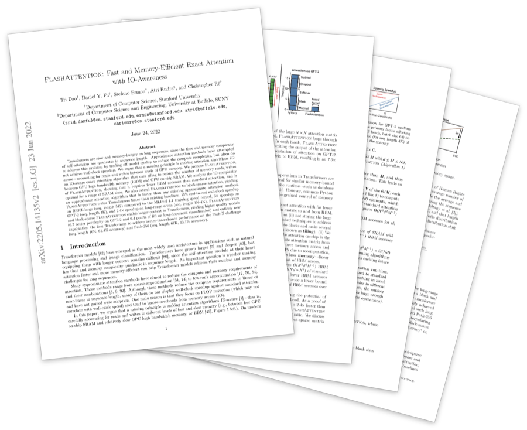<span class="gutter-figure-caption">[*FlashAttention: Fast and Memory-Efficient Exact Attention with IO-Awareness* (2022)](https://arxiv.org/abs/2205.14135)</span></span>
