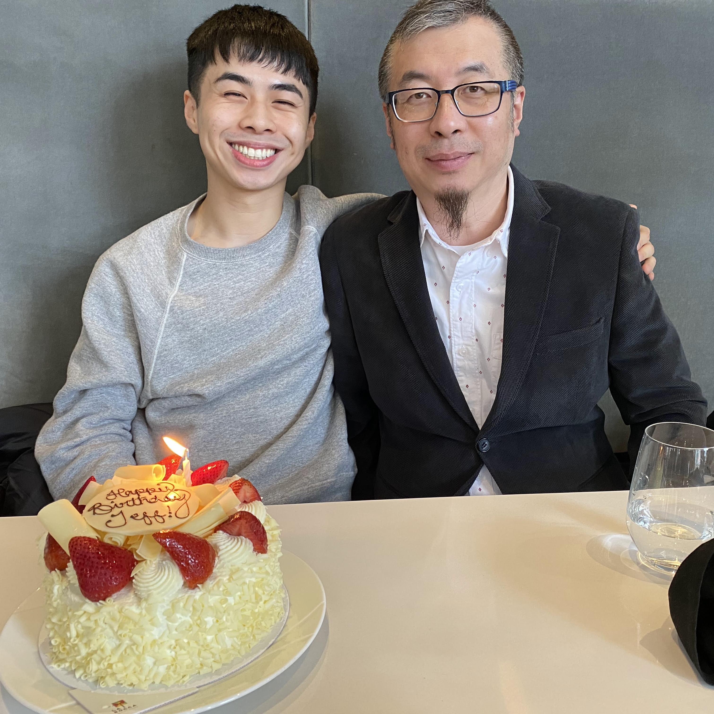

# Dedication

 

In loving memory of my father, my [teacher](https://web.archive.org/web/20260206222945/https://ginsengpress.com/articles/yin-and-yang/), and my best friend [Dr. Thomas Zhang ND., R.TCMP, R.Ac](https://web.archive.org/web/20260316214521/https://ginsengpress.com/about-ginseng-press/). 
The love I put into this book is but a fraction of the love he gave me. 
May you rest in pure land. I am happy that it was in our karma to meet and learn during this lifetime. 

<!-- *And ye shall know the truth, and the truth shall make you free.* John 8:32 -->

<!-- 南無阿彌陀佛 
*Nāmó Āmítuófó*  -->

三月七日，沙湖道中遇雨。雨具先去，同行皆狼狈，余独不觉。已而遂晴，故作此词。

莫听穿林打叶声， 
何妨吟啸且徐行。 
竹杖芒鞋轻胜马， 
谁怕？ 
一蓑烟雨任平生。 

料峭春风吹酒醒， 
微冷， 
山头斜照却相迎。 
回首向来萧瑟处， 
归去， 
也无风雨也无晴。 

On the seventh of the third month, we were caught in the rain along the Shahu Way without any rain gear. Everyone felt awkward, except myself. The sky later cleared, and I wrote these lyrics:

Heed not the rain beating against the leaves 
Why not whistle and sing as you stroll along 
Straw sandals and a bamboo staff  
are lighter and better than horseback 
What’s there to fear? 
A raincoat is all I need in life’s journey 

A cool spring breeze sobers up the spirit, 
a slight chill, 
Yet the setting sun over the mountains is welcoming. 
Looking back over this bleak path 
Were I to return 
I would heed not rain  
nor shine. 

《定风波·莫听穿林打叶声》（元丰五年）　苏东坡　　大山及友人 英译 
"Calming the Waves" (1082) by Su Dongpo, tr. Dashan & Friends

<audio id="cash-audio" controls src="./assets/waves.mp3">Your browser doesn’t support the audio element.</audio> 