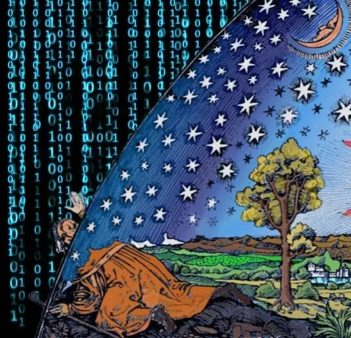

<!-- <small>*Ἀγεωμέτρητος μηδεὶς εἰσίτω.*</small> 
<small>*οὐκ ἔστιν βασιλικὴ ἀτραπὸς εἰς τὴν γεωμετρίαν.*</small>  -->

# Structure and Interpretation
# of Tensor Programs
### First Edition 

`A Whirlwind Tour to Deep Learning and Deep Learning Systems` 
<small>*`Run`[`nanochat`](https://github.com/karpathy/nanochat)`by building` [`borscht`](https://github.com/j4orz/teenygrad)`from scratch: a hackable subset of`[`torch`](https://pytorch.org/)*</small>*[What's in a name?](https://en.wikipedia.org/wiki/A_rose_by_any_other_name_would_smell_as_sweet) Borscht is a sour soup with meat from Eastern Europe, most often associated with the variant originating in Ukraine with red beetroots . It's a permutation-like pun on `torch`, given how the deep learning framework `borscht` aims to be a rough subset of PyTorch. You want a `torch.Tensor`? You get the [`borscht`](https://github.com/j4orz/teenygrad) `borscht.Tensor`. My mother in law's borscht is to die for!* **Мне очень нравится ваш борщ, миссис Ким!** 
<small>*`with Python, Rust, and CUDA Rust programming languages!`*</small> 

*Made with 🖤🪻 by [Jeffrey Zhang,](https://x.com/j4orz) [University of Waterloo (BMath)](https://academic-calendar-archive.uwaterloo.ca/undergraduate-studies/2022-2023/group/u-Waterloo-Faculty-of-Mathematics.html)* 
*Made possible by [Lambda Labs Research Grant](https://lambda.ai/research)* 
<!-- *Contributing writers:*
- foobarbaz -->

> You are viewing this on a mobile device, but SITP is best viewed on a desktop — the book includes various multimedia lecture videos, visualizers, any tufte-style sidenotes with many external hyperlinks to other resources.

Citation:

<pre>
@book{zhang2026sitp,
  author = "Jeffrey David Zhang",
  title = "Structure and Interpretation of Tensor Programs",
  year = 2026,
  url = "https://sitp.ai"
}
</pre>