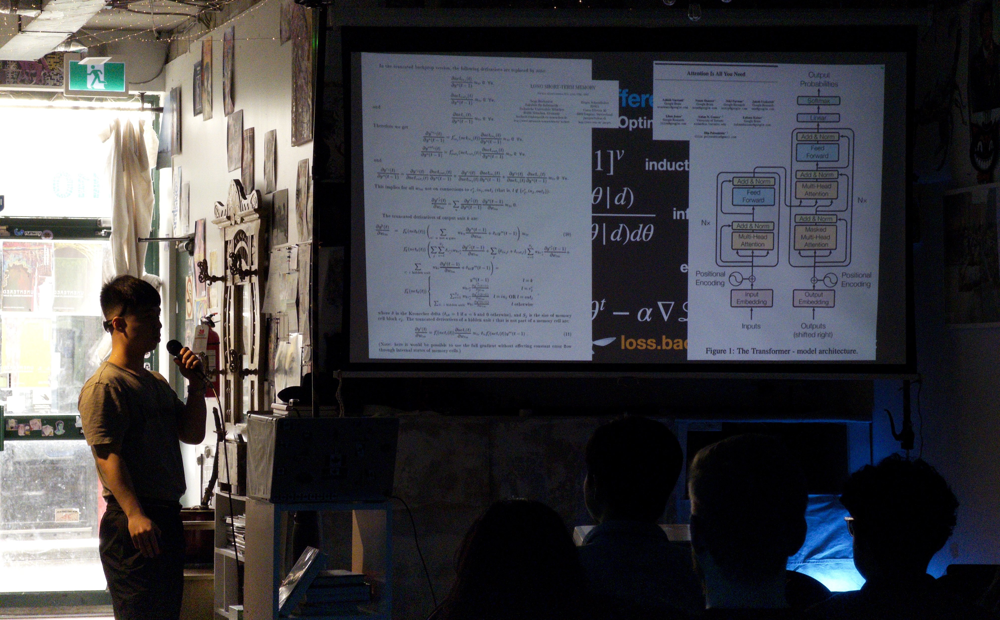

<small>*Presenting an early outline of SITP at [Toronto School of Foundation Modeling Season 1 (2025)](https://tsfm.ca/schedule)*</small>

# Preface

## The Structure and Interpretation of The AI Curriculum

 

This book is aspirationally titled [*The Structure and Interpretation of Tensor Programs*](./front.md), (SITP)
as it's goal is to serve a similar role for software 2.0 as
[*The Structure and Interpretation of Computer Programs*](https://mitp-content-server.mit.edu/books/content/sectbyfn/books_pres_0/6515/sicp.zip/full-text/book/book.html)
(SICP) did for software 1.0.
Written by Harold Abelson and Gerald Sussman with Julie Sussman, SICP took learners on a whimsical whirlwind tour throughout the essence of computation
starting with the elements of programs with functional programming, higher order functions, data abstraction, streams,
and ending with programming their own programming languages with virtual interpreters and compilers to register machines.
Although perhaps not as well-known, there also exists [*The Structure and Interpretation of Classical Mechanics*](https://groups.csail.mit.edu/mac/users/gjs/6946/sicm-html/book.html) (SICM) (Sussman et al., 2001) and [*Functional Differential Geometry*](https://library.oapen.org/handle/20.500.12657/26057) (FDM) (Sussman et al., 2013) which cover classical and quantum mechanics of physics respectively.
We'd like to imagine if Sussman and other Schemers had more energy, the next text would perhaps not cover thermodynamics,
but rather deep learning.
We thus present [*The Structure and Interpretation of Tensor Programs*](./front.md) (SITP).

<blockquote class="twitter-tweet" data-conversation="none" data-width="300">
1.5k lines of rust and 100 commits later, we can now inference the FFN neural language model from (Bengio et al. 2003) straight from Karpathy&#39;s Zero to Hero. all you have to do is replace the single &quot;import torch&quot; line with &quot;import picograd&quot; 😎
&mdash; j4orz (@j4orz) <a href="https://x.com/j4orz/status/1907452857248350421?ref_src=twsrc%5Etfw">April 2, 2025</a></blockquote>

My alma matter was amongst those which took the SICP approach, and as intended,
for someone coming into first year college have taken some elementary computer science courses from high school, it blew my mind (Lambda Calculus!).
After graduating college in 2022, I followed my curiosity for diving deeper into the souls of our machine by going on to developing industrial languages and
runtimes.*"There is only one project, architecture, operating system and languages, compiler, it's only one project. It's all together." -- Boris Babayan*.
Particularly, I hacked on languages with [domain specific cloud compilers](https://www.infoq.com/presentations/deploy-pipelines-coinbase/)
and runtimes with [cloud provisioners, and cloud garbage collectors](https://www.infoq.com/presentations/coinbase-terraform-earth/).
At the end of 2022 though, when ChatGPT was released by OpenAI my mind was blown twice more.
As someone programming for some time, I could not believe this at all.
After two more years of hacking on cloud languages and runtimes, I started my transition from
domain specific cloud compilers from GPS to TERRAFORM to domain specific tensor compilers from TORCH to TRITON.*It turns out there is effectively zero overlap except that they are both compilers in that they take some source program and produce some target program.*

The transition started with a tweet showcasing the beginnings of a tensor library evaluating the forward pass of a feed forward network
from Andrej Karpathy's [Neural Networks: Zero to Hero](https://karpathy.ai/zero-to-hero.html) course.
While it was illuminating to start implementing each individual torch call that the nets from `makemore` were making,
my knowledge felt quite fragmented as I personally forgot lots of foundation from college*I had the definition of a gradient and basis in the basement of my subconscious at best. Thank you [Professor.West](https://www.math.uwaterloo.ca/%7Ejjwest/OfficeHours.htm) for sharing your [juggling](https://www.youtube.com/watch?v=sy4g2W6NU1M), and [Professor. Wolczuk](https://wolczuk.com/) for sharing your [Ukrainian floor dancing](https://www.youtube.com/results?search_query=dan+wolczuk+dancing)*,
and I wasn't sure how to bridge myself to industrial deep learning systems like `tinygrad`*Here's a PR I was able to land in tinygrad [making logsumexp numerically stable](https://github.com/tinygrad/tinygrad/pull/6921). It felt like I was contributing to LLVM without having taken a course on compiler construction to learn the basics of parsing, optimization, and lowering.*, `torch`, `jax`, `vllm`, and `sglang`.

<blockquote class="twitter-tweet" data-width="300">
I think taste is conveyed in things like - what problems we choose - what RQs we ask - how we approach answering those RQs - how we convey our findings and more. ↵
&mdash; Shriram Krishnamurthi (primary: Bluesky) (@ShriramKMurthi) <a href="https://x.com/ShriramKMurthi/status/2053097307055300627?ref_src=twsrc%5Etfw">May 9, 2026</a></blockquote>

Shortly after, I decided to take the plunge and started drinking from the firehose of deep learning canon:
Hastie et al.,, Murphy, Goodfellow et al.,, you name it.
The one thought I could not get out of my head was *where is the SICP for software 2.0*?
While I found two excellent resources on building your own torch-like autograd by Tianqi Chen's 10-414 Carnegie Mellon and Alexander Rush's CS5781 at Cornell,
I personally would have enjoyed a more unified resource that took me from math, to deep learning, to deep learning systems in a *single unbroken sequence of thought*,
and perhaps others would feel similarly. That is the genesis story for this book, whose central research question is the following: **What does the SICP for deep learning look like**?

<blockquote class="twitter-tweet" data-conversation="none" data-width="300">
We really could use a SICP for DL. We have the Little Lisper for DL (<a href="https://t.co/su31hFJeUe">https://t.co/su31hFJeUe</a>) but that&#39;s a different type of book entirely.
&mdash; Shriram Krishnamurthi (primary: Bluesky) (@ShriramKMurthi) <a href="https://x.com/ShriramKMurthi/status/2051049923617968353?ref_src=twsrc%5Etfw">May 3, 2026</a></blockquote>

Pur shortly, SITP, is a function that maps learners from the product type of
an introductory computer science book such as [DCIC (Fisler et al., 2025)](https://dcic-world.org/) and an introductory systems programming book such as [TRPL (Klabnick et al., 2026)]() with experimental modifications (Crichton et al.,)
to a frontier model report such as the frontier technical report of [The Llama 3 Herd of Models (Meta 2024)](https://arxiv.org/abs/2407.21783) and frontier systems book such as Hugging Face's [Ultra Scale Book (Tazi et al., 2025)](https://huggingface.co/spaces/nanotron/ultrascale-playbook).

$$
\begin{aligned}
\text{SITP}&: \href{https://dcic-world.org/}{\text{DCIC}} \times \href{https://rust-book.cs.brown.edu/}{\text{TRPL}} \to \href{https://arxiv.org/pdf/2407.21783}{\text{LLAMA3}} \times \href{https://huggingface.co/spaces/nanotron/ultrascale-playbook}{\text{USPB}} \\
\text{SITP} &:= \href{https://htdp.org/}{\text{HTDP}}(\href{https://web.stanford.edu/~jurafsky/slp3/}{\text{PTDS}}, \href{https://web.stanford.edu/~jurafsky/slp3/}{\text{LADR}}, \href{https://people.csail.mit.edu/jsolomon/share/book/numerical_book.pdf}{\text{NA}}, \href{https://web.stanford.edu/~jurafsky/slp3/}{\text{NO}}, \\
&\phantom{:= \text{HTDP}(}\href{https://web.stanford.edu/~jurafsky/slp3/}{\text{SLP}}, \href{https://www.bishopbook.com/}{\text{DL}}, \href{http://incompleteideas.net/book/the-book-2nd.html}{\text{RL}}, \\
&\phantom{:= \text{HTDP}(}\href{https://theartofhpc.com/}{\text{TAOHPC}}, \href{https://epubs.siam.org/doi/book/10.1137/1.9781611972078}{\text{TAODCP}}, \href{https://shop.elsevier.com/books/programming-massively-parallel-processors/hwu/978-0-443-43900-1}{\text{PMPP}})
\end{aligned}
$$

where the function $\text{HTDP}(\cdot)$ is the systematic and principled design of a curriculum implemented by chimera-like professors and lecturers whom are usually interested and capable in the intersection of both programming language theory (PLT) and computer science education (CSE). 
In the same way that we use non-intersective adjectives in the distinctions of fake gun vs gun, non-tight language model vs language model, there is also the teaching professor vs professor*"I think of the position as having “twice” the teaching and “half” the research as an assistant professor (of course individual approaches can and do differ!)." -- [@JoePolitz, September 5, 2024](https://x.com/JoePolitz/status/1831797256871375332)*.
That is, SITP applies the form of HTDP developed by such teaching professors to the substance of deep learning. What then, is such a form?

The [How to Design Programs](https://htdp.org/) HTDP text  *This was the actual text used at my alma matter. Thank you to [Professor Ragde](https://cs.uwaterloo.ca/~plragde/flaneries/) for bringing it over, and to [Professor Vasiga](https://cs.uwaterloo.ca/~tmjvasig/) for bringing it to life.* was also seminal in that it was the first computer science text to treat curriculum design *as* scientific research and an engineering problem [(Felleisen et al., 2004)](https://cs.brown.edu/people/sk/Publications/Papers/Published/fffk-htdp-vs-sicp-journal/), building *off* the shoulders of the giant that SICP (Abelseon et al., 1985) is.

>  First, the book discusses explicitly how programs should be constructed. Second, to tame the complexity of programming, it defines a series of teaching languages based on Scheme that represent five distinct knowledge levels through which students pass during their first course. The levels correspond to the complexity of data definitions that the program design guidelines use. Third, the book uses exercises to reinforce the explicit guidelines on program design; few, if any, exercises are designed for the sake of domain knowledge. Finally, the book uses more accessible forms of domain knowledge than SICP. Because of this shift in emphasis, we gave our book the title How to Design Programs (HTDP).

*the concreteness fading [(Fyfe et al., 2014)](https://eric.ed.gov/?id=EJ1036777) of declarative concepts in mathematics [(Hestenes et al., 1992)](https://gwern.net/doc/science/physics/1992-hestenes.pdf)* by presenting  notions just in time by defining them by their context, and iteratively refining such concepts from the informal to formal ending in HtDP-style Intermezzos*Which present the formal syntax and semantics of a language.*.

that *transfer [(Bransford, Shwartz 1999)](https://journals.sagepub.com/doi/abs/10.3102/0091732x024001061) to procedural skills of computation* [(Price et al., 2021)](https://www.lifescied.org/doi/pdf/10.1187/cbe.20-12-0276) in the context of deep learning. Such transfer is possible because the computational discipline of deep learning has lots of structural similarity with mathematics, and is why we have books such as [Deisenroth et al., (2020)](https://mml-book.github.io/), and subsequent courses follwing such book.

<iframe height="400px" width="100%" loading="lazy" src="https://www.youtube.com/embed/5c0BvOlR5gs?si=WpT3iVQbpjMMB6Ku"  title="YouTube video player" frameborder="0" allow="accelerometer; autoplay; clipboard-write; encrypted-media; gyroscope; picture-in-picture; web-share" referrerpolicy="strict-origin-when-cross-origin" allowfullscreen></iframe>

When it comes to the discipline of deep learning, there are two large jumps of *transfer* a learner must make.
The first one is that a learner must learn the mathematics *for* machine learning, while although elementary, has a non-trivial breadth of probability theory, linear algebra, differential calculus, and if the learner has the time,
to deepen such concepts with information theory, measure theory, and analysis.
One of the primary texts that seeks to provide a unified treatment in such mathematics *for* machine learning
is [(Deisenroth et al., 2020)](https://mml-book.github.io/)*"For instance, [Princeton's](https://www.cs.princeton.edu/courses/archive/spring21/cos302/) [COS302](https://www.youtube.com/playlist?list=PLCO4cUaBLHFEHo42HVIVWaSOvbAiH30uc) offered by Ryan Adams, which turns out to be the lab that created created [HIPS/autograd](https://github.com/hips/autograd) (led by Matthew Johnson, Dougal Maclaurin, and David Duvenaud), which inspired PyTorch! See [https://soumith.ch/blog/2023-12-17-pytorch-design-origins.md.html#/origins](https://soumith.ch/blog/2023-12-17-pytorch-design-origins.md.html#/origins)*., which provides an excellent two part structure
with the foundational mathematics, followed by the applied.
The core motivation is that any gaps in mathematics can be filled, preparing a learner for a text like
such [(Goodfellow et al., 2017)]() to deepen their understanding in neural network architecture.

More recently, with the advent of scaling large language models [(Kaplan et al., 2020)](https://arxiv.org/pdf/2001.08361)
and the slowing of Moore's Law [(Moore 1965)](http://cva.stanford.edu/classes/cs99s/papers/moore-crammingmorecomponents.pdf),
another jump of *transfer* the learner must make is how to efficiently map their architecture and optimizers to massively parallel hardware at the level of a single graphics processing unit (GPU) and multi GPU.
The two canonical texts for this are [(Hwu et al., 2026)]() for systems, and more recently
[(Tazi et al., 2025)](https://huggingface.co/spaces/nanotron/ultrascale-playbook)*"Alternatively, JAX Scaling Book (link.)*.

As someone opening up PMPP, it was extremely frustrating to read the appendix that briefly covered the process of deep learning
without a proper foundation in the modeling of architecture and optimizers.

When I realized the two large jumps I was making from re-learning foundational mathematics to frontier architecture,
and from modeling frontier architecture to accelerating frontier architecture, my "aha" moment was realizing
the vast bridges a learner was being asked to cross, and realizing Shriram's taste of finding some intermediary point
to smoothen such a progression. This was the motivation for the explicit Design Recipe in HtDP to go from
blank page to a well-designed program, and more recently, property-based testing to go from unit tests to model checking and SAT solvers.
To return to the short description, SITP that maps learners from the product type of
an introductory computer science book and an introductory systems programming book
to a frontier model report such as the frontier technical report and frontier systems book.
That is,

$$\text{SITP}: \href{https://dcic-world.org/}{\text{DCIC}} \times \href{https://rust-book.cs.brown.edu/}{\text{TRPL}} \to \href{https://arxiv.org/pdf/2407.21783}{\text{LLAMA3}} \times \href{https://huggingface.co/spaces/nanotron/ultrascale-playbook}{\text{USPB}}$$

unity/intertwined mathematics and programming
- Evaluation (Benchmarks): Stochastics of probability theory $(\Omega, \mathcal{F}, \mathbb{P})$
- Specification (Architecture): Dimensionality of linear algebra $(V, \langle\cdot, \cdot\rangle)$
- Implementation (Optimizers): Approximation of differential calculus $\frac{d\mathscr{L}}{dw}$, $\nabla\mathscr{L}$, $\mathbb{J}$, $\mathbb{H}$
- Computation (Systems): Rooflines of processors $\text{max}(compute, communication)$

For instance, the traditional ordering one might approach to the discipline of deep learning is to *synthetically deduce* definitions starting from what is considered to be elementary (i.e your choice of foundations which you pay lip service to as a working mathematician: ZFC or DTT). The benefits of this approach is that the *transfer [(Bransford, Shwartz 1999)](https://journals.sagepub.com/doi/abs/10.3102/0091732x024001061)* of concepts is maximized — afterall, studying mathematics is simply generic programming. While this is no doubt the standard for most mathematical texts, this is what was special about the textbook How to Design Programs, an explicitly curriculum designed and engineered for transfer [(Felleisen, Findler, Flatt, Krishnamurthi 2004)](https://cs.brown.edu/people/sk/Publications/Papers/Published/fffk-htdp-vs-sicp-journal/) expositing programming based off the principles of set theory (whatever that may mean).

all in the context of autoregressive language modeling, culminating in the transformers architecture

<blockquote class="twitter-tweet" data-conversation="none" data-width="300">
if your bread-and-butter consists solely of:  - tuning hyperparams/config files  - fitting points on a log-log plot  - tweaking a few lines in <a href="https://t.co/vrRjs7gH5m">https://t.co/vrRjs7gH5m</a>, <a href="https://t.co/iQsuN4ByoO">https://t.co/iQsuN4ByoO</a>, <a href="https://t.co/2IJGCXpQ4L">https://t.co/2IJGCXpQ4L</a>, <a href="https://t.co/hZfCBXeGKv">https://t.co/hZfCBXeGKv</a>  - waiting a week for &lt;= 512 chips to…
&mdash; Susan Zhang (@suchenzang) <a href="https://x.com/suchenzang/status/2063606910285488616?ref_src=twsrc%5Etfw">June 7, 2026</a></blockquote>

<blockquote class="twitter-tweet" data-conversation="none" data-width="300">
and if you &quot;just&quot; do infra, you&#39;re SOL on having any impact, RIP <a href="https://t.co/EX0IQp0U84">https://t.co/EX0IQp0U84</a>
&mdash; Susan Zhang (@suchenzang) <a href="https://x.com/suchenzang/status/2082609362212995197?ref_src=twsrc%5Etfw">July 29, 2026</a></blockquote>

during a crisis, it's the Kairos (καιρός). the opportune moment.
we are living in the eye of the storm, and it's hard to predict what comes next.

- one case study: Shampoo/Muon, Muon Kernels (Tri Dao), CuTe Layout
- check afterword. check repo singsys for
  - gpt2 -> dsv3 -> k3
  - hopper, blackwell, rubin, feynman
- this book is a take on such a normative claim.
- not only does SITP cover AI, it uses AI
- https://www.coreauto.com/blog/when-ai-starts-writing-systems-code mlsys 2026 keynote

foo

- primary goal: understanding. but after understanding, automate yourself.
- in some sense, the intelligence revolution is simply an extension of the information revolution, not only in the information theoretical sense where next-token predicion can be viewed as compression, but also in the practical sense where we all first learned Python to automate something.
- everyone must start becoming research engineers. instantiate new patterns of bits or atoms into reality.
  - perhaps thats the next transformer with continual learning (core auto)
  - perhaps thats the next transformer with memory (engram)
  - perhaps thats the next theory of deep learning (learning mechanics)
  - perhaps thats the next deep learning framework (modula)
  - perhaps thats the next gpu (matx)
  - perhaps thats the next human assistant (thinking)
  - perhaps thats the next scientific assistant (periodic labs, isomorphic labs)
  - perhaps thats the next imaging (midjourney, art and medical)
  - perhaps thats the next digital physical (pragmatic)
  - perhaps thats the next education (eureka)
  - perhaps thats the next god with SSI
  - or perhaps it's curing cancer, or getting to mars
  - these are prompts that are not 1 shot

<!--

- the what (math) the how (computation) are equally important,
  moore's law, hardware software codesign, researchers writing kernels
  chapter 1 and 3 seem quite different than chapters 2 and 4, but they are really unified in this era of deep learning systems
  for research engineers, chapters 2 and 4 might be "the how", but they are really "the what" because performance matters.
- position paper by [Krishnamurthi and Fisler (2020)]() which has been operationalized at the school-level with [Bootstrap:Data Science](https://www.bootstrapworld.org/materials/data-science/) and at the collegiate-level with [Data Centric Introduction to Computing](https://dcic-world.org/)
- explicit instruction, and a process for performing procedural skills
- The difference between design and research seems to be a question of new versus good. Design doesn't have to be new, but it has to be good. Research doesn't have to be good, but it has to be new.
- problem of exposition (3B1B quote)
- https://www.paulgraham.com/desres.html

- https://docs.divio.com/documentation-system/, there are lots of tutorials and how to guides,
some explanations. not many references. at the limit, this is my attempt at creating a canonical reference.
  - https://docs.python.org/3/ and https://docs.astral.sh/uv/guides/
  - https://doc.rust-lang.org/stable/
  - https://lean-lang.org/learn/

- torch and vllm is the linux of AI, where is the xv6?
- curriculum engineering, drscheme (racket): https://cs.brown.edu/people/sk/Publications/Papers/Published/fffkf-drscheme-journal/, pyret: https://pyret.org/pyret-code/
- the book's breadth is ambitious but we should expect ourselves to learn more with AI now. AI is the rocketship for our minds.
- alan kay, lisp's interpreter is like maxwells equations, everyone should also implement back propagation and a mingpt https://karpathy.github.io/2026/02/12/microgpt/, ./assets/lisp.png
- mark sarofim, golden age of systems,
linear algebra, numpy, and torch stood the test of time
- the only misnomer is that this is a book about torch, not jax
- use MIT and Standford because they are the standard when it comes to open course ware. i.e some MIT speedrunning Scott Young.
- lot of conceptual baggage
- karpathy as sensei. it's memey but it's the same as calling aristotle the first teacher.
this is why SITP heavily uses LLM101n
-->

      

[**Karpathy's LLM101n Syllabus**](https://github.com/karpathy/LLM101n)

- Chapter 01 **Bigram Language Model** (language modeling)
- Chapter 02 **Micrograd** (machine learning, backpropagation)
- Chapter 03 **N-gram model** (multi-layer perceptron, matmul, gelu)
- Chapter 04 **Attention** (attention, softmax, positional encoder)
- Chapter 05 **Transformer** (transformer, residual, layernorm, GPT-2)
- Chapter 06 **Tokenization** (minBPE, byte pair encoding)
- Chapter 07 **Optimization** (initialization, optimization, AdamW)
- Chapter 08 **Need for Speed I: Device** (device, CPU, GPU, ...)
- Chapter 09 **Need for Speed II: Precision** (mixed precision training, fp16, bf16, fp8, ...)
- Chapter 10 **Need for Speed III: Distributed** (distributed optimization, DDP, ZeRO)
- Chapter 11 **Datasets** (datasets, data loading, synthetic data generation)
- Chapter 12 **Inference I: kv-cache** (kv-cache)
- Chapter 13 **Inference II: Quantization** (quantization)
- Chapter 14 **Finetuning I: SFT** (supervised finetuning SFT, PEFT, LoRA, chat)
- Chapter 15 **Finetuning II: RL** (reinforcement learning, RLHF, PPO, DPO)
- Chapter 16 **Deployment** (API, web app)
- Chapter 17 **Multimodal** (VQVAE, diffusion transformer)

**SITP's Syllabus**

$$
\begin{array}{ll}
\left.
\begin{array}{ll}
1.1 & \quad\rlap{\text{From Certain to Uncertain Knowledge}}\hphantom{\text{Next Token Prediction is Classification and Compression}} \\
1.2 & \quad\text{Next Token Prediction is Classification and Compression}
\end{array}
\right\}
&
\href{https://www.youtube.com/playlist?list=PLaZQkZp6WhWyvdiP49JG-rjyTPck_hvEu}{\text{Stanford CS124}},\ 
\href{https://www.youtube.com/playlist?list=PLoROMvodv4rOpr_A7B9SriE_iZmkanvUg}{\text{CS109}}
\\[0.6em]

\left.
\begin{array}{ll}
1.3 & \quad\rlap{\text{Parameterizing Classification with Logistic Regression}}\hphantom{\text{Next Token Prediction is Classification and Compression}} \\
1.4 & \quad\text{Parameterizing Quantification with Linear Regression}
\end{array}
\right\}
&
\href{https://www.youtube.com/playlist?list=PLoROMvodv4rNH7qL6-efu_q2_bPuy0adh}{\text{Stanford CS229}},\ 
\href{https://www.youtube.com/playlist?list=PLE7DDD91010BC51F8}{\text{MIT 18.06}},\
\href{https://www.youtube.com/playlist?list=PLUl4u3cNGP63oMNUHXqIUcrkS2PivhN3k}{\text{MIT 18.065}} \\[0.6em]

\left.
\begin{array}{ll}
2.1 & \quad\rlap{\text{The Three Language Problem}}\hphantom{\text{Next Token Prediction is Classification and Compression}} \\
2.2 & \quad\text{Virtualizing Shapes with Strides} \\
2.3 & \quad\text{Accelerating Basic Linear Algebra on CPUs}
\end{array}
\right\}
&
\href{https://www.youtube.com/playlist?list=PLUl4u3cNGP63VIBQVWguXxZZi0566y7Wf}{\text{MIT 6.172}} \\[0.6em]

\left.
\begin{array}{ll}
2.4 & \quad\rlap{\text{From the BLAS to LAPACK}}\hphantom{\text{Next Token Prediction is Classification and Compression}} \\
2.5 & \quad\text{QR Decomposition} \\
2.6 & \quad\text{Singular Value Decomposition}
\end{array}
\right\}
&
\href{https://www.youtube.com/playlist?list=PLQ3UicqQtfNsivZX5TmUAoUkkBqFT8aOL}{\text{MIT 6.7350}} \\[0.6em]

\left.
\begin{array}{ll}
3.1 & \quad\rlap{\text{Optimization with Gradient Descent}}\hphantom{\text{Next Token Prediction is Classification and Compression}} \\
3.2 & \quad\text{Learning Representations with FFNs} \\
3.3 & \quad\text{Learning Representations with CNNs} \\
3.4 & \quad\text{Learning Representations with RNNs}
\end{array}
\right\}
&
\href{https://www.youtube.com/playlist?list=PLoROMvodv4rOaMFbaqxPDoLWjDaRAdP9D}{\text{Stanford CS224N}},\ 
\href{https://www.youtube.com/playlist?list=PLUl4u3cNGP63URZnh5iqBzDTDYPUTQT-8}{\text{MIT 6.7960}},\
\href{https://www.youtube.com/playlist?list=PLUl4u3cNGP62EaLLH92E_VCN4izBKK6OE}{\text{MIT 18.S096}}

\\[0.6em]

\left.
\begin{array}{ll}
3.5 & \quad\rlap{\text{Learning Representations with GPTs}}\hphantom{\text{Next Token Prediction is Classification and Compression}}
\end{array}
\right\}

&
\href{https://www.youtube.com/playlist?list=PLoROMvodv4rMqXOcazWaTUHhq-yembLCV}{\text{Stanford CS336}} \\[0.6em]

\left.
\begin{array}{ll}
4.1 & \quad\rlap{\text{Automatic Differentiation}}\hphantom{\text{Next Token Prediction is Classification and Compression}} \\
4.2 & \quad\text{Gradient-Based Optimization} \\
4.3 & \quad\text{Network Primitives} \\
\end{array}
\right\}

&
\href{https://www.youtube.com/playlist?list=PLO45-80-XKkQyROXXpn4PfjF1J2tH46w8}{\text{Cornell CS5781}},\ 
\href{https://www.youtube.com/playlist?list=PLT6QPhVMICSa30axDNX9nljqaTeuftC8t}{\text{CMU 10-414}}
\\[0.6em]

\left.
\begin{array}{ll}
4.4 & \quad\rlap{\text{Accelerating Matrix Multiplication on GPUs}}\hphantom{\text{Next Token Prediction is Classification and Compression}} \\
4.5 & \quad\text{Accelerating Matrix Multiplication on TPUs} \\
4.6 & \quad\text{From Strides to Layouts} \\
4.6 & \quad\text{Accelerating Attention} \\
\end{array}
\right\}

&
\href{https://www.youtube.com/playlist?list=PLoROMvodv4rMp7MTFr4hQsDEcX7Bx6Odp}{\text{Stanford CS149}},\ 
\href{https://accelerated-computing.academy/fall25/lectures/}{\text{MIT 6.S894}},\
\href{https://www.youtube.com/@GPUMODE/videos}{\text{GPU MODE}} \\[0.6em]

\end{array}
$$

Jeffrey Zhang 
Waterloo, Ontario 
August 2026 
