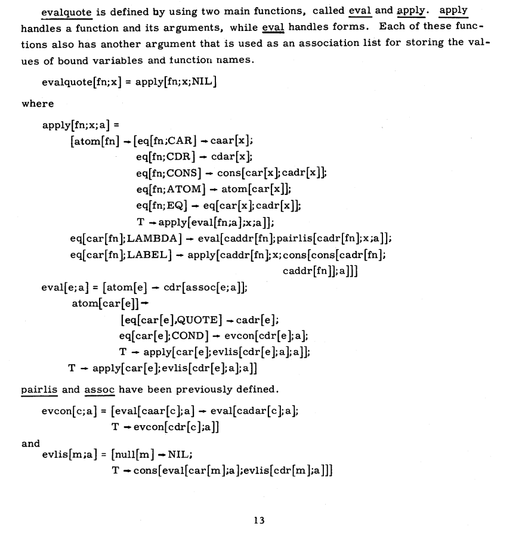

<small>*Presenting an early outline of SITP at [Toronto School of Foundation Modeling Season 1 (2025)](https://tsfm.ca/schedule)*</small>

# Preface

## The Structure and Interpretation of The AI Curriculum

 

This book is aspirationally titled [*The Structure and Interpretation of Tensor Programs*](./front.md), (henceforth SITP)
as it's goal is to serve a similar role for software 2.0 as
[*The Structure and Interpretation of Computer Programs*](https://mitp-content-server.mit.edu/books/content/sectbyfn/books_pres_0/6515/sicp.zip/full-text/book/book.html)
(henceforth SICP) did for software 1.0.
Written by Harold Abelson and Gerald Sussman with Julie Sussman, SICP took learners on a whimsical whirlwind tour throughout the essence of computation
starting with the elements of programs with functional programming, higher order functions, data abstraction, streams,
and ending with programming their own programming languages with virtual interpreters and compilers to register machines.

My alma matter was amongst those which took the SICP approach*Actually it's Scheming dual, [HtDP (Felleisen, Findler, Flatt, Krishnamurthi (2014))](https://htdp.org/). Thank you [Professor. Vasiga](https://cs.uwaterloo.ca/~tmjvasig/), and [Professor Ragde](https://cs.uwaterloo.ca/~plragde/flaneries/) for bringing over HtDP to Waterloo.*, and as intended,
for someone coming into first year college have taken computer science in high school, it blew my mind.
After graduating college in 2022, I followed my curiosity for diving deeper into the souls of our machine by going on to developing industrial languages and
runtimes.*"There is only one project, architecture, operating system and languages, compiler, it's only one project. It's all together." -- Boris Babayan*.
Particularly, I hacked on languages with [domain specific cloud compilers](https://www.infoq.com/presentations/deploy-pipelines-coinbase/)
and runtimes with [cloud provisioners, and cloud garbage collectors](https://www.infoq.com/presentations/coinbase-terraform-earth/).
At the end of 2022 though, when ChatGPT was released by OpenAI my mind was blown twice more.
As someone programming for some time, I could not believe this at all.
After two more years of hacking on cloud languages and runtimes, I started my transition from
domain specific cloud compilers from GPS to Terraform to domain specific tensor compilers from PyTorch to Triton.

The transition started with a tweet*"1.5k lines of rust and 100 commits later, we can now inference the FFN neural language model from (Bengio et al. 2003) straight from Karpathy's Zero to Hero. all you have to do is replace the single "import torch" line with "import picograd" 😎" -- [@j4orz, April 2, 2025](https://x.com/j4orz/status/1907452857248350421)* showcasing the beginnings of a tensor library evaluating the forward pass of a feed forward network
from Andrej Karpathy's [Neural Networks: Zero to Hero](https://karpathy.ai/zero-to-hero.html) course.
While it was illuminating to start implementing each individual torch call that the nets from `makemore` were making,
my knowledge felt quite fragmented as I personally forgot lots of foundation from college*I had the defiition of a basis in the basement of my subconscious at best. Thank you [Professor. Wolczuk](https://wolczuk.com/)!*,
and I wasn't sure how to bridge myself to industrial deep learning systems like `tinygrad`*Here's a PR I was able to land in tinygrad [making logsumexp numerically stable](https://github.com/tinygrad/tinygrad/pull/6921). It felt like I was contributing to LLVM without having taken a course on compiler construction to learn the basics of parsing, optimization, and lowering.*, `torch`, `jax`, `vllm`, and `sglang`.

Shortly after, I decided to take the plunge and started drinking from the firehose of deep learning canon:
Hastie et al.,, Murphy, Goodfellow et al.,, you name it.
The one thought I could not get out of my head was *where is the SICP for software 2.0*?
While I found two excellent resources on building your own torch-like autograd by Tianqi Chen at Carnegie Mellon and Sasha Rush at Cornell,
I personally would have enjoyed a more unified resource that took me from math, to deep learning, to deep learning systems in a single unbroken sequence of thought,
and perhaps others would feel similarly. That is the genesis story for this book, whose central research question is the following: **What does the SICP for Deep Learning look like**?*"We really could use a SICP for DL. We have the Little Lisper for DL ([thelittlelearner.com](https://www.thelittlelearner.com/)) but that's a different type of book entirely." -- [@ShriramKMurthi, May 3, 2026](https://x.com/ShriramKMurthi/status/2051049923617968353)*

<blockquote class="twitter-tweet" data-conversation="none" data-width="300">
We really could use a SICP for DL. We have the Little Lisper for DL (<a href="https://t.co/su31hFJeUe">https://t.co/su31hFJeUe</a>) but that&#39;s a different type of book entirely.
&mdash; Shriram Krishnamurthi (primary: Bluesky) (@ShriramKMurthi) <a href="https://x.com/ShriramKMurthi/status/2051049923617968353?ref_src=twsrc%5Etfw">May 3, 2026</a></blockquote>

Put shortly, SITP as a book is a function that maps learners from the product type of
an introductory computer science book such as [DCIC (Fisler, Krishnamurthi, Lerner, Politz)](https://dcic-world.org/) and an introductory systems programming book such as [TRPL (Klabnick, Nichols, Krycho)]()
with experimental modifications (Crichton, Gray, Krishnamurthi)
to a frontier model report such as the frontier technical report of [The Llama 3 Herd of Models (Meta 2024)](https://arxiv.org/abs/2407.21783) and frontier systems book such as Hugging Face's [Ultra Scale Book (Tazi et al., 2025)](https://huggingface.co/spaces/nanotron/ultrascale-playbook).

$$
\begin{aligned}
\text{SITP}&: \href{https://dcic-world.org/}{\text{DCIC}} \times \href{https://rust-book.cs.brown.edu/}{\text{TRPL}} \to \href{https://arxiv.org/pdf/2407.21783}{\text{LLAMA3}} \times \href{https://huggingface.co/spaces/nanotron/ultrascale-playbook}{\text{USPB}} \\
\text{SITP} &:= \href{https://htdp.org/}{\text{HTDP}}(\href{https://web.stanford.edu/~jurafsky/slp3/}{\text{SLP}}, \href{https://www.bishopbook.com/}{\text{DL}}, \href{http://incompleteideas.net/book/the-book-2nd.html}{\text{RL}}, \href{https://people.csail.mit.edu/jsolomon/share/book/numerical_book.pdf}{\text{NA}}, \href{https://theartofhpc.com/}{\text{TAOHPC}}, \href{https://epubs.siam.org/doi/book/10.1137/1.9781611972078}{\text{TAODCP}}, \href{https://shop.elsevier.com/books/programming-massively-parallel-processors/hwu/978-0-443-43900-1}{\text{PMPP}})
\end{aligned}
$$

where the function $HTDP(\cdot)$ is the systematic and principled design of a curriculum implemented by course developers that descend from the HtDP lineage*"I think of the position as having “twice” the teaching and “half” the research as an assistant professor (of course individual approaches can and do differ!)." -- [@JoePolitz, September 5, 2024](https://x.com/JoePolitz/status/1831797256871375332)*. The two guiding principles for SITP are the following:

1. *the concreteness fading [(Fyfe et al., 2014)](https://eric.ed.gov/?id=EJ1036777) of declarative concepts in mathematics [(Hestenes et al., 1992)](https://gwern.net/doc/science/physics/1992-hestenes.pdf)* by presenting  notions just in time by defining them by their context, and iteratively refining such concepts from the informal to formal ending in HtDP-style Intermezzos*Which present the formal syntax and semantics of a language.*.
2. that *transfer [(Bransford, Shwartz 1999)](https://journals.sagepub.com/doi/abs/10.3102/0091732x024001061) to procedural skills of computation* [(Price et al., 2021)](https://www.lifescied.org/doi/pdf/10.1187/cbe.20-12-0276) in the context of deep learning. Such transfer is possible because the computational discipline of deep learning has lots of structural similarity with mathematics, and is why we have books such as [Deisenroth et al., (2020)](https://mml-book.github.io/), and subsequent courses follwing such book, for instance [Princeton's](https://www.cs.princeton.edu/courses/archive/spring21/cos302/) [COS302](https://www.youtube.com/playlist?list=PLCO4cUaBLHFEHo42HVIVWaSOvbAiH30uc)*"Offered by Ryan Adams, who's lab led by Matthew Johnson, Dougal Maclaurin, and David Duvenaud created [HIPS/autograd](https://github.com/hips/autograd), which inspired PyTorch. See [https://soumith.ch/blog/2023-12-17-pytorch-design-origins.md.html#/origins](https://soumith.ch/blog/2023-12-17-pytorch-design-origins.md.html#/origins)*.

<!-- explicit instruction, and a process for performing procedural skills*. -->

<!-- Well, the good news is that we stand on the shoulders of giants, namely
the position paper by [Krishnamurthi and Fisler (2020)]() which has been operationalized at the school-level with [Bootstrap:Data Science](https://www.bootstrapworld.org/materials/data-science/) and at the collegiate-level with [Data Centric Introduction to Computing](https://dcic-world.org/). -->

<!-- the only misnomer is that this is a book about torch, not jax -->

<!--  -->

<!-- https://www.paulgraham.com/desres.html

> The difference between design and research seems to be a question of new versus good. Design doesn't have to be new, but it has to be good. Research doesn't have to be good, but it has to be new. -->
<!-- problem of exposition (3B1B quote) -->

<!-- sicp compiler chapter doesn't get into pratt parsing, SSA or SON IRs, graph coloring register allocation -->

<!-- > Everything is vague to a degree you do not realize till you have tried to make it precise. -->

<!-- SITP = HTDP(JURAFSKY + BISHOP + SOLOMON + TAOHPC + TAODP + PMPP) -->
<!-- SITP: DCIC -> HF SCALE + JAX SCALE -->
<!-- the only misnomer is that this is a book about torch, not jax -->

<!-- https://docs.divio.com/documentation-system/

there are lots of tutorials and how to guides,
some explanations. not many references.
at the limit, this is my attempt at creating a canonical reference.
-->

<!-- torch and vllm is the linux of AI

where is the xv6?

-->

<!--

the book's breadth is ambitious
but we should expect ourselves to learn more with AI now.
AI is the rocketship for our minds.

-->

<!--
- alan kay, lisp's interpreter is like maxwells equations
- everyone should also implement back propagation
- and a mingpt https://karpathy.github.io/2026/02/12/microgpt/

-->

      

[**Karpathy's LLM101n Syllabus**](https://github.com/karpathy/LLM101n)

- Chapter 01 **Bigram Language Model** (language modeling)
- Chapter 02 **Micrograd** (machine learning, backpropagation)
- Chapter 03 **N-gram model** (multi-layer perceptron, matmul, gelu)
- Chapter 04 **Attention** (attention, softmax, positional encoder)
- Chapter 05 **Transformer** (transformer, residual, layernorm, GPT-2)
- Chapter 06 **Tokenization** (minBPE, byte pair encoding)
- Chapter 07 **Optimization** (initialization, optimization, AdamW)
- Chapter 08 **Need for Speed I: Device** (device, CPU, GPU, ...)
- Chapter 09 **Need for Speed II: Precision** (mixed precision training, fp16, bf16, fp8, ...)
- Chapter 10 **Need for Speed III: Distributed** (distributed optimization, DDP, ZeRO)
- Chapter 11 **Datasets** (datasets, data loading, synthetic data generation)
- Chapter 12 **Inference I: kv-cache** (kv-cache)
- Chapter 13 **Inference II: Quantization** (quantization)
- Chapter 14 **Finetuning I: SFT** (supervised finetuning SFT, PEFT, LoRA, chat)
- Chapter 15 **Finetuning II: RL** (reinforcement learning, RLHF, PPO, DPO)
- Chapter 16 **Deployment** (API, web app)
- Chapter 17 **Multimodal** (VQVAE, diffusion transformer)

**SITP's Syllabus**

$$
\begin{array}{ll}
\left.
\begin{array}{ll}
1.1 & \quad\rlap{\text{From Certain to Uncertain Knowledge}}\hphantom{\text{Next Token Prediction is Classification and Compression}} \\
1.2 & \quad\text{Next Token Prediction is Classification and Compression}
\end{array}
\right\}
&
\href{https://www.youtube.com/playlist?list=PLaZQkZp6WhWyvdiP49JG-rjyTPck_hvEu}{\text{Stanford CS124}},\ 
\href{https://www.youtube.com/playlist?list=PLoROMvodv4rOpr_A7B9SriE_iZmkanvUg}{\text{CS109}}
\\[0.6em]

\left.
\begin{array}{ll}
1.3 & \quad\rlap{\text{Parameterizing Classification with Logistic Regression}}\hphantom{\text{Next Token Prediction is Classification and Compression}} \\
1.4 & \quad\text{Parameterizing Quantification with Linear Regression}
\end{array}
\right\}
&
\href{https://www.youtube.com/playlist?list=PLoROMvodv4rNH7qL6-efu_q2_bPuy0adh}{\text{Stanford CS229}},\ 
\href{https://www.youtube.com/playlist?list=PLE7DDD91010BC51F8}{\text{MIT 18.06}},\
\href{https://www.youtube.com/playlist?list=PLUl4u3cNGP63oMNUHXqIUcrkS2PivhN3k}{\text{MIT 18.065}} \\[0.6em]

\left.
\begin{array}{ll}
2.1 & \quad\rlap{\text{The Three Language Problem}}\hphantom{\text{Next Token Prediction is Classification and Compression}} \\
2.2 & \quad\text{Virtualizing Shapes with Strides} \\
2.3 & \quad\text{Accelerating Basic Linear Algebra on CPUs}
\end{array}
\right\}
&
\href{https://www.youtube.com/playlist?list=PLUl4u3cNGP63VIBQVWguXxZZi0566y7Wf}{\text{MIT 6.172}} \\[0.6em]

\left.
\begin{array}{ll}
2.4 & \quad\rlap{\text{From the BLAS to LAPACK}}\hphantom{\text{Next Token Prediction is Classification and Compression}} \\
2.5 & \quad\text{QR Decomposition} \\
2.6 & \quad\text{Singular Value Decomposition}
\end{array}
\right\}
&
\href{https://www.youtube.com/playlist?list=PLQ3UicqQtfNsivZX5TmUAoUkkBqFT8aOL}{\text{MIT 6.7350}} \\[0.6em]

\left.
\begin{array}{ll}
3.1 & \quad\rlap{\text{Optimization with Gradient Descent}}\hphantom{\text{Next Token Prediction is Classification and Compression}} \\
3.2 & \quad\text{Learning Representations with FFNs} \\
3.3 & \quad\text{Learning Representations with CNNs} \\
3.4 & \quad\text{Learning Representations with RNNs}
\end{array}
\right\}
&
\href{https://www.youtube.com/playlist?list=PLoROMvodv4rOaMFbaqxPDoLWjDaRAdP9D}{\text{Stanford CS224N}},\ 
\href{https://www.youtube.com/playlist?list=PLUl4u3cNGP63URZnh5iqBzDTDYPUTQT-8}{\text{MIT 6.7960}},\
\href{https://www.youtube.com/playlist?list=PLUl4u3cNGP62EaLLH92E_VCN4izBKK6OE}{\text{MIT 18.S096}}

\\[0.6em]

\left.
\begin{array}{ll}
3.5 & \quad\rlap{\text{Learning Representations with GPTs}}\hphantom{\text{Next Token Prediction is Classification and Compression}}
\end{array}
\right\}

&
\href{https://www.youtube.com/playlist?list=PLoROMvodv4rMqXOcazWaTUHhq-yembLCV}{\text{Stanford CS336}} \\[0.6em]

\left.
\begin{array}{ll}
4.1 & \quad\rlap{\text{Automatic Differentiation}}\hphantom{\text{Next Token Prediction is Classification and Compression}} \\
4.2 & \quad\text{Gradient-Based Optimization} \\
4.3 & \quad\text{Network Primitives} \\
\end{array}
\right\}

&
\href{https://www.youtube.com/playlist?list=PLO45-80-XKkQyROXXpn4PfjF1J2tH46w8}{\text{Cornell CS5781}},\ 
\href{https://www.youtube.com/playlist?list=PLT6QPhVMICSa30axDNX9nljqaTeuftC8t}{\text{CMU 10-414}}
\\[0.6em]

\left.
\begin{array}{ll}
4.4 & \quad\rlap{\text{Accelerating Matrix Multiplication on GPUs}}\hphantom{\text{Next Token Prediction is Classification and Compression}} \\
4.5 & \quad\text{Accelerating Matrix Multiplication on TPUs} \\
4.6 & \quad\text{From Strides to Layouts} \\
4.6 & \quad\text{Accelerating Attention} \\
\end{array}
\right\}

&
\href{https://www.youtube.com/playlist?list=PLoROMvodv4rMp7MTFr4hQsDEcX7Bx6Odp}{\text{Stanford CS149}},\ 
\href{https://accelerated-computing.academy/fall25/lectures/}{\text{MIT 6.S894}},\
\href{https://www.youtube.com/@GPUMODE/videos}{\text{GPU MODE}} \\[0.6em]

\end{array}
$$

Jeffrey Zhang 
Waterloo, Ontario 
August 2026 
